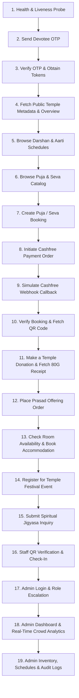

# Temple Digital Platform — Complete API Testing Guide

> **Official Master Test Suite & API Specification**  
> Comprehensive documentation for independently testing all **217 implemented backend endpoints** of the Temple Digital Platform.  
> Verified against production controllers, DTO schemas, authentication guards, and Cashfree payment architecture.

---

## Table of Contents
1. [Environment & Test Setup](#1-environment--test-setup)
2. [End-to-End Recommended Testing Flow](#2-end-to-end-recommended-testing-flow)
3. [Authentication & Token Acquisition Guide](#3-authentication--token-acquisition-guide)
4. [Admin Multi-Tenant RBAC Testing](#4-admin-multi-tenant-rbac-testing)
5. [Cashfree Webhook Simulation & Testing](#5-cashfree-webhook-simulation--testing)
6. [Negative Testing Matrix](#6-negative-testing-matrix)
7. [Postman Collection Integration](#7-postman-collection-integration)
8. [Complete API Endpoint Catalog (217 Routes)](#8-complete-api-endpoint-catalog-217-routes)
   - [8.1 Health (3 Routes)](#81-health)
   - [8.2 Auth (7 Routes)](#82-auth)
   - [8.3 Users (10 Routes)](#83-users)
   - [8.4 Temple (5 Routes)](#84-temple)
   - [8.5 Temple Info (5 Routes)](#85-temple-info)
   - [8.6 Deity (5 Routes)](#86-deity)
   - [8.7 Gallery (6 Routes)](#87-gallery)
   - [8.8 Darshan (8 Routes)](#88-darshan)
   - [8.9 Aarti (7 Routes)](#89-aarti)
   - [8.10 Puja (9 Routes)](#810-puja)
   - [8.11 Seva (9 Routes)](#811-seva)
   - [8.12 Booking (10 Routes)](#812-booking)
   - [8.13 Payments (6 Routes)](#813-payments)
   - [8.14 Donations (10 Routes)](#814-donations)
   - [8.15 Prasad (14 Routes)](#815-prasad)
   - [8.16 Accommodation (13 Routes)](#816-accommodation)
   - [8.17 Events (10 Routes)](#817-events)
   - [8.18 Notifications (12 Routes)](#818-notifications)
   - [8.19 QR Verification (7 Routes)](#819-qr-verification)
   - [8.20 Paath (2 Routes)](#820-paath)
   - [8.21 Paath Admin (5 Routes)](#821-paath-admin)
   - [8.22 Gurukul (3 Routes)](#822-gurukul)
   - [8.23 Gurukul Admin (8 Routes)](#823-gurukul-admin)
   - [8.24 Mahaprasad (3 Routes)](#824-mahaprasad)
   - [8.25 Mahaprasad Admin (5 Routes)](#825-mahaprasad-admin)
   - [8.26 Jigyasa Samadhan (2 Routes)](#826-jigyasa-samadhan)
   - [8.27 Jigyasa Admin (6 Routes)](#827-jigyasa-admin)
   - [8.28 Admin (16 Routes)](#828-admin)
   - [8.29 Pages (11 Routes)](#829-pages)

---

## 1. Environment & Test Setup

Before initiating API tests, ensure the backend services (Node.js/NestJS, PostgreSQL, Redis) are running and configured with the required environment variables:

| Variable | Description | Example / Test Placeholder |
| :--- | :--- | :--- |
| `PORT` | HTTP Port for NestJS server | `3000` |
| `NODE_ENV` | Runtime environment (`development` / `production`) | `development` |
| `API_PREFIX` | Global REST API route prefix | `api/v1` |
| `CORS_ORIGINS` | Permitted client URLs | `http://localhost:3000,http://localhost:8080,http://localhost:8081` |
| `DATABASE_URL` | PostgreSQL connection string | `postgresql://<USER>:<PASSWORD>@localhost:5432/temple?schema=public` |
| `REDIS_URL` | Redis connection string for caching & OTP rate limiting | `redis://localhost:6379` |
| `JWT_SECRET` | Secret key for signing Access Tokens (min 32 chars) | `<JWT_SECRET_32_CHARS_LONG>` |
| `JWT_ACCESS_TOKEN_EXPIRY` | Lifetime for Access Tokens | `15m` |
| `JWT_REFRESH_TOKEN_EXPIRY` | Lifetime for Refresh Tokens | `7d` |
| `DEV_OTP` | Static OTP in development mode | `123456` |
| `CASHFREE_APP_ID` | Cashfree Client Application ID | `<CASHFREE_APP_ID>` |
| `CASHFREE_SECRET_KEY` | Cashfree API Secret Key | `<CASHFREE_SECRET_KEY>` |
| `CASHFREE_WEBHOOK_SECRET`| Cashfree HMAC Webhook Signing Secret | `<CASHFREE_WEBHOOK_SECRET>` |
| `CASHFREE_ENVIRONMENT` | Cashfree gateway environment | `sandbox` (test) or `production` |

---

## 2. End-to-End Recommended Testing Flow

Follow this structured sequential workflow to test the entire lifecycle from public discovery to authenticated devotee actions and administrative operations:



### Testing Sequence Steps:
1. **Health Verification**: Call `GET /api/v1/health` and `GET /api/v1/health/ready` to confirm App, Database, and Redis are in `up` status.
2. **Devotee Authentication**:
   - `POST /api/v1/auth/send-otp` with `{"phone": "+919876543210"}`.
   - `POST /api/v1/auth/verify-otp` with `{"phone": "+919876543210", "otp": "123456"}`.
   - Extract and store `data.tokens.accessToken` and `data.tokens.refreshToken`.
3. **Temple Discovery**:
   - `GET /api/v1/temples` to list active temples and grab the primary `templeId`.
   - `GET /api/v1/home` and `GET /api/v1/temple-overview?templeId={templeId}` for aggregated page data.
4. **Darshan & Schedules**:
   - `GET /api/v1/temples/{templeId}/darshan/schedules`
   - `GET /api/v1/temples/{templeId}/aarti`
5. **Puja & Seva Booking**:
   - `GET /api/v1/temples/{templeId}/puja` -> select a `pujaId` and `slotId`.
   - `POST /api/v1/bookings/puja` with `Authorization: Bearer <accessToken>` -> returns booking record with status `PENDING_PAYMENT` and a unique `bookingId`.
6. **Cashfree Payment**:
   - `POST /api/v1/payments/booking/{bookingId}` -> returns Cashfree `orderId` and `paymentSessionId`.
   - Simulate payment completion or webhook dispatch (`POST /api/v1/payments/webhook/cashfree`).
7. **Booking Check & QR Retrieval**:
   - `GET /api/v1/bookings/{bookingId}` -> verify status is `CONFIRMED` and copy `qrToken`.
8. **QR Verification**:
   - `GET /api/v1/qr/verify/{qrToken}` using Staff/Admin token -> validates cryptographic QR and checks in attendee.
9. **Donation Flow**:
   - `GET /api/v1/temples/{templeId}/donations/causes`
   - `POST /api/v1/temples/{templeId}/donations` -> initiates Cashfree donation order.
10. **Prasad Offering**:
    - `GET /api/v1/temples/{templeId}/prasad/products`
    - `POST /api/v1/temples/{templeId}/prasad/orders` -> creates a home delivery prasad order.
11. **Accommodation**:
    - `GET /api/v1/temples/{templeId}/accommodation/rooms`
    - `GET /api/v1/temples/{templeId}/accommodation/availability?checkIn=2026-09-01&checkOut=2026-09-03`
    - `POST /api/v1/temples/{templeId}/accommodation/bookings`
12. **Events**:
    - `GET /api/v1/temples/{templeId}/events`
    - `POST /api/v1/temples/{templeId}/events/{eventId}/register`
13. **Spiritual Features**:
    - `GET /api/v1/paath` (Audio streams of Vedic Mantras)
    - `GET /api/v1/gurukul/courses` & `POST /api/v1/gurukul/inquiries`
    - `GET /api/v1/mahaprasad/slots` & `POST /api/v1/mahaprasad/bookings`
    - `POST /api/v1/jigyasa/ask` (Submit spiritual question)
14. **Admin Testing**:
    - Log in as Admin -> Access `GET /api/v1/admin/temples/{templeId}/dashboard`, `GET /api/v1/admin/temples/{templeId}/crowd`, `GET /api/v1/admin/audit-logs`, and perform catalog CRUD.

---

## 3. Authentication & Token Acquisition Guide

### Step 1: Request OTP
```http
POST /api/v1/auth/send-otp
Content-Type: application/json

{
  "phone": "+919876543210"
}
```
**Response (200 OK):**
```json
{
  "success": true,
  "data": {
    "message": "OTP sent (dev mode: 123456)"
  }
}
```

### Step 2: Verify OTP and Receive Tokens
```http
POST /api/v1/auth/verify-otp
Content-Type: application/json

{
  "phone": "+919876543210",
  "otp": "123456"
}
```
**Response (200 OK):**
```json
{
  "success": true,
  "data": {
    "tokens": {
      "accessToken": "eyJhbGciOiJIUzI1NiIsInR5cCI6IkpXVCJ9...",
      "refreshToken": "4a7b9c1d-8e2f-4a3b-9c1d-8e2f4a3b9c1d"
    },
    "user": {
      "id": "cmth9jxs000064g95y1j5zxjq",
      "phone": "+919876543210",
      "role": "DEVOTEE",
      "status": "ACTIVE"
    }
  }
}
```

### Step 3: Use Access Token
Attach the header to all protected endpoints:
```http
Authorization: Bearer <ACCESS_TOKEN>
```

### Step 4: Refresh Access Token
```http
POST /api/v1/auth/refresh
Content-Type: application/json

{
  "refreshToken": "<REFRESH_TOKEN>"
}
```

---

## 4. Admin Multi-Tenant RBAC Testing

The platform enforces strict Role-Based Access Control (RBAC) and Multi-Tenant Temple Isolation via `RolesGuard` and `TempleAccessGuard`.

### Role Hierarchy:
- **SUPER_ADMIN**: Global unrestricted access across all temples.
- **ADMIN / MANAGER / STAFF**: Tenant-scoped access. The user **must have an active `StaffAssignment`** record linking their `userId` to the target `templeId`.

### Setting Up a Test Admin in PostgreSQL:
```sql
-- 1. Elevate user to ADMIN role
UPDATE "User" SET role = 'ADMIN', name = 'Temple Admin' WHERE phone = '+919999000002';

-- 2. Grant tenant management assignment for the target temple
INSERT INTO "StaffAssignment" (id, "userId", "templeId", "createdAt", "updatedAt")
VALUES ('sa_test_01', '<USER_ID>', '<TEMPLE_ID>', NOW(), NOW())
ON CONFLICT ("userId", "templeId") DO NOTHING;
```

After updating the database, invoke `POST /api/v1/auth/refresh` with the user's `refreshToken` to obtain a new JWT token containing the `ADMIN` role.

---

## 5. Cashfree Webhook Simulation & Testing

The backend handles asynchronous payment status transitions via Cashfree webhook notifications:

```http
POST /api/v1/payments/webhook/cashfree
Content-Type: application/json
x-webhook-signature: <COMPUTED_HMAC_SHA256>
x-webhook-timestamp: 1725110400

{
  "data": {
    "order": {
      "order_id": "cf_ord_cmth9jxs000064g95y1j5zxjq",
      "order_amount": 501.00,
      "order_currency": "INR",
      "order_tags": {
        "bookingId": "cmth9jxs000064g95y1j5zxjq"
      }
    },
    "payment": {
      "cf_payment_id": 987654321,
      "payment_status": "SUCCESS",
      "payment_amount": 501.00,
      "payment_time": "2026-09-01T10:05:00Z"
    }
  },
  "event_time": "2026-09-01T10:05:01Z",
  "type": "PAYMENT_SUCCESS_WEBHOOK"
}
```

---

## 6. Negative Testing Matrix

| Test Scenario | Target Endpoint | Input Condition | Expected Status | Expected Error Code |
| :--- | :--- | :--- | :--- | :--- |
| **Missing Auth Header** | `GET /api/v1/auth/profile` | No Authorization header | `401 Unauthorized` | `UNAUTHORIZED` |
| **Invalid Bearer Token** | `GET /api/v1/bookings/me` | `Bearer invalid.token.value` | `401 Unauthorized` | `INVALID_TOKEN` |
| **Insufficient Privileges** | `GET /api/v1/admin/users` | Token with role `DEVOTEE` | `403 Forbidden` | `FORBIDDEN` |
| **Unassigned Temple Access** | `GET /api/v1/admin/temples/{id}/crowd` | Admin not assigned in StaffAssignment | `403 Forbidden` | `FORBIDDEN` |
| **OTP Spam / Cooldown** | `POST /api/v1/auth/send-otp` | 2 requests within 60 seconds | `400 / 429` | `COOLDOWN_ACTIVE` |
| **Invalid OTP Code** | `POST /api/v1/auth/verify-otp` | `{"otp": "000000"}` | `401 Unauthorized` | `INVALID_OTP` |
| **Brute Force Invalidation** | `POST /api/v1/auth/verify-otp` | 5 consecutive wrong OTP attempts | `401 Unauthorized` | `OTP_INVALIDATED` |
| **Slot Overbooking / Full** | `POST /api/v1/bookings/puja` | Requesting seats when capacity = 0 | `409 Conflict` | `SLOT_FULL` |
| **Resource Not Found** | `GET /api/v1/temples/invalid_id` | Non-existent CUID | `404 Not Found` | `NOT_FOUND` |
| **Rate Limit Exceeded** | Any rate-limited endpoint | > Limit points within window | `429 Too Many Requests` | `RATE_LIMIT_EXCEEDED` |

---

## 7. Postman Collection Integration

A ready-to-import Postman Collection v2.1 is available at:
`postman/Temple-Digital-Platform.postman_collection.json`

### Features:
- Parametrized environments: `{{baseUrl}}`, `{{accessToken}}`, `{{adminToken}}`, `{{templeId}}`, `{{bookingId}}`.
- **Automatic Token Capture**: Running `POST /api/v1/auth/verify-otp` automatically sets `accessToken` and `refreshToken` in collection variables.
- **Booking ID Chaining**: Creating a booking automatically captures `bookingId` and `qrToken` for downstream payment and verification testing.

---

## 8. Complete API Endpoint Catalog (217 Routes)

---

### 8.1 Health (3 Routes)

#### `GET` /api/v1/api/v1/health

**Purpose:** System health check (App, DB & Redis)

**Authentication:** `Not Required (Public)`

**Role:** `PUBLIC`

**Headers:**
```http
Content-Type: application/json
```

**Path Parameters:** None

**Query Parameters:** None

**Expected Success Response (`200 The Health Check is successful`):**
```json
{
  "status": "ok",
  "info": {
    "database": {
      "status": "up"
    }
  },
  "error": {},
  "details": {
    "database": {
      "status": "up"
    }
  }
}
```

**Important Error Responses:**
- `400 Bad Request`: Invalid request parameters, missing required fields, or validation constraint failure.
- `429 Too Many Requests`: Route or IP rate limit exceeded.

**Notes:** Verified directly from NestJS controller decorators and Prisma schemas.

---

#### `GET` /api/v1/api/v1/health/live

**Purpose:** Application liveness probe

**Authentication:** `Not Required (Public)`

**Role:** `PUBLIC`

**Headers:**
```http
Content-Type: application/json
```

**Path Parameters:** None

**Query Parameters:** None

**Expected Success Response (`200 The Health Check is successful`):**
```json
{
  "status": "ok",
  "info": {
    "database": {
      "status": "up"
    }
  },
  "error": {},
  "details": {
    "database": {
      "status": "up"
    }
  }
}
```

**Important Error Responses:**
- `400 Bad Request`: Invalid request parameters, missing required fields, or validation constraint failure.
- `429 Too Many Requests`: Route or IP rate limit exceeded.

**Notes:** Verified directly from NestJS controller decorators and Prisma schemas.

---

#### `GET` /api/v1/api/v1/health/ready

**Purpose:** Database and Redis readiness probe

**Authentication:** `Not Required (Public)`

**Role:** `PUBLIC`

**Headers:**
```http
Content-Type: application/json
```

**Path Parameters:** None

**Query Parameters:** None

**Expected Success Response (`200 The Health Check is successful`):**
```json
{
  "status": "ok",
  "info": {
    "database": {
      "status": "up"
    }
  },
  "error": {},
  "details": {
    "database": {
      "status": "up"
    }
  }
}
```

**Important Error Responses:**
- `400 Bad Request`: Invalid request parameters, missing required fields, or validation constraint failure.
- `429 Too Many Requests`: Route or IP rate limit exceeded.

**Notes:** Verified directly from NestJS controller decorators and Prisma schemas.

---


---

### 8.2 Auth (7 Routes)

#### `POST` /api/v1/api/v1/auth/send-otp

**Purpose:** Send OTP to phone number

**Authentication:** `Not Required (Public)`

**Role:** `PUBLIC`

**Headers:**
```http
Content-Type: application/json
```

**Path Parameters:** None

**Query Parameters:** None

**Request Body:** None or empty payload.

**Expected Success Response (`200 OK`):**
```json
{
  "success": true,
  "data": {}
}
```

**Important Error Responses:**
- `400 Bad Request`: Invalid request parameters, missing required fields, or validation constraint failure.
- `429 Too Many Requests`: Route or IP rate limit exceeded.

**Notes:** Verified directly from NestJS controller decorators and Prisma schemas.

---

#### `POST` /api/v1/api/v1/auth/verify-otp

**Purpose:** Verify OTP and get access/refresh tokens

**Authentication:** `Not Required (Public)`

**Role:** `PUBLIC`

**Headers:**
```http
Content-Type: application/json
```

**Path Parameters:** None

**Query Parameters:** None

**Request Body:** None or empty payload.

**Expected Success Response (`200 OK`):**
```json
{
  "success": true,
  "data": {}
}
```

**Important Error Responses:**
- `400 Bad Request`: Invalid request parameters, missing required fields, or validation constraint failure.
- `429 Too Many Requests`: Route or IP rate limit exceeded.

**Notes:** Verified directly from NestJS controller decorators and Prisma schemas.

---

#### `POST` /api/v1/api/v1/auth/refresh

**Purpose:** Refresh access token using refresh token

**Authentication:** `Not Required (Public)`

**Role:** `PUBLIC`

**Headers:**
```http
Content-Type: application/json
```

**Path Parameters:** None

**Query Parameters:** None

**Request Body:** None or empty payload.

**Expected Success Response (`200 OK`):**
```json
{
  "success": true,
  "data": {}
}
```

**Important Error Responses:**
- `400 Bad Request`: Invalid request parameters, missing required fields, or validation constraint failure.
- `429 Too Many Requests`: Route or IP rate limit exceeded.

**Notes:** Verified directly from NestJS controller decorators and Prisma schemas.

---

#### `POST` /api/v1/api/v1/auth/logout

**Purpose:** Logout and invalidate refresh token

**Authentication:** `Required (Bearer JWT)`

**Role:** `DEVOTEE (Authenticated User)`

**Headers:**
```http
Content-Type: application/json
Authorization: Bearer <DEVOTEE_ACCESS_TOKEN>
```

**Path Parameters:** None

**Query Parameters:** None

**Request Body:** None or empty payload.

**Expected Success Response (`200 OK`):**
```json
{
  "success": true,
  "data": {}
}
```

**Important Error Responses:**
- `400 Bad Request`: Invalid request parameters, missing required fields, or validation constraint failure.
- `401 Unauthorized`: Missing, expired, or malformed JWT bearer token.
- `429 Too Many Requests`: Route or IP rate limit exceeded.

**Notes:** Verified directly from NestJS controller decorators and Prisma schemas.

---

#### `GET` /api/v1/api/v1/auth/profile

**Purpose:** Get current user profile

**Authentication:** `Required (Bearer JWT)`

**Role:** `DEVOTEE (Authenticated User)`

**Headers:**
```http
Content-Type: application/json
Authorization: Bearer <DEVOTEE_ACCESS_TOKEN>
```

**Path Parameters:** None

**Query Parameters:** None

**Expected Success Response (`200 OK`):**
```json
{
  "success": true,
  "data": {}
}
```

**Important Error Responses:**
- `400 Bad Request`: Invalid request parameters, missing required fields, or validation constraint failure.
- `401 Unauthorized`: Missing, expired, or malformed JWT bearer token.
- `429 Too Many Requests`: Route or IP rate limit exceeded.

**Notes:** Verified directly from NestJS controller decorators and Prisma schemas.

---

#### `POST` /api/v1/api/v1/auth/profile

**Purpose:** Update user profile

**Authentication:** `Required (Bearer JWT)`

**Role:** `DEVOTEE (Authenticated User)`

**Headers:**
```http
Content-Type: application/json
Authorization: Bearer <DEVOTEE_ACCESS_TOKEN>
```

**Path Parameters:** None

**Query Parameters:** None

**Request Body:** None or empty payload.

**Expected Success Response (`201 OK`):**
```json
{
  "success": true,
  "data": {}
}
```

**Important Error Responses:**
- `400 Bad Request`: Invalid request parameters, missing required fields, or validation constraint failure.
- `401 Unauthorized`: Missing, expired, or malformed JWT bearer token.
- `429 Too Many Requests`: Route or IP rate limit exceeded.

**Notes:** Verified directly from NestJS controller decorators and Prisma schemas.

---

#### `POST` /api/v1/api/v1/auth/complete-profile

**Purpose:** Complete user registration profile details

**Authentication:** `Required (Bearer JWT)`

**Role:** `DEVOTEE (Authenticated User)`

**Headers:**
```http
Content-Type: application/json
Authorization: Bearer <DEVOTEE_ACCESS_TOKEN>
```

**Path Parameters:** None

**Query Parameters:** None

**Request Body:**
```json
{
  "name": "Rahul Sharma",
  "email": "rahul@example.com",
  "dateOfBirth": "1990-01-15",
  "gender": "Male",
  "emergencyContact": "+919876543210"
}
```

**Expected Success Response (`201 OK`):**
```json
{
  "success": true,
  "data": {}
}
```

**Important Error Responses:**
- `400 Bad Request`: Invalid request parameters, missing required fields, or validation constraint failure.
- `401 Unauthorized`: Missing, expired, or malformed JWT bearer token.
- `429 Too Many Requests`: Route or IP rate limit exceeded.

**Notes:** Verified directly from NestJS controller decorators and Prisma schemas.

---


---

### 8.3 Users (10 Routes)

#### `GET` /api/v1/api/v1/users

**Purpose:** List all users (admin/staff)

**Authentication:** `Required (Bearer JWT)`

**Role:** `DEVOTEE (Authenticated User)`

**Headers:**
```http
Content-Type: application/json
Authorization: Bearer <DEVOTEE_ACCESS_TOKEN>
```

**Path Parameters:** None

**Query Parameters:**
- `page` (string, optional): Filter / Pagination
- `limit` (string, optional): Filter / Pagination
- `role` (string, optional): Filter / Pagination
- `status` (string, optional): Filter / Pagination
- `search` (string, optional): Filter / Pagination

**Expected Success Response (`200 OK`):**
```json
{
  "success": true,
  "data": {}
}
```

**Important Error Responses:**
- `400 Bad Request`: Invalid request parameters, missing required fields, or validation constraint failure.
- `401 Unauthorized`: Missing, expired, or malformed JWT bearer token.
- `429 Too Many Requests`: Route or IP rate limit exceeded.

**Notes:** Verified directly from NestJS controller decorators and Prisma schemas.

---

#### `GET` /api/v1/api/v1/users/profile

**Purpose:** Get current user profile

**Authentication:** `Required (Bearer JWT)`

**Role:** `DEVOTEE (Authenticated User)`

**Headers:**
```http
Content-Type: application/json
Authorization: Bearer <DEVOTEE_ACCESS_TOKEN>
```

**Path Parameters:** None

**Query Parameters:** None

**Expected Success Response (`200 OK`):**
```json
{
  "success": true,
  "data": {}
}
```

**Important Error Responses:**
- `400 Bad Request`: Invalid request parameters, missing required fields, or validation constraint failure.
- `401 Unauthorized`: Missing, expired, or malformed JWT bearer token.
- `429 Too Many Requests`: Route or IP rate limit exceeded.

**Notes:** Verified directly from NestJS controller decorators and Prisma schemas.

---

#### `GET` /api/v1/api/v1/users/me

**Purpose:** Get current user profile (alias)

**Authentication:** `Required (Bearer JWT)`

**Role:** `DEVOTEE (Authenticated User)`

**Headers:**
```http
Content-Type: application/json
Authorization: Bearer <DEVOTEE_ACCESS_TOKEN>
```

**Path Parameters:** None

**Query Parameters:** None

**Expected Success Response (`200 OK`):**
```json
{
  "success": true,
  "data": {}
}
```

**Important Error Responses:**
- `400 Bad Request`: Invalid request parameters, missing required fields, or validation constraint failure.
- `401 Unauthorized`: Missing, expired, or malformed JWT bearer token.
- `429 Too Many Requests`: Route or IP rate limit exceeded.

**Notes:** Verified directly from NestJS controller decorators and Prisma schemas.

---

#### `PUT` /api/v1/api/v1/users/location

**Purpose:** Update current user location coordinates

**Authentication:** `Required (Bearer JWT)`

**Role:** `DEVOTEE (Authenticated User)`

**Headers:**
```http
Content-Type: application/json
Authorization: Bearer <DEVOTEE_ACCESS_TOKEN>
```

**Path Parameters:** None

**Query Parameters:** None

**Request Body:**
```json
{
  "latitude": 28.6139,
  "longitude": 77.209
}
```

**Expected Success Response (`200 OK`):**
```json
{
  "success": true,
  "data": {}
}
```

**Important Error Responses:**
- `400 Bad Request`: Invalid request parameters, missing required fields, or validation constraint failure.
- `401 Unauthorized`: Missing, expired, or malformed JWT bearer token.
- `429 Too Many Requests`: Route or IP rate limit exceeded.

**Notes:** Verified directly from NestJS controller decorators and Prisma schemas.

---

#### `GET` /api/v1/api/v1/users/{id}

**Purpose:** Get user by ID (admin/staff)

**Authentication:** `Required (Bearer JWT)`

**Role:** `DEVOTEE (Authenticated User)`

**Headers:**
```http
Content-Type: application/json
Authorization: Bearer <DEVOTEE_ACCESS_TOKEN>
```

**Path Parameters:**
- `id` (string): Unique identifier

**Query Parameters:** None

**Expected Success Response (`200 OK`):**
```json
{
  "success": true,
  "data": {}
}
```

**Important Error Responses:**
- `400 Bad Request`: Invalid request parameters, missing required fields, or validation constraint failure.
- `401 Unauthorized`: Missing, expired, or malformed JWT bearer token.
- `404 Not Found`: Target entity with the specified ID does not exist in the database.
- `429 Too Many Requests`: Route or IP rate limit exceeded.

**Notes:** Verified directly from NestJS controller decorators and Prisma schemas.

---

#### `PUT` /api/v1/api/v1/users/{id}/role

**Purpose:** Update user role (admin only)

**Authentication:** `Required (Bearer JWT)`

**Role:** `DEVOTEE (Authenticated User)`

**Headers:**
```http
Content-Type: application/json
Authorization: Bearer <DEVOTEE_ACCESS_TOKEN>
```

**Path Parameters:**
- `id` (string): Unique identifier

**Query Parameters:** None

**Request Body:** None or empty payload.

**Expected Success Response (`200 OK`):**
```json
{
  "success": true,
  "data": {}
}
```

**Important Error Responses:**
- `400 Bad Request`: Invalid request parameters, missing required fields, or validation constraint failure.
- `401 Unauthorized`: Missing, expired, or malformed JWT bearer token.
- `404 Not Found`: Target entity with the specified ID does not exist in the database.
- `429 Too Many Requests`: Route or IP rate limit exceeded.

**Notes:** Verified directly from NestJS controller decorators and Prisma schemas.

---

#### `PUT` /api/v1/api/v1/users/{id}/status

**Purpose:** Update user status (admin only)

**Authentication:** `Required (Bearer JWT)`

**Role:** `DEVOTEE (Authenticated User)`

**Headers:**
```http
Content-Type: application/json
Authorization: Bearer <DEVOTEE_ACCESS_TOKEN>
```

**Path Parameters:**
- `id` (string): Unique identifier

**Query Parameters:** None

**Request Body:** None or empty payload.

**Expected Success Response (`200 OK`):**
```json
{
  "success": true,
  "data": {}
}
```

**Important Error Responses:**
- `400 Bad Request`: Invalid request parameters, missing required fields, or validation constraint failure.
- `401 Unauthorized`: Missing, expired, or malformed JWT bearer token.
- `404 Not Found`: Target entity with the specified ID does not exist in the database.
- `429 Too Many Requests`: Route or IP rate limit exceeded.

**Notes:** Verified directly from NestJS controller decorators and Prisma schemas.

---

#### `POST` /api/v1/api/v1/users/addresses

**Purpose:** Add address for current user

**Authentication:** `Required (Bearer JWT)`

**Role:** `DEVOTEE (Authenticated User)`

**Headers:**
```http
Content-Type: application/json
Authorization: Bearer <DEVOTEE_ACCESS_TOKEN>
```

**Path Parameters:** None

**Query Parameters:** None

**Request Body:** None or empty payload.

**Expected Success Response (`201 OK`):**
```json
{
  "success": true,
  "data": {}
}
```

**Important Error Responses:**
- `400 Bad Request`: Invalid request parameters, missing required fields, or validation constraint failure.
- `401 Unauthorized`: Missing, expired, or malformed JWT bearer token.
- `429 Too Many Requests`: Route or IP rate limit exceeded.

**Notes:** Verified directly from NestJS controller decorators and Prisma schemas.

---

#### `PUT` /api/v1/api/v1/users/addresses/{addressId}

**Purpose:** Update address

**Authentication:** `Required (Bearer JWT)`

**Role:** `DEVOTEE (Authenticated User)`

**Headers:**
```http
Content-Type: application/json
Authorization: Bearer <DEVOTEE_ACCESS_TOKEN>
```

**Path Parameters:**
- `addressId` (string): Unique identifier

**Query Parameters:** None

**Request Body:** None or empty payload.

**Expected Success Response (`200 OK`):**
```json
{
  "success": true,
  "data": {}
}
```

**Important Error Responses:**
- `400 Bad Request`: Invalid request parameters, missing required fields, or validation constraint failure.
- `401 Unauthorized`: Missing, expired, or malformed JWT bearer token.
- `404 Not Found`: Target entity with the specified ID does not exist in the database.
- `429 Too Many Requests`: Route or IP rate limit exceeded.

**Notes:** Verified directly from NestJS controller decorators and Prisma schemas.

---

#### `DELETE` /api/v1/api/v1/users/addresses/{addressId}

**Purpose:** Delete address

**Authentication:** `Required (Bearer JWT)`

**Role:** `DEVOTEE (Authenticated User)`

**Headers:**
```http
Content-Type: application/json
Authorization: Bearer <DEVOTEE_ACCESS_TOKEN>
```

**Path Parameters:**
- `addressId` (string): Unique identifier

**Query Parameters:** None

**Expected Success Response (`200 OK`):**
```json
{
  "success": true,
  "data": {}
}
```

**Important Error Responses:**
- `400 Bad Request`: Invalid request parameters, missing required fields, or validation constraint failure.
- `401 Unauthorized`: Missing, expired, or malformed JWT bearer token.
- `404 Not Found`: Target entity with the specified ID does not exist in the database.
- `429 Too Many Requests`: Route or IP rate limit exceeded.

**Notes:** Verified directly from NestJS controller decorators and Prisma schemas.

---


---

### 8.4 Temple (5 Routes)

#### `GET` /api/v1/api/v1/temples

**Purpose:** List all temples

**Authentication:** `Not Required (Public)`

**Role:** `PUBLIC`

**Headers:**
```http
Content-Type: application/json
```

**Path Parameters:** None

**Query Parameters:**
- `page` (string, optional): Filter / Pagination
- `limit` (string, optional): Filter / Pagination
- `status` (string, optional): Filter / Pagination
- `search` (string, optional): Filter / Pagination

**Expected Success Response (`200 OK`):**
```json
{
  "success": true,
  "data": {}
}
```

**Important Error Responses:**
- `400 Bad Request`: Invalid request parameters, missing required fields, or validation constraint failure.
- `429 Too Many Requests`: Route or IP rate limit exceeded.

**Notes:** Verified directly from NestJS controller decorators and Prisma schemas.

---

#### `POST` /api/v1/api/v1/temples

**Purpose:** Create temple (admin only)

**Authentication:** `Required (Bearer JWT)`

**Role:** `DEVOTEE (Authenticated User)`

**Headers:**
```http
Content-Type: application/json
Authorization: Bearer <DEVOTEE_ACCESS_TOKEN>
```

**Path Parameters:** None

**Query Parameters:** None

**Request Body:** None or empty payload.

**Expected Success Response (`201 OK`):**
```json
{
  "success": true,
  "data": {}
}
```

**Important Error Responses:**
- `400 Bad Request`: Invalid request parameters, missing required fields, or validation constraint failure.
- `401 Unauthorized`: Missing, expired, or malformed JWT bearer token.
- `429 Too Many Requests`: Route or IP rate limit exceeded.

**Notes:** Verified directly from NestJS controller decorators and Prisma schemas.

---

#### `GET` /api/v1/api/v1/temples/{id}

**Purpose:** Get temple by ID (public)

**Authentication:** `Not Required (Public)`

**Role:** `PUBLIC`

**Headers:**
```http
Content-Type: application/json
```

**Path Parameters:**
- `id` (string): Unique identifier

**Query Parameters:** None

**Expected Success Response (`200 OK`):**
```json
{
  "success": true,
  "data": {}
}
```

**Important Error Responses:**
- `400 Bad Request`: Invalid request parameters, missing required fields, or validation constraint failure.
- `404 Not Found`: Target entity with the specified ID does not exist in the database.
- `429 Too Many Requests`: Route or IP rate limit exceeded.

**Notes:** Verified directly from NestJS controller decorators and Prisma schemas.

---

#### `PUT` /api/v1/api/v1/temples/{id}

**Purpose:** Update temple (admin only)

**Authentication:** `Required (Bearer JWT)`

**Role:** `DEVOTEE (Authenticated User)`

**Headers:**
```http
Content-Type: application/json
Authorization: Bearer <DEVOTEE_ACCESS_TOKEN>
```

**Path Parameters:**
- `id` (string): Unique identifier

**Query Parameters:** None

**Request Body:** None or empty payload.

**Expected Success Response (`200 OK`):**
```json
{
  "success": true,
  "data": {}
}
```

**Important Error Responses:**
- `400 Bad Request`: Invalid request parameters, missing required fields, or validation constraint failure.
- `401 Unauthorized`: Missing, expired, or malformed JWT bearer token.
- `404 Not Found`: Target entity with the specified ID does not exist in the database.
- `429 Too Many Requests`: Route or IP rate limit exceeded.

**Notes:** Verified directly from NestJS controller decorators and Prisma schemas.

---

#### `DELETE` /api/v1/api/v1/temples/{id}

**Purpose:** Delete temple (admin only)

**Authentication:** `Required (Bearer JWT)`

**Role:** `DEVOTEE (Authenticated User)`

**Headers:**
```http
Content-Type: application/json
Authorization: Bearer <DEVOTEE_ACCESS_TOKEN>
```

**Path Parameters:**
- `id` (string): Unique identifier

**Query Parameters:** None

**Expected Success Response (`200 OK`):**
```json
{
  "success": true,
  "data": {}
}
```

**Important Error Responses:**
- `400 Bad Request`: Invalid request parameters, missing required fields, or validation constraint failure.
- `401 Unauthorized`: Missing, expired, or malformed JWT bearer token.
- `404 Not Found`: Target entity with the specified ID does not exist in the database.
- `429 Too Many Requests`: Route or IP rate limit exceeded.

**Notes:** Verified directly from NestJS controller decorators and Prisma schemas.

---


---

### 8.5 Temple Info (5 Routes)

#### `GET` /api/v1/api/v1/temples/{templeId}/info

**Purpose:** Get temple information (public)

**Authentication:** `Not Required (Public)`

**Role:** `PUBLIC`

**Headers:**
```http
Content-Type: application/json
```

**Path Parameters:**
- `templeId` (string): Unique identifier

**Query Parameters:** None

**Expected Success Response (`200 OK`):**
```json
{
  "success": true,
  "data": {}
}
```

**Important Error Responses:**
- `400 Bad Request`: Invalid request parameters, missing required fields, or validation constraint failure.
- `404 Not Found`: Target entity with the specified ID does not exist in the database.
- `429 Too Many Requests`: Route or IP rate limit exceeded.

**Notes:** Verified directly from NestJS controller decorators and Prisma schemas.

---

#### `POST` /api/v1/api/v1/temples/{templeId}/info

**Purpose:** Create temple info (staff+)

**Authentication:** `Required (Bearer JWT)`

**Role:** `DEVOTEE (Authenticated User)`

**Headers:**
```http
Content-Type: application/json
Authorization: Bearer <DEVOTEE_ACCESS_TOKEN>
```

**Path Parameters:**
- `templeId` (string): Unique identifier

**Query Parameters:** None

**Request Body:** None or empty payload.

**Expected Success Response (`201 OK`):**
```json
{
  "success": true,
  "data": {}
}
```

**Important Error Responses:**
- `400 Bad Request`: Invalid request parameters, missing required fields, or validation constraint failure.
- `401 Unauthorized`: Missing, expired, or malformed JWT bearer token.
- `404 Not Found`: Target entity with the specified ID does not exist in the database.
- `429 Too Many Requests`: Route or IP rate limit exceeded.

**Notes:** Verified directly from NestJS controller decorators and Prisma schemas.

---

#### `GET` /api/v1/api/v1/temples/{templeId}/info/{id}

**Purpose:** Get temple info by ID (public)

**Authentication:** `Not Required (Public)`

**Role:** `PUBLIC`

**Headers:**
```http
Content-Type: application/json
```

**Path Parameters:**
- `id` (string): Unique identifier

**Query Parameters:** None

**Expected Success Response (`200 OK`):**
```json
{
  "success": true,
  "data": {}
}
```

**Important Error Responses:**
- `400 Bad Request`: Invalid request parameters, missing required fields, or validation constraint failure.
- `404 Not Found`: Target entity with the specified ID does not exist in the database.
- `429 Too Many Requests`: Route or IP rate limit exceeded.

**Notes:** Verified directly from NestJS controller decorators and Prisma schemas.

---

#### `PUT` /api/v1/api/v1/temples/{templeId}/info/{id}

**Purpose:** Update temple info (staff+)

**Authentication:** `Required (Bearer JWT)`

**Role:** `DEVOTEE (Authenticated User)`

**Headers:**
```http
Content-Type: application/json
Authorization: Bearer <DEVOTEE_ACCESS_TOKEN>
```

**Path Parameters:**
- `id` (string): Unique identifier

**Query Parameters:** None

**Request Body:** None or empty payload.

**Expected Success Response (`200 OK`):**
```json
{
  "success": true,
  "data": {}
}
```

**Important Error Responses:**
- `400 Bad Request`: Invalid request parameters, missing required fields, or validation constraint failure.
- `401 Unauthorized`: Missing, expired, or malformed JWT bearer token.
- `404 Not Found`: Target entity with the specified ID does not exist in the database.
- `429 Too Many Requests`: Route or IP rate limit exceeded.

**Notes:** Verified directly from NestJS controller decorators and Prisma schemas.

---

#### `DELETE` /api/v1/api/v1/temples/{templeId}/info/{id}

**Purpose:** Delete temple info (admin only)

**Authentication:** `Required (Bearer JWT)`

**Role:** `DEVOTEE (Authenticated User)`

**Headers:**
```http
Content-Type: application/json
Authorization: Bearer <DEVOTEE_ACCESS_TOKEN>
```

**Path Parameters:**
- `id` (string): Unique identifier

**Query Parameters:** None

**Expected Success Response (`200 OK`):**
```json
{
  "success": true,
  "data": {}
}
```

**Important Error Responses:**
- `400 Bad Request`: Invalid request parameters, missing required fields, or validation constraint failure.
- `401 Unauthorized`: Missing, expired, or malformed JWT bearer token.
- `404 Not Found`: Target entity with the specified ID does not exist in the database.
- `429 Too Many Requests`: Route or IP rate limit exceeded.

**Notes:** Verified directly from NestJS controller decorators and Prisma schemas.

---


---

### 8.6 Deity (5 Routes)

#### `GET` /api/v1/api/v1/temples/{templeId}/deities

**Purpose:** List deities for a temple (public)

**Authentication:** `Not Required (Public)`

**Role:** `PUBLIC`

**Headers:**
```http
Content-Type: application/json
```

**Path Parameters:**
- `templeId` (string): Unique identifier

**Query Parameters:**
- `isActive` (string, optional): Filter / Pagination

**Expected Success Response (`200 OK`):**
```json
{
  "success": true,
  "data": {}
}
```

**Important Error Responses:**
- `400 Bad Request`: Invalid request parameters, missing required fields, or validation constraint failure.
- `404 Not Found`: Target entity with the specified ID does not exist in the database.
- `429 Too Many Requests`: Route or IP rate limit exceeded.

**Notes:** Verified directly from NestJS controller decorators and Prisma schemas.

---

#### `POST` /api/v1/api/v1/temples/{templeId}/deities

**Purpose:** Create deity (staff+)

**Authentication:** `Required (Bearer JWT)`

**Role:** `DEVOTEE (Authenticated User)`

**Headers:**
```http
Content-Type: application/json
Authorization: Bearer <DEVOTEE_ACCESS_TOKEN>
```

**Path Parameters:**
- `templeId` (string): Unique identifier

**Query Parameters:** None

**Request Body:** None or empty payload.

**Expected Success Response (`201 OK`):**
```json
{
  "success": true,
  "data": {}
}
```

**Important Error Responses:**
- `400 Bad Request`: Invalid request parameters, missing required fields, or validation constraint failure.
- `401 Unauthorized`: Missing, expired, or malformed JWT bearer token.
- `404 Not Found`: Target entity with the specified ID does not exist in the database.
- `429 Too Many Requests`: Route or IP rate limit exceeded.

**Notes:** Verified directly from NestJS controller decorators and Prisma schemas.

---

#### `GET` /api/v1/api/v1/temples/{templeId}/deities/{id}

**Purpose:** Get deity by ID (public)

**Authentication:** `Not Required (Public)`

**Role:** `PUBLIC`

**Headers:**
```http
Content-Type: application/json
```

**Path Parameters:**
- `id` (string): Unique identifier

**Query Parameters:** None

**Expected Success Response (`200 OK`):**
```json
{
  "success": true,
  "data": {}
}
```

**Important Error Responses:**
- `400 Bad Request`: Invalid request parameters, missing required fields, or validation constraint failure.
- `404 Not Found`: Target entity with the specified ID does not exist in the database.
- `429 Too Many Requests`: Route or IP rate limit exceeded.

**Notes:** Verified directly from NestJS controller decorators and Prisma schemas.

---

#### `PUT` /api/v1/api/v1/temples/{templeId}/deities/{id}

**Purpose:** Update deity (staff+)

**Authentication:** `Required (Bearer JWT)`

**Role:** `DEVOTEE (Authenticated User)`

**Headers:**
```http
Content-Type: application/json
Authorization: Bearer <DEVOTEE_ACCESS_TOKEN>
```

**Path Parameters:**
- `id` (string): Unique identifier

**Query Parameters:** None

**Request Body:** None or empty payload.

**Expected Success Response (`200 OK`):**
```json
{
  "success": true,
  "data": {}
}
```

**Important Error Responses:**
- `400 Bad Request`: Invalid request parameters, missing required fields, or validation constraint failure.
- `401 Unauthorized`: Missing, expired, or malformed JWT bearer token.
- `404 Not Found`: Target entity with the specified ID does not exist in the database.
- `429 Too Many Requests`: Route or IP rate limit exceeded.

**Notes:** Verified directly from NestJS controller decorators and Prisma schemas.

---

#### `DELETE` /api/v1/api/v1/temples/{templeId}/deities/{id}

**Purpose:** Delete deity (admin only)

**Authentication:** `Required (Bearer JWT)`

**Role:** `DEVOTEE (Authenticated User)`

**Headers:**
```http
Content-Type: application/json
Authorization: Bearer <DEVOTEE_ACCESS_TOKEN>
```

**Path Parameters:**
- `id` (string): Unique identifier

**Query Parameters:** None

**Expected Success Response (`200 OK`):**
```json
{
  "success": true,
  "data": {}
}
```

**Important Error Responses:**
- `400 Bad Request`: Invalid request parameters, missing required fields, or validation constraint failure.
- `401 Unauthorized`: Missing, expired, or malformed JWT bearer token.
- `404 Not Found`: Target entity with the specified ID does not exist in the database.
- `429 Too Many Requests`: Route or IP rate limit exceeded.

**Notes:** Verified directly from NestJS controller decorators and Prisma schemas.

---


---

### 8.7 Gallery (6 Routes)

#### `POST` /api/v1/api/v1/temples/{templeId}/gallery/presigned-url

**Purpose:** Generate pre-signed S3/Cloudinary upload signature/URL (staff+)

**Authentication:** `Required (Bearer JWT)`

**Role:** `DEVOTEE (Authenticated User)`

**Headers:**
```http
Content-Type: application/json
Authorization: Bearer <DEVOTEE_ACCESS_TOKEN>
```

**Path Parameters:**
- `templeId` (string): Unique identifier

**Query Parameters:** None

**Request Body:** None or empty payload.

**Expected Success Response (`201 OK`):**
```json
{
  "success": true,
  "data": {}
}
```

**Important Error Responses:**
- `400 Bad Request`: Invalid request parameters, missing required fields, or validation constraint failure.
- `401 Unauthorized`: Missing, expired, or malformed JWT bearer token.
- `404 Not Found`: Target entity with the specified ID does not exist in the database.
- `429 Too Many Requests`: Route or IP rate limit exceeded.

**Notes:** Verified directly from NestJS controller decorators and Prisma schemas.

---

#### `GET` /api/v1/api/v1/temples/{templeId}/gallery

**Purpose:** List gallery items for a temple (public)

**Authentication:** `Not Required (Public)`

**Role:** `PUBLIC`

**Headers:**
```http
Content-Type: application/json
```

**Path Parameters:**
- `templeId` (string): Unique identifier

**Query Parameters:**
- `isPublished` (string, optional): Filter / Pagination

**Expected Success Response (`200 OK`):**
```json
{
  "success": true,
  "data": {}
}
```

**Important Error Responses:**
- `400 Bad Request`: Invalid request parameters, missing required fields, or validation constraint failure.
- `404 Not Found`: Target entity with the specified ID does not exist in the database.
- `429 Too Many Requests`: Route or IP rate limit exceeded.

**Notes:** Verified directly from NestJS controller decorators and Prisma schemas.

---

#### `POST` /api/v1/api/v1/temples/{templeId}/gallery

**Purpose:** Create gallery item (staff+)

**Authentication:** `Required (Bearer JWT)`

**Role:** `DEVOTEE (Authenticated User)`

**Headers:**
```http
Content-Type: application/json
Authorization: Bearer <DEVOTEE_ACCESS_TOKEN>
```

**Path Parameters:**
- `templeId` (string): Unique identifier

**Query Parameters:** None

**Request Body:** None or empty payload.

**Expected Success Response (`201 OK`):**
```json
{
  "success": true,
  "data": {}
}
```

**Important Error Responses:**
- `400 Bad Request`: Invalid request parameters, missing required fields, or validation constraint failure.
- `401 Unauthorized`: Missing, expired, or malformed JWT bearer token.
- `404 Not Found`: Target entity with the specified ID does not exist in the database.
- `429 Too Many Requests`: Route or IP rate limit exceeded.

**Notes:** Verified directly from NestJS controller decorators and Prisma schemas.

---

#### `GET` /api/v1/api/v1/temples/{templeId}/gallery/{id}

**Purpose:** Get gallery item by ID (public)

**Authentication:** `Not Required (Public)`

**Role:** `PUBLIC`

**Headers:**
```http
Content-Type: application/json
```

**Path Parameters:**
- `id` (string): Unique identifier

**Query Parameters:** None

**Expected Success Response (`200 OK`):**
```json
{
  "success": true,
  "data": {}
}
```

**Important Error Responses:**
- `400 Bad Request`: Invalid request parameters, missing required fields, or validation constraint failure.
- `404 Not Found`: Target entity with the specified ID does not exist in the database.
- `429 Too Many Requests`: Route or IP rate limit exceeded.

**Notes:** Verified directly from NestJS controller decorators and Prisma schemas.

---

#### `PUT` /api/v1/api/v1/temples/{templeId}/gallery/{id}

**Purpose:** Update gallery item (staff+)

**Authentication:** `Required (Bearer JWT)`

**Role:** `DEVOTEE (Authenticated User)`

**Headers:**
```http
Content-Type: application/json
Authorization: Bearer <DEVOTEE_ACCESS_TOKEN>
```

**Path Parameters:**
- `id` (string): Unique identifier

**Query Parameters:** None

**Request Body:** None or empty payload.

**Expected Success Response (`200 OK`):**
```json
{
  "success": true,
  "data": {}
}
```

**Important Error Responses:**
- `400 Bad Request`: Invalid request parameters, missing required fields, or validation constraint failure.
- `401 Unauthorized`: Missing, expired, or malformed JWT bearer token.
- `404 Not Found`: Target entity with the specified ID does not exist in the database.
- `429 Too Many Requests`: Route or IP rate limit exceeded.

**Notes:** Verified directly from NestJS controller decorators and Prisma schemas.

---

#### `DELETE` /api/v1/api/v1/temples/{templeId}/gallery/{id}

**Purpose:** Delete gallery item (admin only)

**Authentication:** `Required (Bearer JWT)`

**Role:** `DEVOTEE (Authenticated User)`

**Headers:**
```http
Content-Type: application/json
Authorization: Bearer <DEVOTEE_ACCESS_TOKEN>
```

**Path Parameters:**
- `id` (string): Unique identifier

**Query Parameters:** None

**Expected Success Response (`200 OK`):**
```json
{
  "success": true,
  "data": {}
}
```

**Important Error Responses:**
- `400 Bad Request`: Invalid request parameters, missing required fields, or validation constraint failure.
- `401 Unauthorized`: Missing, expired, or malformed JWT bearer token.
- `404 Not Found`: Target entity with the specified ID does not exist in the database.
- `429 Too Many Requests`: Route or IP rate limit exceeded.

**Notes:** Verified directly from NestJS controller decorators and Prisma schemas.

---


---

### 8.8 Darshan (8 Routes)

#### `GET` /api/v1/api/v1/temples/{templeId}/darshan/schedules

**Purpose:** List darshan schedules for a temple

**Authentication:** `Not Required (Public)`

**Role:** `PUBLIC`

**Headers:**
```http
Content-Type: application/json
```

**Path Parameters:**
- `templeId` (string): Unique identifier

**Query Parameters:**
- `isActive` (string, optional): Filter / Pagination

**Expected Success Response (`200 OK`):**
```json
{
  "success": true,
  "data": {}
}
```

**Important Error Responses:**
- `400 Bad Request`: Invalid request parameters, missing required fields, or validation constraint failure.
- `404 Not Found`: Target entity with the specified ID does not exist in the database.
- `429 Too Many Requests`: Route or IP rate limit exceeded.

**Notes:** Verified directly from NestJS controller decorators and Prisma schemas.

---

#### `POST` /api/v1/api/v1/temples/{templeId}/darshan/schedules

**Purpose:** Create darshan schedule (staff+)

**Authentication:** `Required (Bearer JWT)`

**Role:** `DEVOTEE (Authenticated User)`

**Headers:**
```http
Content-Type: application/json
Authorization: Bearer <DEVOTEE_ACCESS_TOKEN>
```

**Path Parameters:**
- `templeId` (string): Unique identifier

**Query Parameters:** None

**Request Body:** None or empty payload.

**Expected Success Response (`201 OK`):**
```json
{
  "success": true,
  "data": {}
}
```

**Important Error Responses:**
- `400 Bad Request`: Invalid request parameters, missing required fields, or validation constraint failure.
- `401 Unauthorized`: Missing, expired, or malformed JWT bearer token.
- `404 Not Found`: Target entity with the specified ID does not exist in the database.
- `429 Too Many Requests`: Route or IP rate limit exceeded.

**Notes:** Verified directly from NestJS controller decorators and Prisma schemas.

---

#### `GET` /api/v1/api/v1/temples/{templeId}/darshan/schedules/{id}

**Purpose:** Get darshan schedule by ID

**Authentication:** `Not Required (Public)`

**Role:** `PUBLIC`

**Headers:**
```http
Content-Type: application/json
```

**Path Parameters:**
- `id` (string): Unique identifier

**Query Parameters:** None

**Expected Success Response (`200 OK`):**
```json
{
  "success": true,
  "data": {}
}
```

**Important Error Responses:**
- `400 Bad Request`: Invalid request parameters, missing required fields, or validation constraint failure.
- `404 Not Found`: Target entity with the specified ID does not exist in the database.
- `429 Too Many Requests`: Route or IP rate limit exceeded.

**Notes:** Verified directly from NestJS controller decorators and Prisma schemas.

---

#### `PUT` /api/v1/api/v1/temples/{templeId}/darshan/schedules/{id}

**Purpose:** Update darshan schedule (staff+)

**Authentication:** `Required (Bearer JWT)`

**Role:** `DEVOTEE (Authenticated User)`

**Headers:**
```http
Content-Type: application/json
Authorization: Bearer <DEVOTEE_ACCESS_TOKEN>
```

**Path Parameters:**
- `id` (string): Unique identifier

**Query Parameters:** None

**Request Body:** None or empty payload.

**Expected Success Response (`200 OK`):**
```json
{
  "success": true,
  "data": {}
}
```

**Important Error Responses:**
- `400 Bad Request`: Invalid request parameters, missing required fields, or validation constraint failure.
- `401 Unauthorized`: Missing, expired, or malformed JWT bearer token.
- `404 Not Found`: Target entity with the specified ID does not exist in the database.
- `429 Too Many Requests`: Route or IP rate limit exceeded.

**Notes:** Verified directly from NestJS controller decorators and Prisma schemas.

---

#### `DELETE` /api/v1/api/v1/temples/{templeId}/darshan/schedules/{id}

**Purpose:** Delete darshan schedule (admin only)

**Authentication:** `Required (Bearer JWT)`

**Role:** `DEVOTEE (Authenticated User)`

**Headers:**
```http
Content-Type: application/json
Authorization: Bearer <DEVOTEE_ACCESS_TOKEN>
```

**Path Parameters:**
- `id` (string): Unique identifier

**Query Parameters:** None

**Expected Success Response (`200 OK`):**
```json
{
  "success": true,
  "data": {}
}
```

**Important Error Responses:**
- `400 Bad Request`: Invalid request parameters, missing required fields, or validation constraint failure.
- `401 Unauthorized`: Missing, expired, or malformed JWT bearer token.
- `404 Not Found`: Target entity with the specified ID does not exist in the database.
- `429 Too Many Requests`: Route or IP rate limit exceeded.

**Notes:** Verified directly from NestJS controller decorators and Prisma schemas.

---

#### `GET` /api/v1/api/v1/temples/{templeId}/darshan/slots

**Purpose:** List darshan slots with availability

**Authentication:** `Not Required (Public)`

**Role:** `PUBLIC`

**Headers:**
```http
Content-Type: application/json
```

**Path Parameters:**
- `templeId` (string): Unique identifier

**Query Parameters:**
- `date` (string, optional): YYYY-MM-DD
- `scheduleId` (string, optional): Filter / Pagination
- `status` (string, optional): Filter / Pagination
- `page` (string, optional): Filter / Pagination
- `limit` (string, optional): Filter / Pagination

**Expected Success Response (`200 OK`):**
```json
{
  "success": true,
  "data": {}
}
```

**Important Error Responses:**
- `400 Bad Request`: Invalid request parameters, missing required fields, or validation constraint failure.
- `404 Not Found`: Target entity with the specified ID does not exist in the database.
- `409 Conflict`: Concurrent booking attempt or slot capacity exhausted.
- `429 Too Many Requests`: Route or IP rate limit exceeded.

**Notes:** Verified directly from NestJS controller decorators and Prisma schemas.

---

#### `GET` /api/v1/api/v1/temples/{templeId}/darshan/availability/{date}

**Purpose:** Get darshan availability for a specific date

**Authentication:** `Not Required (Public)`

**Role:** `PUBLIC`

**Headers:**
```http
Content-Type: application/json
```

**Path Parameters:**
- `templeId` (string): Unique identifier
- `date` (string): Unique identifier

**Query Parameters:** None

**Expected Success Response (`200 OK`):**
```json
{
  "success": true,
  "data": {}
}
```

**Important Error Responses:**
- `400 Bad Request`: Invalid request parameters, missing required fields, or validation constraint failure.
- `404 Not Found`: Target entity with the specified ID does not exist in the database.
- `429 Too Many Requests`: Route or IP rate limit exceeded.

**Notes:** Verified directly from NestJS controller decorators and Prisma schemas.

---

#### `PUT` /api/v1/api/v1/temples/{templeId}/darshan/slots/{id}

**Purpose:** Update darshan slot capacity/status (staff+)

**Authentication:** `Required (Bearer JWT)`

**Role:** `DEVOTEE (Authenticated User)`

**Headers:**
```http
Content-Type: application/json
Authorization: Bearer <DEVOTEE_ACCESS_TOKEN>
```

**Path Parameters:**
- `id` (string): Unique identifier

**Query Parameters:** None

**Request Body:** None or empty payload.

**Expected Success Response (`200 OK`):**
```json
{
  "success": true,
  "data": {}
}
```

**Important Error Responses:**
- `400 Bad Request`: Invalid request parameters, missing required fields, or validation constraint failure.
- `401 Unauthorized`: Missing, expired, or malformed JWT bearer token.
- `404 Not Found`: Target entity with the specified ID does not exist in the database.
- `409 Conflict`: Concurrent booking attempt or slot capacity exhausted.
- `429 Too Many Requests`: Route or IP rate limit exceeded.

**Notes:** Verified directly from NestJS controller decorators and Prisma schemas.

---


---

### 8.9 Aarti (7 Routes)

#### `GET` /api/v1/api/v1/temples/{templeId}/aarti

**Purpose:** List aarti schedules for a temple

**Authentication:** `Not Required (Public)`

**Role:** `PUBLIC`

**Headers:**
```http
Content-Type: application/json
```

**Path Parameters:**
- `templeId` (string): Unique identifier

**Query Parameters:**
- `status` (string, optional): Filter / Pagination

**Expected Success Response (`200 OK`):**
```json
{
  "success": true,
  "data": {}
}
```

**Important Error Responses:**
- `400 Bad Request`: Invalid request parameters, missing required fields, or validation constraint failure.
- `404 Not Found`: Target entity with the specified ID does not exist in the database.
- `429 Too Many Requests`: Route or IP rate limit exceeded.

**Notes:** Verified directly from NestJS controller decorators and Prisma schemas.

---

#### `POST` /api/v1/api/v1/temples/{templeId}/aarti

**Purpose:** Create aarti schedule (staff+)

**Authentication:** `Required (Bearer JWT)`

**Role:** `DEVOTEE (Authenticated User)`

**Headers:**
```http
Content-Type: application/json
Authorization: Bearer <DEVOTEE_ACCESS_TOKEN>
```

**Path Parameters:**
- `templeId` (string): Unique identifier

**Query Parameters:** None

**Request Body:** None or empty payload.

**Expected Success Response (`201 OK`):**
```json
{
  "success": true,
  "data": {}
}
```

**Important Error Responses:**
- `400 Bad Request`: Invalid request parameters, missing required fields, or validation constraint failure.
- `401 Unauthorized`: Missing, expired, or malformed JWT bearer token.
- `404 Not Found`: Target entity with the specified ID does not exist in the database.
- `429 Too Many Requests`: Route or IP rate limit exceeded.

**Notes:** Verified directly from NestJS controller decorators and Prisma schemas.

---

#### `GET` /api/v1/api/v1/temples/{templeId}/aarti/today

**Purpose:** Get today's aarti schedule

**Authentication:** `Not Required (Public)`

**Role:** `PUBLIC`

**Headers:**
```http
Content-Type: application/json
```

**Path Parameters:**
- `templeId` (string): Unique identifier

**Query Parameters:** None

**Expected Success Response (`200 OK`):**
```json
{
  "success": true,
  "data": {}
}
```

**Important Error Responses:**
- `400 Bad Request`: Invalid request parameters, missing required fields, or validation constraint failure.
- `404 Not Found`: Target entity with the specified ID does not exist in the database.
- `429 Too Many Requests`: Route or IP rate limit exceeded.

**Notes:** Verified directly from NestJS controller decorators and Prisma schemas.

---

#### `GET` /api/v1/api/v1/temples/{templeId}/aarti/upcoming

**Purpose:** Get upcoming aarti schedules

**Authentication:** `Not Required (Public)`

**Role:** `PUBLIC`

**Headers:**
```http
Content-Type: application/json
```

**Path Parameters:**
- `templeId` (string): Unique identifier

**Query Parameters:**
- `days` (string, optional): Days ahead (default 7)

**Expected Success Response (`200 OK`):**
```json
{
  "success": true,
  "data": {}
}
```

**Important Error Responses:**
- `400 Bad Request`: Invalid request parameters, missing required fields, or validation constraint failure.
- `404 Not Found`: Target entity with the specified ID does not exist in the database.
- `429 Too Many Requests`: Route or IP rate limit exceeded.

**Notes:** Verified directly from NestJS controller decorators and Prisma schemas.

---

#### `GET` /api/v1/api/v1/temples/{templeId}/aarti/{id}

**Purpose:** Get aarti schedule by ID

**Authentication:** `Not Required (Public)`

**Role:** `PUBLIC`

**Headers:**
```http
Content-Type: application/json
```

**Path Parameters:**
- `id` (string): Unique identifier

**Query Parameters:** None

**Expected Success Response (`200 OK`):**
```json
{
  "success": true,
  "data": {}
}
```

**Important Error Responses:**
- `400 Bad Request`: Invalid request parameters, missing required fields, or validation constraint failure.
- `404 Not Found`: Target entity with the specified ID does not exist in the database.
- `429 Too Many Requests`: Route or IP rate limit exceeded.

**Notes:** Verified directly from NestJS controller decorators and Prisma schemas.

---

#### `PUT` /api/v1/api/v1/temples/{templeId}/aarti/{id}

**Purpose:** Update aarti schedule (staff+)

**Authentication:** `Required (Bearer JWT)`

**Role:** `DEVOTEE (Authenticated User)`

**Headers:**
```http
Content-Type: application/json
Authorization: Bearer <DEVOTEE_ACCESS_TOKEN>
```

**Path Parameters:**
- `id` (string): Unique identifier

**Query Parameters:** None

**Request Body:** None or empty payload.

**Expected Success Response (`200 OK`):**
```json
{
  "success": true,
  "data": {}
}
```

**Important Error Responses:**
- `400 Bad Request`: Invalid request parameters, missing required fields, or validation constraint failure.
- `401 Unauthorized`: Missing, expired, or malformed JWT bearer token.
- `404 Not Found`: Target entity with the specified ID does not exist in the database.
- `429 Too Many Requests`: Route or IP rate limit exceeded.

**Notes:** Verified directly from NestJS controller decorators and Prisma schemas.

---

#### `DELETE` /api/v1/api/v1/temples/{templeId}/aarti/{id}

**Purpose:** Delete aarti schedule (admin only)

**Authentication:** `Required (Bearer JWT)`

**Role:** `DEVOTEE (Authenticated User)`

**Headers:**
```http
Content-Type: application/json
Authorization: Bearer <DEVOTEE_ACCESS_TOKEN>
```

**Path Parameters:**
- `id` (string): Unique identifier

**Query Parameters:** None

**Expected Success Response (`200 OK`):**
```json
{
  "success": true,
  "data": {}
}
```

**Important Error Responses:**
- `400 Bad Request`: Invalid request parameters, missing required fields, or validation constraint failure.
- `401 Unauthorized`: Missing, expired, or malformed JWT bearer token.
- `404 Not Found`: Target entity with the specified ID does not exist in the database.
- `429 Too Many Requests`: Route or IP rate limit exceeded.

**Notes:** Verified directly from NestJS controller decorators and Prisma schemas.

---


---

### 8.10 Puja (9 Routes)

#### `GET` /api/v1/api/v1/temples/{templeId}/puja

**Purpose:** List puja services for a temple

**Authentication:** `Not Required (Public)`

**Role:** `PUBLIC`

**Headers:**
```http
Content-Type: application/json
```

**Path Parameters:**
- `templeId` (string): Unique identifier

**Query Parameters:**
- `isActive` (string, optional): Filter / Pagination

**Expected Success Response (`200 OK`):**
```json
{
  "success": true,
  "data": {}
}
```

**Important Error Responses:**
- `400 Bad Request`: Invalid request parameters, missing required fields, or validation constraint failure.
- `404 Not Found`: Target entity with the specified ID does not exist in the database.
- `429 Too Many Requests`: Route or IP rate limit exceeded.

**Notes:** Verified directly from NestJS controller decorators and Prisma schemas.

---

#### `POST` /api/v1/api/v1/temples/{templeId}/puja

**Purpose:** Create puja service (staff+)

**Authentication:** `Required (Bearer JWT)`

**Role:** `DEVOTEE (Authenticated User)`

**Headers:**
```http
Content-Type: application/json
Authorization: Bearer <DEVOTEE_ACCESS_TOKEN>
```

**Path Parameters:**
- `templeId` (string): Unique identifier

**Query Parameters:** None

**Request Body:** None or empty payload.

**Expected Success Response (`201 OK`):**
```json
{
  "success": true,
  "data": {}
}
```

**Important Error Responses:**
- `400 Bad Request`: Invalid request parameters, missing required fields, or validation constraint failure.
- `401 Unauthorized`: Missing, expired, or malformed JWT bearer token.
- `404 Not Found`: Target entity with the specified ID does not exist in the database.
- `429 Too Many Requests`: Route or IP rate limit exceeded.

**Notes:** Verified directly from NestJS controller decorators and Prisma schemas.

---

#### `GET` /api/v1/api/v1/temples/{templeId}/puja/availability/{date}

**Purpose:** Get puja availability for a specific date

**Authentication:** `Not Required (Public)`

**Role:** `PUBLIC`

**Headers:**
```http
Content-Type: application/json
```

**Path Parameters:**
- `templeId` (string): Unique identifier
- `date` (string): Unique identifier

**Query Parameters:** None

**Expected Success Response (`200 OK`):**
```json
{
  "success": true,
  "data": {}
}
```

**Important Error Responses:**
- `400 Bad Request`: Invalid request parameters, missing required fields, or validation constraint failure.
- `404 Not Found`: Target entity with the specified ID does not exist in the database.
- `429 Too Many Requests`: Route or IP rate limit exceeded.

**Notes:** Verified directly from NestJS controller decorators and Prisma schemas.

---

#### `GET` /api/v1/api/v1/temples/{templeId}/puja/slots

**Purpose:** List puja slots with availability

**Authentication:** `Not Required (Public)`

**Role:** `PUBLIC`

**Headers:**
```http
Content-Type: application/json
```

**Path Parameters:**
- `templeId` (string): Unique identifier

**Query Parameters:**
- `date` (string, optional): YYYY-MM-DD
- `pujaId` (string, optional): Filter / Pagination
- `status` (string, optional): Filter / Pagination
- `page` (string, optional): Filter / Pagination
- `limit` (string, optional): Filter / Pagination

**Expected Success Response (`200 OK`):**
```json
{
  "success": true,
  "data": {}
}
```

**Important Error Responses:**
- `400 Bad Request`: Invalid request parameters, missing required fields, or validation constraint failure.
- `404 Not Found`: Target entity with the specified ID does not exist in the database.
- `409 Conflict`: Concurrent booking attempt or slot capacity exhausted.
- `429 Too Many Requests`: Route or IP rate limit exceeded.

**Notes:** Verified directly from NestJS controller decorators and Prisma schemas.

---

#### `POST` /api/v1/api/v1/temples/{templeId}/puja/slots

**Purpose:** Create puja slot (staff+)

**Authentication:** `Required (Bearer JWT)`

**Role:** `DEVOTEE (Authenticated User)`

**Headers:**
```http
Content-Type: application/json
Authorization: Bearer <DEVOTEE_ACCESS_TOKEN>
```

**Path Parameters:**
- `templeId` (string): Unique identifier

**Query Parameters:** None

**Request Body:** None or empty payload.

**Expected Success Response (`201 OK`):**
```json
{
  "success": true,
  "data": {}
}
```

**Important Error Responses:**
- `400 Bad Request`: Invalid request parameters, missing required fields, or validation constraint failure.
- `401 Unauthorized`: Missing, expired, or malformed JWT bearer token.
- `404 Not Found`: Target entity with the specified ID does not exist in the database.
- `409 Conflict`: Concurrent booking attempt or slot capacity exhausted.
- `429 Too Many Requests`: Route or IP rate limit exceeded.

**Notes:** Verified directly from NestJS controller decorators and Prisma schemas.

---

#### `GET` /api/v1/api/v1/temples/{templeId}/puja/{id}

**Purpose:** Get puja service by ID

**Authentication:** `Not Required (Public)`

**Role:** `PUBLIC`

**Headers:**
```http
Content-Type: application/json
```

**Path Parameters:**
- `id` (string): Unique identifier

**Query Parameters:** None

**Expected Success Response (`200 OK`):**
```json
{
  "success": true,
  "data": {}
}
```

**Important Error Responses:**
- `400 Bad Request`: Invalid request parameters, missing required fields, or validation constraint failure.
- `404 Not Found`: Target entity with the specified ID does not exist in the database.
- `429 Too Many Requests`: Route or IP rate limit exceeded.

**Notes:** Verified directly from NestJS controller decorators and Prisma schemas.

---

#### `PUT` /api/v1/api/v1/temples/{templeId}/puja/{id}

**Purpose:** Update puja service (staff+)

**Authentication:** `Required (Bearer JWT)`

**Role:** `DEVOTEE (Authenticated User)`

**Headers:**
```http
Content-Type: application/json
Authorization: Bearer <DEVOTEE_ACCESS_TOKEN>
```

**Path Parameters:**
- `id` (string): Unique identifier

**Query Parameters:** None

**Request Body:** None or empty payload.

**Expected Success Response (`200 OK`):**
```json
{
  "success": true,
  "data": {}
}
```

**Important Error Responses:**
- `400 Bad Request`: Invalid request parameters, missing required fields, or validation constraint failure.
- `401 Unauthorized`: Missing, expired, or malformed JWT bearer token.
- `404 Not Found`: Target entity with the specified ID does not exist in the database.
- `429 Too Many Requests`: Route or IP rate limit exceeded.

**Notes:** Verified directly from NestJS controller decorators and Prisma schemas.

---

#### `DELETE` /api/v1/api/v1/temples/{templeId}/puja/{id}

**Purpose:** Delete puja service (admin only)

**Authentication:** `Required (Bearer JWT)`

**Role:** `DEVOTEE (Authenticated User)`

**Headers:**
```http
Content-Type: application/json
Authorization: Bearer <DEVOTEE_ACCESS_TOKEN>
```

**Path Parameters:**
- `id` (string): Unique identifier

**Query Parameters:** None

**Expected Success Response (`200 OK`):**
```json
{
  "success": true,
  "data": {}
}
```

**Important Error Responses:**
- `400 Bad Request`: Invalid request parameters, missing required fields, or validation constraint failure.
- `401 Unauthorized`: Missing, expired, or malformed JWT bearer token.
- `404 Not Found`: Target entity with the specified ID does not exist in the database.
- `429 Too Many Requests`: Route or IP rate limit exceeded.

**Notes:** Verified directly from NestJS controller decorators and Prisma schemas.

---

#### `PUT` /api/v1/api/v1/temples/{templeId}/puja/slots/{id}

**Purpose:** Update puja slot capacity/status (staff+)

**Authentication:** `Required (Bearer JWT)`

**Role:** `DEVOTEE (Authenticated User)`

**Headers:**
```http
Content-Type: application/json
Authorization: Bearer <DEVOTEE_ACCESS_TOKEN>
```

**Path Parameters:**
- `id` (string): Unique identifier

**Query Parameters:** None

**Request Body:** None or empty payload.

**Expected Success Response (`200 OK`):**
```json
{
  "success": true,
  "data": {}
}
```

**Important Error Responses:**
- `400 Bad Request`: Invalid request parameters, missing required fields, or validation constraint failure.
- `401 Unauthorized`: Missing, expired, or malformed JWT bearer token.
- `404 Not Found`: Target entity with the specified ID does not exist in the database.
- `409 Conflict`: Concurrent booking attempt or slot capacity exhausted.
- `429 Too Many Requests`: Route or IP rate limit exceeded.

**Notes:** Verified directly from NestJS controller decorators and Prisma schemas.

---


---

### 8.11 Seva (9 Routes)

#### `GET` /api/v1/api/v1/temples/{templeId}/seva

**Purpose:** List seva services for a temple

**Authentication:** `Not Required (Public)`

**Role:** `PUBLIC`

**Headers:**
```http
Content-Type: application/json
```

**Path Parameters:**
- `templeId` (string): Unique identifier

**Query Parameters:**
- `isActive` (string, optional): Filter / Pagination

**Expected Success Response (`200 OK`):**
```json
{
  "success": true,
  "data": {}
}
```

**Important Error Responses:**
- `400 Bad Request`: Invalid request parameters, missing required fields, or validation constraint failure.
- `404 Not Found`: Target entity with the specified ID does not exist in the database.
- `429 Too Many Requests`: Route or IP rate limit exceeded.

**Notes:** Verified directly from NestJS controller decorators and Prisma schemas.

---

#### `POST` /api/v1/api/v1/temples/{templeId}/seva

**Purpose:** Create seva (staff+)

**Authentication:** `Required (Bearer JWT)`

**Role:** `DEVOTEE (Authenticated User)`

**Headers:**
```http
Content-Type: application/json
Authorization: Bearer <DEVOTEE_ACCESS_TOKEN>
```

**Path Parameters:**
- `templeId` (string): Unique identifier

**Query Parameters:** None

**Request Body:** None or empty payload.

**Expected Success Response (`201 OK`):**
```json
{
  "success": true,
  "data": {}
}
```

**Important Error Responses:**
- `400 Bad Request`: Invalid request parameters, missing required fields, or validation constraint failure.
- `401 Unauthorized`: Missing, expired, or malformed JWT bearer token.
- `404 Not Found`: Target entity with the specified ID does not exist in the database.
- `429 Too Many Requests`: Route or IP rate limit exceeded.

**Notes:** Verified directly from NestJS controller decorators and Prisma schemas.

---

#### `GET` /api/v1/api/v1/temples/{templeId}/seva/availability/{date}

**Purpose:** Get seva availability for a specific date

**Authentication:** `Not Required (Public)`

**Role:** `PUBLIC`

**Headers:**
```http
Content-Type: application/json
```

**Path Parameters:**
- `templeId` (string): Unique identifier
- `date` (string): Unique identifier

**Query Parameters:** None

**Expected Success Response (`200 OK`):**
```json
{
  "success": true,
  "data": {}
}
```

**Important Error Responses:**
- `400 Bad Request`: Invalid request parameters, missing required fields, or validation constraint failure.
- `404 Not Found`: Target entity with the specified ID does not exist in the database.
- `429 Too Many Requests`: Route or IP rate limit exceeded.

**Notes:** Verified directly from NestJS controller decorators and Prisma schemas.

---

#### `GET` /api/v1/api/v1/temples/{templeId}/seva/slots

**Purpose:** List seva slots with availability

**Authentication:** `Not Required (Public)`

**Role:** `PUBLIC`

**Headers:**
```http
Content-Type: application/json
```

**Path Parameters:**
- `templeId` (string): Unique identifier

**Query Parameters:**
- `date` (string, optional): YYYY-MM-DD
- `sevaId` (string, optional): Filter / Pagination
- `status` (string, optional): Filter / Pagination
- `page` (string, optional): Filter / Pagination
- `limit` (string, optional): Filter / Pagination

**Expected Success Response (`200 OK`):**
```json
{
  "success": true,
  "data": {}
}
```

**Important Error Responses:**
- `400 Bad Request`: Invalid request parameters, missing required fields, or validation constraint failure.
- `404 Not Found`: Target entity with the specified ID does not exist in the database.
- `409 Conflict`: Concurrent booking attempt or slot capacity exhausted.
- `429 Too Many Requests`: Route or IP rate limit exceeded.

**Notes:** Verified directly from NestJS controller decorators and Prisma schemas.

---

#### `POST` /api/v1/api/v1/temples/{templeId}/seva/slots

**Purpose:** Create seva slot (staff+)

**Authentication:** `Required (Bearer JWT)`

**Role:** `DEVOTEE (Authenticated User)`

**Headers:**
```http
Content-Type: application/json
Authorization: Bearer <DEVOTEE_ACCESS_TOKEN>
```

**Path Parameters:**
- `templeId` (string): Unique identifier

**Query Parameters:** None

**Request Body:** None or empty payload.

**Expected Success Response (`201 OK`):**
```json
{
  "success": true,
  "data": {}
}
```

**Important Error Responses:**
- `400 Bad Request`: Invalid request parameters, missing required fields, or validation constraint failure.
- `401 Unauthorized`: Missing, expired, or malformed JWT bearer token.
- `404 Not Found`: Target entity with the specified ID does not exist in the database.
- `409 Conflict`: Concurrent booking attempt or slot capacity exhausted.
- `429 Too Many Requests`: Route or IP rate limit exceeded.

**Notes:** Verified directly from NestJS controller decorators and Prisma schemas.

---

#### `GET` /api/v1/api/v1/temples/{templeId}/seva/{id}

**Purpose:** Get seva by ID

**Authentication:** `Not Required (Public)`

**Role:** `PUBLIC`

**Headers:**
```http
Content-Type: application/json
```

**Path Parameters:**
- `id` (string): Unique identifier

**Query Parameters:** None

**Expected Success Response (`200 OK`):**
```json
{
  "success": true,
  "data": {}
}
```

**Important Error Responses:**
- `400 Bad Request`: Invalid request parameters, missing required fields, or validation constraint failure.
- `404 Not Found`: Target entity with the specified ID does not exist in the database.
- `429 Too Many Requests`: Route or IP rate limit exceeded.

**Notes:** Verified directly from NestJS controller decorators and Prisma schemas.

---

#### `PUT` /api/v1/api/v1/temples/{templeId}/seva/{id}

**Purpose:** Update seva (staff+)

**Authentication:** `Required (Bearer JWT)`

**Role:** `DEVOTEE (Authenticated User)`

**Headers:**
```http
Content-Type: application/json
Authorization: Bearer <DEVOTEE_ACCESS_TOKEN>
```

**Path Parameters:**
- `id` (string): Unique identifier

**Query Parameters:** None

**Request Body:** None or empty payload.

**Expected Success Response (`200 OK`):**
```json
{
  "success": true,
  "data": {}
}
```

**Important Error Responses:**
- `400 Bad Request`: Invalid request parameters, missing required fields, or validation constraint failure.
- `401 Unauthorized`: Missing, expired, or malformed JWT bearer token.
- `404 Not Found`: Target entity with the specified ID does not exist in the database.
- `429 Too Many Requests`: Route or IP rate limit exceeded.

**Notes:** Verified directly from NestJS controller decorators and Prisma schemas.

---

#### `DELETE` /api/v1/api/v1/temples/{templeId}/seva/{id}

**Purpose:** Delete seva (admin only)

**Authentication:** `Required (Bearer JWT)`

**Role:** `DEVOTEE (Authenticated User)`

**Headers:**
```http
Content-Type: application/json
Authorization: Bearer <DEVOTEE_ACCESS_TOKEN>
```

**Path Parameters:**
- `id` (string): Unique identifier

**Query Parameters:** None

**Expected Success Response (`200 OK`):**
```json
{
  "success": true,
  "data": {}
}
```

**Important Error Responses:**
- `400 Bad Request`: Invalid request parameters, missing required fields, or validation constraint failure.
- `401 Unauthorized`: Missing, expired, or malformed JWT bearer token.
- `404 Not Found`: Target entity with the specified ID does not exist in the database.
- `429 Too Many Requests`: Route or IP rate limit exceeded.

**Notes:** Verified directly from NestJS controller decorators and Prisma schemas.

---

#### `PUT` /api/v1/api/v1/temples/{templeId}/seva/slots/{id}

**Purpose:** Update seva slot capacity/status (staff+)

**Authentication:** `Required (Bearer JWT)`

**Role:** `DEVOTEE (Authenticated User)`

**Headers:**
```http
Content-Type: application/json
Authorization: Bearer <DEVOTEE_ACCESS_TOKEN>
```

**Path Parameters:**
- `id` (string): Unique identifier

**Query Parameters:** None

**Request Body:** None or empty payload.

**Expected Success Response (`200 OK`):**
```json
{
  "success": true,
  "data": {}
}
```

**Important Error Responses:**
- `400 Bad Request`: Invalid request parameters, missing required fields, or validation constraint failure.
- `401 Unauthorized`: Missing, expired, or malformed JWT bearer token.
- `404 Not Found`: Target entity with the specified ID does not exist in the database.
- `409 Conflict`: Concurrent booking attempt or slot capacity exhausted.
- `429 Too Many Requests`: Route or IP rate limit exceeded.

**Notes:** Verified directly from NestJS controller decorators and Prisma schemas.

---


---

### 8.12 Booking (10 Routes)

#### `POST` /api/v1/api/v1/bookings/puja

**Purpose:** Create puja booking

**Authentication:** `Required (Bearer JWT)`

**Role:** `DEVOTEE (Authenticated User)`

**Headers:**
```http
Content-Type: application/json
Authorization: Bearer <DEVOTEE_ACCESS_TOKEN>
```

**Path Parameters:** None

**Query Parameters:** None

**Request Body:** None or empty payload.

**Expected Success Response (`201 OK`):**
```json
{
  "success": true,
  "data": {}
}
```

**Important Error Responses:**
- `400 Bad Request`: Invalid request parameters, missing required fields, or validation constraint failure.
- `401 Unauthorized`: Missing, expired, or malformed JWT bearer token.
- `409 Conflict`: Concurrent booking attempt or slot capacity exhausted.
- `429 Too Many Requests`: Route or IP rate limit exceeded.

**Notes:** Verified directly from NestJS controller decorators and Prisma schemas.

---

#### `POST` /api/v1/api/v1/bookings/seva

**Purpose:** Create seva booking

**Authentication:** `Required (Bearer JWT)`

**Role:** `DEVOTEE (Authenticated User)`

**Headers:**
```http
Content-Type: application/json
Authorization: Bearer <DEVOTEE_ACCESS_TOKEN>
```

**Path Parameters:** None

**Query Parameters:** None

**Request Body:** None or empty payload.

**Expected Success Response (`201 OK`):**
```json
{
  "success": true,
  "data": {}
}
```

**Important Error Responses:**
- `400 Bad Request`: Invalid request parameters, missing required fields, or validation constraint failure.
- `401 Unauthorized`: Missing, expired, or malformed JWT bearer token.
- `409 Conflict`: Concurrent booking attempt or slot capacity exhausted.
- `429 Too Many Requests`: Route or IP rate limit exceeded.

**Notes:** Verified directly from NestJS controller decorators and Prisma schemas.

---

#### `POST` /api/v1/api/v1/bookings/darshan

**Purpose:** Create darshan booking (free, auto-confirmed)

**Authentication:** `Required (Bearer JWT)`

**Role:** `DEVOTEE (Authenticated User)`

**Headers:**
```http
Content-Type: application/json
Authorization: Bearer <DEVOTEE_ACCESS_TOKEN>
```

**Path Parameters:** None

**Query Parameters:** None

**Request Body:** None or empty payload.

**Expected Success Response (`201 OK`):**
```json
{
  "success": true,
  "data": {}
}
```

**Important Error Responses:**
- `400 Bad Request`: Invalid request parameters, missing required fields, or validation constraint failure.
- `401 Unauthorized`: Missing, expired, or malformed JWT bearer token.
- `409 Conflict`: Concurrent booking attempt or slot capacity exhausted.
- `429 Too Many Requests`: Route or IP rate limit exceeded.

**Notes:** Verified directly from NestJS controller decorators and Prisma schemas.

---

#### `GET` /api/v1/api/v1/bookings/me

**Purpose:** Get current user bookings

**Authentication:** `Required (Bearer JWT)`

**Role:** `DEVOTEE (Authenticated User)`

**Headers:**
```http
Content-Type: application/json
Authorization: Bearer <DEVOTEE_ACCESS_TOKEN>
```

**Path Parameters:** None

**Query Parameters:**
- `status` (string, optional): Filter / Pagination
- `page` (string, optional): Filter / Pagination
- `limit` (string, optional): Filter / Pagination

**Expected Success Response (`200 OK`):**
```json
{
  "success": true,
  "data": {}
}
```

**Important Error Responses:**
- `400 Bad Request`: Invalid request parameters, missing required fields, or validation constraint failure.
- `401 Unauthorized`: Missing, expired, or malformed JWT bearer token.
- `409 Conflict`: Concurrent booking attempt or slot capacity exhausted.
- `429 Too Many Requests`: Route or IP rate limit exceeded.

**Notes:** Verified directly from NestJS controller decorators and Prisma schemas.

---

#### `GET` /api/v1/api/v1/bookings/reference/{reference}

**Purpose:** Get booking by reference (public)

**Authentication:** `Not Required (Public)`

**Role:** `PUBLIC`

**Headers:**
```http
Content-Type: application/json
```

**Path Parameters:**
- `reference` (string): Unique identifier

**Query Parameters:** None

**Expected Success Response (`200 OK`):**
```json
{
  "success": true,
  "data": {}
}
```

**Important Error Responses:**
- `400 Bad Request`: Invalid request parameters, missing required fields, or validation constraint failure.
- `404 Not Found`: Target entity with the specified ID does not exist in the database.
- `409 Conflict`: Concurrent booking attempt or slot capacity exhausted.
- `429 Too Many Requests`: Route or IP rate limit exceeded.

**Notes:** Verified directly from NestJS controller decorators and Prisma schemas.

---

#### `GET` /api/v1/api/v1/bookings/{id}

**Purpose:** Get booking by ID

**Authentication:** `Required (Bearer JWT)`

**Role:** `DEVOTEE (Authenticated User)`

**Headers:**
```http
Content-Type: application/json
Authorization: Bearer <DEVOTEE_ACCESS_TOKEN>
```

**Path Parameters:**
- `id` (string): Unique identifier

**Query Parameters:** None

**Expected Success Response (`200 OK`):**
```json
{
  "success": true,
  "data": {}
}
```

**Important Error Responses:**
- `400 Bad Request`: Invalid request parameters, missing required fields, or validation constraint failure.
- `401 Unauthorized`: Missing, expired, or malformed JWT bearer token.
- `404 Not Found`: Target entity with the specified ID does not exist in the database.
- `409 Conflict`: Concurrent booking attempt or slot capacity exhausted.
- `429 Too Many Requests`: Route or IP rate limit exceeded.

**Notes:** Verified directly from NestJS controller decorators and Prisma schemas.

---

#### `GET` /api/v1/api/v1/bookings/temple/{templeId}

**Purpose:** Get temple bookings (staff+)

**Authentication:** `Required (Bearer JWT)`

**Role:** `DEVOTEE (Authenticated User)`

**Headers:**
```http
Content-Type: application/json
Authorization: Bearer <DEVOTEE_ACCESS_TOKEN>
```

**Path Parameters:**
- `templeId` (string): Unique identifier

**Query Parameters:**
- `status` (string, optional): Filter / Pagination
- `bookingType` (string, optional): Filter / Pagination
- `date` (string, optional): Filter / Pagination
- `page` (string, optional): Filter / Pagination
- `limit` (string, optional): Filter / Pagination

**Expected Success Response (`200 OK`):**
```json
{
  "success": true,
  "data": {}
}
```

**Important Error Responses:**
- `400 Bad Request`: Invalid request parameters, missing required fields, or validation constraint failure.
- `401 Unauthorized`: Missing, expired, or malformed JWT bearer token.
- `404 Not Found`: Target entity with the specified ID does not exist in the database.
- `409 Conflict`: Concurrent booking attempt or slot capacity exhausted.
- `429 Too Many Requests`: Route or IP rate limit exceeded.

**Notes:** Verified directly from NestJS controller decorators and Prisma schemas.

---

#### `POST` /api/v1/api/v1/bookings/{id}/cancel

**Purpose:** Cancel booking

**Authentication:** `Required (Bearer JWT)`

**Role:** `DEVOTEE (Authenticated User)`

**Headers:**
```http
Content-Type: application/json
Authorization: Bearer <DEVOTEE_ACCESS_TOKEN>
```

**Path Parameters:**
- `id` (string): Unique identifier

**Query Parameters:** None

**Request Body:** None or empty payload.

**Expected Success Response (`201 OK`):**
```json
{
  "success": true,
  "data": {}
}
```

**Important Error Responses:**
- `400 Bad Request`: Invalid request parameters, missing required fields, or validation constraint failure.
- `401 Unauthorized`: Missing, expired, or malformed JWT bearer token.
- `404 Not Found`: Target entity with the specified ID does not exist in the database.
- `409 Conflict`: Concurrent booking attempt or slot capacity exhausted.
- `429 Too Many Requests`: Route or IP rate limit exceeded.

**Notes:** Verified directly from NestJS controller decorators and Prisma schemas.

---

#### `POST` /api/v1/api/v1/bookings/{id}/check-in

**Purpose:** Check in booking (staff+)

**Authentication:** `Required (Bearer JWT)`

**Role:** `DEVOTEE (Authenticated User)`

**Headers:**
```http
Content-Type: application/json
Authorization: Bearer <DEVOTEE_ACCESS_TOKEN>
```

**Path Parameters:**
- `id` (string): Unique identifier

**Query Parameters:** None

**Request Body:** None or empty payload.

**Expected Success Response (`201 OK`):**
```json
{
  "success": true,
  "data": {}
}
```

**Important Error Responses:**
- `400 Bad Request`: Invalid request parameters, missing required fields, or validation constraint failure.
- `401 Unauthorized`: Missing, expired, or malformed JWT bearer token.
- `404 Not Found`: Target entity with the specified ID does not exist in the database.
- `409 Conflict`: Concurrent booking attempt or slot capacity exhausted.
- `429 Too Many Requests`: Route or IP rate limit exceeded.

**Notes:** Verified directly from NestJS controller decorators and Prisma schemas.

---

#### `POST` /api/v1/api/v1/bookings/verify-qr

**Purpose:** Verify QR token (public for scanning)

**Authentication:** `Not Required (Public)`

**Role:** `PUBLIC`

**Headers:**
```http
Content-Type: application/json
```

**Path Parameters:** None

**Query Parameters:** None

**Request Body:** None or empty payload.

**Expected Success Response (`201 OK`):**
```json
{
  "success": true,
  "data": {}
}
```

**Important Error Responses:**
- `400 Bad Request`: Invalid request parameters, missing required fields, or validation constraint failure.
- `409 Conflict`: Concurrent booking attempt or slot capacity exhausted.
- `429 Too Many Requests`: Route or IP rate limit exceeded.

**Notes:** Verified directly from NestJS controller decorators and Prisma schemas.

---


---

### 8.13 Payments (6 Routes)

#### `POST` /api/v1/api/v1/payments/booking/{bookingId}

**Purpose:** Create Cashfree payment order for booking

**Authentication:** `Required (Bearer JWT)`

**Role:** `DEVOTEE (Authenticated User)`

**Headers:**
```http
Content-Type: application/json
Authorization: Bearer <DEVOTEE_ACCESS_TOKEN>
```

**Path Parameters:**
- `bookingId` (string): Unique identifier

**Query Parameters:** None

**Request Body:** None or empty payload.

**Expected Success Response (`201 OK`):**
```json
{
  "success": true,
  "data": {}
}
```

**Important Error Responses:**
- `400 Bad Request`: Invalid request parameters, missing required fields, or validation constraint failure.
- `401 Unauthorized`: Missing, expired, or malformed JWT bearer token.
- `404 Not Found`: Target entity with the specified ID does not exist in the database.
- `429 Too Many Requests`: Route or IP rate limit exceeded.

**Notes:** Verified directly from NestJS controller decorators and Prisma schemas.

---

#### `GET` /api/v1/api/v1/payments/{id}/status

**Purpose:** Reconcile / check authoritative payment status from gateway

**Authentication:** `Required (Bearer JWT)`

**Role:** `DEVOTEE (Authenticated User)`

**Headers:**
```http
Content-Type: application/json
Authorization: Bearer <DEVOTEE_ACCESS_TOKEN>
```

**Path Parameters:**
- `id` (string): Unique identifier

**Query Parameters:** None

**Expected Success Response (`200 OK`):**
```json
{
  "success": true,
  "data": {}
}
```

**Important Error Responses:**
- `400 Bad Request`: Invalid request parameters, missing required fields, or validation constraint failure.
- `401 Unauthorized`: Missing, expired, or malformed JWT bearer token.
- `404 Not Found`: Target entity with the specified ID does not exist in the database.
- `429 Too Many Requests`: Route or IP rate limit exceeded.

**Notes:** Verified directly from NestJS controller decorators and Prisma schemas.

---

#### `POST` /api/v1/api/v1/payments/webhook

**Purpose:** Cashfree webhook handler (public, signature-verified)

**Authentication:** `Not Required (Public)`

**Role:** `PUBLIC`

**Headers:**
```http
Content-Type: application/json
x-webhook-signature: <HMAC_SHA256_SIGNATURE>
x-webhook-timestamp: <TIMESTAMP>
```

**Path Parameters:** None

**Query Parameters:** None

**Request Body:** None or empty payload.

**Expected Success Response (`200 OK`):**
```json
{
  "success": true,
  "data": {}
}
```

**Important Error Responses:**
- `400 Bad Request`: Invalid request parameters, missing required fields, or validation constraint failure.
- `429 Too Many Requests`: Route or IP rate limit exceeded.

**Notes:** Verified directly from NestJS controller decorators and Prisma schemas.

---

#### `GET` /api/v1/api/v1/payments/me

**Purpose:** Get current user payments

**Authentication:** `Required (Bearer JWT)`

**Role:** `DEVOTEE (Authenticated User)`

**Headers:**
```http
Content-Type: application/json
Authorization: Bearer <DEVOTEE_ACCESS_TOKEN>
```

**Path Parameters:** None

**Query Parameters:**
- `page` (string, optional): Filter / Pagination
- `limit` (string, optional): Filter / Pagination

**Expected Success Response (`200 OK`):**
```json
{
  "success": true,
  "data": {}
}
```

**Important Error Responses:**
- `400 Bad Request`: Invalid request parameters, missing required fields, or validation constraint failure.
- `401 Unauthorized`: Missing, expired, or malformed JWT bearer token.
- `429 Too Many Requests`: Route or IP rate limit exceeded.

**Notes:** Verified directly from NestJS controller decorators and Prisma schemas.

---

#### `GET` /api/v1/api/v1/payments/{id}

**Purpose:** Get payment by ID

**Authentication:** `Required (Bearer JWT)`

**Role:** `DEVOTEE (Authenticated User)`

**Headers:**
```http
Content-Type: application/json
Authorization: Bearer <DEVOTEE_ACCESS_TOKEN>
```

**Path Parameters:**
- `id` (string): Unique identifier

**Query Parameters:** None

**Expected Success Response (`200 OK`):**
```json
{
  "success": true,
  "data": {}
}
```

**Important Error Responses:**
- `400 Bad Request`: Invalid request parameters, missing required fields, or validation constraint failure.
- `401 Unauthorized`: Missing, expired, or malformed JWT bearer token.
- `404 Not Found`: Target entity with the specified ID does not exist in the database.
- `429 Too Many Requests`: Route or IP rate limit exceeded.

**Notes:** Verified directly from NestJS controller decorators and Prisma schemas.

---

#### `POST` /api/v1/api/v1/payments/{id}/refund

**Purpose:** Refund payment (admin/manager only)

**Authentication:** `Required (Bearer JWT)`

**Role:** `DEVOTEE (Authenticated User)`

**Headers:**
```http
Content-Type: application/json
Authorization: Bearer <DEVOTEE_ACCESS_TOKEN>
```

**Path Parameters:**
- `id` (string): Unique identifier

**Query Parameters:** None

**Request Body:** None or empty payload.

**Expected Success Response (`201 OK`):**
```json
{
  "success": true,
  "data": {}
}
```

**Important Error Responses:**
- `400 Bad Request`: Invalid request parameters, missing required fields, or validation constraint failure.
- `401 Unauthorized`: Missing, expired, or malformed JWT bearer token.
- `404 Not Found`: Target entity with the specified ID does not exist in the database.
- `429 Too Many Requests`: Route or IP rate limit exceeded.

**Notes:** Verified directly from NestJS controller decorators and Prisma schemas.

---


---

### 8.14 Donations (10 Routes)

#### `GET` /api/v1/api/v1/temples/{templeId}/donations/causes

**Purpose:** List donation causes for a temple

**Authentication:** `Not Required (Public)`

**Role:** `PUBLIC`

**Headers:**
```http
Content-Type: application/json
```

**Path Parameters:**
- `templeId` (string): Unique identifier

**Query Parameters:**
- `isActive` (string, optional): Filter / Pagination

**Expected Success Response (`200 OK`):**
```json
{
  "success": true,
  "data": {}
}
```

**Important Error Responses:**
- `400 Bad Request`: Invalid request parameters, missing required fields, or validation constraint failure.
- `404 Not Found`: Target entity with the specified ID does not exist in the database.
- `429 Too Many Requests`: Route or IP rate limit exceeded.

**Notes:** Verified directly from NestJS controller decorators and Prisma schemas.

---

#### `POST` /api/v1/api/v1/temples/{templeId}/donations/causes

**Purpose:** Create donation cause (staff+)

**Authentication:** `Required (Bearer JWT)`

**Role:** `DEVOTEE (Authenticated User)`

**Headers:**
```http
Content-Type: application/json
Authorization: Bearer <DEVOTEE_ACCESS_TOKEN>
```

**Path Parameters:**
- `templeId` (string): Unique identifier

**Query Parameters:** None

**Request Body:** None or empty payload.

**Expected Success Response (`201 OK`):**
```json
{
  "success": true,
  "data": {}
}
```

**Important Error Responses:**
- `400 Bad Request`: Invalid request parameters, missing required fields, or validation constraint failure.
- `401 Unauthorized`: Missing, expired, or malformed JWT bearer token.
- `404 Not Found`: Target entity with the specified ID does not exist in the database.
- `429 Too Many Requests`: Route or IP rate limit exceeded.

**Notes:** Verified directly from NestJS controller decorators and Prisma schemas.

---

#### `PUT` /api/v1/api/v1/temples/{templeId}/donations/causes/{id}

**Purpose:** Update donation cause (staff+)

**Authentication:** `Required (Bearer JWT)`

**Role:** `DEVOTEE (Authenticated User)`

**Headers:**
```http
Content-Type: application/json
Authorization: Bearer <DEVOTEE_ACCESS_TOKEN>
```

**Path Parameters:**
- `id` (string): Unique identifier

**Query Parameters:** None

**Request Body:** None or empty payload.

**Expected Success Response (`200 OK`):**
```json
{
  "success": true,
  "data": {}
}
```

**Important Error Responses:**
- `400 Bad Request`: Invalid request parameters, missing required fields, or validation constraint failure.
- `401 Unauthorized`: Missing, expired, or malformed JWT bearer token.
- `404 Not Found`: Target entity with the specified ID does not exist in the database.
- `429 Too Many Requests`: Route or IP rate limit exceeded.

**Notes:** Verified directly from NestJS controller decorators and Prisma schemas.

---

#### `DELETE` /api/v1/api/v1/temples/{templeId}/donations/causes/{id}

**Purpose:** Delete donation cause (admin only)

**Authentication:** `Required (Bearer JWT)`

**Role:** `DEVOTEE (Authenticated User)`

**Headers:**
```http
Content-Type: application/json
Authorization: Bearer <DEVOTEE_ACCESS_TOKEN>
```

**Path Parameters:**
- `id` (string): Unique identifier

**Query Parameters:** None

**Expected Success Response (`200 OK`):**
```json
{
  "success": true,
  "data": {}
}
```

**Important Error Responses:**
- `400 Bad Request`: Invalid request parameters, missing required fields, or validation constraint failure.
- `401 Unauthorized`: Missing, expired, or malformed JWT bearer token.
- `404 Not Found`: Target entity with the specified ID does not exist in the database.
- `429 Too Many Requests`: Route or IP rate limit exceeded.

**Notes:** Verified directly from NestJS controller decorators and Prisma schemas.

---

#### `POST` /api/v1/api/v1/temples/{templeId}/donations

**Purpose:** Create donation

**Authentication:** `Required (Bearer JWT)`

**Role:** `DEVOTEE (Authenticated User)`

**Headers:**
```http
Content-Type: application/json
Authorization: Bearer <DEVOTEE_ACCESS_TOKEN>
```

**Path Parameters:**
- `templeId` (string): Unique identifier

**Query Parameters:** None

**Request Body:** None or empty payload.

**Expected Success Response (`201 OK`):**
```json
{
  "success": true,
  "data": {}
}
```

**Important Error Responses:**
- `400 Bad Request`: Invalid request parameters, missing required fields, or validation constraint failure.
- `401 Unauthorized`: Missing, expired, or malformed JWT bearer token.
- `404 Not Found`: Target entity with the specified ID does not exist in the database.
- `429 Too Many Requests`: Route or IP rate limit exceeded.

**Notes:** Verified directly from NestJS controller decorators and Prisma schemas.

---

#### `GET` /api/v1/api/v1/temples/{templeId}/donations

**Purpose:** Get temple donations (staff+)

**Authentication:** `Required (Bearer JWT)`

**Role:** `DEVOTEE (Authenticated User)`

**Headers:**
```http
Content-Type: application/json
Authorization: Bearer <DEVOTEE_ACCESS_TOKEN>
```

**Path Parameters:**
- `templeId` (string): Unique identifier

**Query Parameters:**
- `status` (string, optional): Filter / Pagination
- `page` (string, optional): Filter / Pagination
- `limit` (string, optional): Filter / Pagination

**Expected Success Response (`200 OK`):**
```json
{
  "success": true,
  "data": {}
}
```

**Important Error Responses:**
- `400 Bad Request`: Invalid request parameters, missing required fields, or validation constraint failure.
- `401 Unauthorized`: Missing, expired, or malformed JWT bearer token.
- `404 Not Found`: Target entity with the specified ID does not exist in the database.
- `429 Too Many Requests`: Route or IP rate limit exceeded.

**Notes:** Verified directly from NestJS controller decorators and Prisma schemas.

---

#### `POST` /api/v1/api/v1/temples/{templeId}/donations/verify

**Purpose:** Verify donation payment

**Authentication:** `Required (Bearer JWT)`

**Role:** `DEVOTEE (Authenticated User)`

**Headers:**
```http
Content-Type: application/json
Authorization: Bearer <DEVOTEE_ACCESS_TOKEN>
```

**Path Parameters:** None

**Query Parameters:** None

**Request Body:** None or empty payload.

**Expected Success Response (`201 OK`):**
```json
{
  "success": true,
  "data": {}
}
```

**Important Error Responses:**
- `400 Bad Request`: Invalid request parameters, missing required fields, or validation constraint failure.
- `401 Unauthorized`: Missing, expired, or malformed JWT bearer token.
- `429 Too Many Requests`: Route or IP rate limit exceeded.

**Notes:** Verified directly from NestJS controller decorators and Prisma schemas.

---

#### `GET` /api/v1/api/v1/temples/{templeId}/donations/me

**Purpose:** Get current user donations

**Authentication:** `Required (Bearer JWT)`

**Role:** `DEVOTEE (Authenticated User)`

**Headers:**
```http
Content-Type: application/json
Authorization: Bearer <DEVOTEE_ACCESS_TOKEN>
```

**Path Parameters:** None

**Query Parameters:**
- `page` (string, optional): Filter / Pagination
- `limit` (string, optional): Filter / Pagination

**Expected Success Response (`200 OK`):**
```json
{
  "success": true,
  "data": {}
}
```

**Important Error Responses:**
- `400 Bad Request`: Invalid request parameters, missing required fields, or validation constraint failure.
- `401 Unauthorized`: Missing, expired, or malformed JWT bearer token.
- `429 Too Many Requests`: Route or IP rate limit exceeded.

**Notes:** Verified directly from NestJS controller decorators and Prisma schemas.

---

#### `GET` /api/v1/api/v1/temples/{templeId}/donations/{id}

**Purpose:** Get donation by ID

**Authentication:** `Required (Bearer JWT)`

**Role:** `DEVOTEE (Authenticated User)`

**Headers:**
```http
Content-Type: application/json
Authorization: Bearer <DEVOTEE_ACCESS_TOKEN>
```

**Path Parameters:**
- `id` (string): Unique identifier

**Query Parameters:** None

**Expected Success Response (`200 OK`):**
```json
{
  "success": true,
  "data": {}
}
```

**Important Error Responses:**
- `400 Bad Request`: Invalid request parameters, missing required fields, or validation constraint failure.
- `401 Unauthorized`: Missing, expired, or malformed JWT bearer token.
- `404 Not Found`: Target entity with the specified ID does not exist in the database.
- `429 Too Many Requests`: Route or IP rate limit exceeded.

**Notes:** Verified directly from NestJS controller decorators and Prisma schemas.

---

#### `GET` /api/v1/api/v1/temples/{templeId}/donations/{id}/receipt

**Purpose:** Get donation receipt

**Authentication:** `Required (Bearer JWT)`

**Role:** `DEVOTEE (Authenticated User)`

**Headers:**
```http
Content-Type: application/json
Authorization: Bearer <DEVOTEE_ACCESS_TOKEN>
```

**Path Parameters:**
- `id` (string): Unique identifier

**Query Parameters:** None

**Expected Success Response (`200 OK`):**
```json
{
  "success": true,
  "data": {}
}
```

**Important Error Responses:**
- `400 Bad Request`: Invalid request parameters, missing required fields, or validation constraint failure.
- `401 Unauthorized`: Missing, expired, or malformed JWT bearer token.
- `404 Not Found`: Target entity with the specified ID does not exist in the database.
- `429 Too Many Requests`: Route or IP rate limit exceeded.

**Notes:** Verified directly from NestJS controller decorators and Prisma schemas.

---


---

### 8.15 Prasad (14 Routes)

#### `GET` /api/v1/api/v1/temples/{templeId}/prasad/products

**Purpose:** List prasad products for a temple

**Authentication:** `Not Required (Public)`

**Role:** `PUBLIC`

**Headers:**
```http
Content-Type: application/json
```

**Path Parameters:**
- `templeId` (string): Unique identifier

**Query Parameters:**
- `isActive` (string, optional): Filter / Pagination

**Expected Success Response (`200 OK`):**
```json
{
  "success": true,
  "data": {}
}
```

**Important Error Responses:**
- `400 Bad Request`: Invalid request parameters, missing required fields, or validation constraint failure.
- `404 Not Found`: Target entity with the specified ID does not exist in the database.
- `429 Too Many Requests`: Route or IP rate limit exceeded.

**Notes:** Verified directly from NestJS controller decorators and Prisma schemas.

---

#### `POST` /api/v1/api/v1/temples/{templeId}/prasad/products

**Purpose:** Create prasad product (staff+)

**Authentication:** `Required (Bearer JWT)`

**Role:** `DEVOTEE (Authenticated User)`

**Headers:**
```http
Content-Type: application/json
Authorization: Bearer <DEVOTEE_ACCESS_TOKEN>
```

**Path Parameters:**
- `templeId` (string): Unique identifier

**Query Parameters:** None

**Request Body:** None or empty payload.

**Expected Success Response (`201 OK`):**
```json
{
  "success": true,
  "data": {}
}
```

**Important Error Responses:**
- `400 Bad Request`: Invalid request parameters, missing required fields, or validation constraint failure.
- `401 Unauthorized`: Missing, expired, or malformed JWT bearer token.
- `404 Not Found`: Target entity with the specified ID does not exist in the database.
- `429 Too Many Requests`: Route or IP rate limit exceeded.

**Notes:** Verified directly from NestJS controller decorators and Prisma schemas.

---

#### `GET` /api/v1/api/v1/temples/{templeId}/prasad/products/{id}

**Purpose:** Get prasad product by ID

**Authentication:** `Not Required (Public)`

**Role:** `PUBLIC`

**Headers:**
```http
Content-Type: application/json
```

**Path Parameters:**
- `id` (string): Unique identifier

**Query Parameters:** None

**Expected Success Response (`200 OK`):**
```json
{
  "success": true,
  "data": {}
}
```

**Important Error Responses:**
- `400 Bad Request`: Invalid request parameters, missing required fields, or validation constraint failure.
- `404 Not Found`: Target entity with the specified ID does not exist in the database.
- `429 Too Many Requests`: Route or IP rate limit exceeded.

**Notes:** Verified directly from NestJS controller decorators and Prisma schemas.

---

#### `PUT` /api/v1/api/v1/temples/{templeId}/prasad/products/{id}

**Purpose:** Update prasad product (staff+)

**Authentication:** `Required (Bearer JWT)`

**Role:** `DEVOTEE (Authenticated User)`

**Headers:**
```http
Content-Type: application/json
Authorization: Bearer <DEVOTEE_ACCESS_TOKEN>
```

**Path Parameters:**
- `id` (string): Unique identifier

**Query Parameters:** None

**Request Body:** None or empty payload.

**Expected Success Response (`200 OK`):**
```json
{
  "success": true,
  "data": {}
}
```

**Important Error Responses:**
- `400 Bad Request`: Invalid request parameters, missing required fields, or validation constraint failure.
- `401 Unauthorized`: Missing, expired, or malformed JWT bearer token.
- `404 Not Found`: Target entity with the specified ID does not exist in the database.
- `429 Too Many Requests`: Route or IP rate limit exceeded.

**Notes:** Verified directly from NestJS controller decorators and Prisma schemas.

---

#### `DELETE` /api/v1/api/v1/temples/{templeId}/prasad/products/{id}

**Purpose:** Delete prasad product (admin only)

**Authentication:** `Required (Bearer JWT)`

**Role:** `DEVOTEE (Authenticated User)`

**Headers:**
```http
Content-Type: application/json
Authorization: Bearer <DEVOTEE_ACCESS_TOKEN>
```

**Path Parameters:**
- `id` (string): Unique identifier

**Query Parameters:** None

**Expected Success Response (`200 OK`):**
```json
{
  "success": true,
  "data": {}
}
```

**Important Error Responses:**
- `400 Bad Request`: Invalid request parameters, missing required fields, or validation constraint failure.
- `401 Unauthorized`: Missing, expired, or malformed JWT bearer token.
- `404 Not Found`: Target entity with the specified ID does not exist in the database.
- `429 Too Many Requests`: Route or IP rate limit exceeded.

**Notes:** Verified directly from NestJS controller decorators and Prisma schemas.

---

#### `PUT` /api/v1/api/v1/temples/{templeId}/prasad/products/{id}/stock

**Purpose:** Update prasad product stock (manager+)

**Authentication:** `Required (Bearer JWT)`

**Role:** `DEVOTEE (Authenticated User)`

**Headers:**
```http
Content-Type: application/json
Authorization: Bearer <DEVOTEE_ACCESS_TOKEN>
```

**Path Parameters:**
- `id` (string): Unique identifier

**Query Parameters:** None

**Request Body:** None or empty payload.

**Expected Success Response (`200 OK`):**
```json
{
  "success": true,
  "data": {}
}
```

**Important Error Responses:**
- `400 Bad Request`: Invalid request parameters, missing required fields, or validation constraint failure.
- `401 Unauthorized`: Missing, expired, or malformed JWT bearer token.
- `404 Not Found`: Target entity with the specified ID does not exist in the database.
- `429 Too Many Requests`: Route or IP rate limit exceeded.

**Notes:** Verified directly from NestJS controller decorators and Prisma schemas.

---

#### `POST` /api/v1/api/v1/temples/{templeId}/prasad/addresses

**Purpose:** Create address

**Authentication:** `Required (Bearer JWT)`

**Role:** `DEVOTEE (Authenticated User)`

**Headers:**
```http
Content-Type: application/json
Authorization: Bearer <DEVOTEE_ACCESS_TOKEN>
```

**Path Parameters:** None

**Query Parameters:** None

**Request Body:** None or empty payload.

**Expected Success Response (`201 OK`):**
```json
{
  "success": true,
  "data": {}
}
```

**Important Error Responses:**
- `400 Bad Request`: Invalid request parameters, missing required fields, or validation constraint failure.
- `401 Unauthorized`: Missing, expired, or malformed JWT bearer token.
- `429 Too Many Requests`: Route or IP rate limit exceeded.

**Notes:** Verified directly from NestJS controller decorators and Prisma schemas.

---

#### `GET` /api/v1/api/v1/temples/{templeId}/prasad/addresses

**Purpose:** List user addresses

**Authentication:** `Required (Bearer JWT)`

**Role:** `DEVOTEE (Authenticated User)`

**Headers:**
```http
Content-Type: application/json
Authorization: Bearer <DEVOTEE_ACCESS_TOKEN>
```

**Path Parameters:** None

**Query Parameters:** None

**Expected Success Response (`200 OK`):**
```json
{
  "success": true,
  "data": {}
}
```

**Important Error Responses:**
- `400 Bad Request`: Invalid request parameters, missing required fields, or validation constraint failure.
- `401 Unauthorized`: Missing, expired, or malformed JWT bearer token.
- `429 Too Many Requests`: Route or IP rate limit exceeded.

**Notes:** Verified directly from NestJS controller decorators and Prisma schemas.

---

#### `POST` /api/v1/api/v1/temples/{templeId}/prasad/orders

**Purpose:** Create prasad order (checkout hold)

**Authentication:** `Required (Bearer JWT)`

**Role:** `DEVOTEE (Authenticated User)`

**Headers:**
```http
Content-Type: application/json
Authorization: Bearer <DEVOTEE_ACCESS_TOKEN>
```

**Path Parameters:**
- `templeId` (string): Unique identifier

**Query Parameters:** None

**Request Body:** None or empty payload.

**Expected Success Response (`201 OK`):**
```json
{
  "success": true,
  "data": {}
}
```

**Important Error Responses:**
- `400 Bad Request`: Invalid request parameters, missing required fields, or validation constraint failure.
- `401 Unauthorized`: Missing, expired, or malformed JWT bearer token.
- `404 Not Found`: Target entity with the specified ID does not exist in the database.
- `429 Too Many Requests`: Route or IP rate limit exceeded.

**Notes:** Verified directly from NestJS controller decorators and Prisma schemas.

---

#### `GET` /api/v1/api/v1/temples/{templeId}/prasad/orders

**Purpose:** Get temple orders (staff+)

**Authentication:** `Required (Bearer JWT)`

**Role:** `DEVOTEE (Authenticated User)`

**Headers:**
```http
Content-Type: application/json
Authorization: Bearer <DEVOTEE_ACCESS_TOKEN>
```

**Path Parameters:**
- `templeId` (string): Unique identifier

**Query Parameters:**
- `status` (string, optional): Filter / Pagination
- `page` (string, optional): Filter / Pagination
- `limit` (string, optional): Filter / Pagination

**Expected Success Response (`200 OK`):**
```json
{
  "success": true,
  "data": {}
}
```

**Important Error Responses:**
- `400 Bad Request`: Invalid request parameters, missing required fields, or validation constraint failure.
- `401 Unauthorized`: Missing, expired, or malformed JWT bearer token.
- `404 Not Found`: Target entity with the specified ID does not exist in the database.
- `429 Too Many Requests`: Route or IP rate limit exceeded.

**Notes:** Verified directly from NestJS controller decorators and Prisma schemas.

---

#### `POST` /api/v1/api/v1/temples/{templeId}/prasad/orders/verify

**Purpose:** Verify order payment

**Authentication:** `Required (Bearer JWT)`

**Role:** `DEVOTEE (Authenticated User)`

**Headers:**
```http
Content-Type: application/json
Authorization: Bearer <DEVOTEE_ACCESS_TOKEN>
```

**Path Parameters:** None

**Query Parameters:** None

**Request Body:** None or empty payload.

**Expected Success Response (`201 OK`):**
```json
{
  "success": true,
  "data": {}
}
```

**Important Error Responses:**
- `400 Bad Request`: Invalid request parameters, missing required fields, or validation constraint failure.
- `401 Unauthorized`: Missing, expired, or malformed JWT bearer token.
- `429 Too Many Requests`: Route or IP rate limit exceeded.

**Notes:** Verified directly from NestJS controller decorators and Prisma schemas.

---

#### `GET` /api/v1/api/v1/temples/{templeId}/prasad/orders/me

**Purpose:** Get current user prasad orders

**Authentication:** `Required (Bearer JWT)`

**Role:** `DEVOTEE (Authenticated User)`

**Headers:**
```http
Content-Type: application/json
Authorization: Bearer <DEVOTEE_ACCESS_TOKEN>
```

**Path Parameters:** None

**Query Parameters:**
- `status` (string, optional): Filter / Pagination
- `page` (string, optional): Filter / Pagination
- `limit` (string, optional): Filter / Pagination

**Expected Success Response (`200 OK`):**
```json
{
  "success": true,
  "data": {}
}
```

**Important Error Responses:**
- `400 Bad Request`: Invalid request parameters, missing required fields, or validation constraint failure.
- `401 Unauthorized`: Missing, expired, or malformed JWT bearer token.
- `429 Too Many Requests`: Route or IP rate limit exceeded.

**Notes:** Verified directly from NestJS controller decorators and Prisma schemas.

---

#### `GET` /api/v1/api/v1/temples/{templeId}/prasad/orders/{id}

**Purpose:** Get order by ID

**Authentication:** `Required (Bearer JWT)`

**Role:** `DEVOTEE (Authenticated User)`

**Headers:**
```http
Content-Type: application/json
Authorization: Bearer <DEVOTEE_ACCESS_TOKEN>
```

**Path Parameters:**
- `id` (string): Unique identifier

**Query Parameters:** None

**Expected Success Response (`200 OK`):**
```json
{
  "success": true,
  "data": {}
}
```

**Important Error Responses:**
- `400 Bad Request`: Invalid request parameters, missing required fields, or validation constraint failure.
- `401 Unauthorized`: Missing, expired, or malformed JWT bearer token.
- `404 Not Found`: Target entity with the specified ID does not exist in the database.
- `429 Too Many Requests`: Route or IP rate limit exceeded.

**Notes:** Verified directly from NestJS controller decorators and Prisma schemas.

---

#### `PUT` /api/v1/api/v1/temples/{templeId}/prasad/orders/{id}/status

**Purpose:** Update order status (staff+)

**Authentication:** `Required (Bearer JWT)`

**Role:** `DEVOTEE (Authenticated User)`

**Headers:**
```http
Content-Type: application/json
Authorization: Bearer <DEVOTEE_ACCESS_TOKEN>
```

**Path Parameters:**
- `id` (string): Unique identifier

**Query Parameters:** None

**Request Body:** None or empty payload.

**Expected Success Response (`200 OK`):**
```json
{
  "success": true,
  "data": {}
}
```

**Important Error Responses:**
- `400 Bad Request`: Invalid request parameters, missing required fields, or validation constraint failure.
- `401 Unauthorized`: Missing, expired, or malformed JWT bearer token.
- `404 Not Found`: Target entity with the specified ID does not exist in the database.
- `429 Too Many Requests`: Route or IP rate limit exceeded.

**Notes:** Verified directly from NestJS controller decorators and Prisma schemas.

---


---

### 8.16 Accommodation (13 Routes)

#### `GET` /api/v1/api/v1/temples/{templeId}/accommodation/rooms

**Purpose:** List rooms for a temple

**Authentication:** `Not Required (Public)`

**Role:** `PUBLIC`

**Headers:**
```http
Content-Type: application/json
```

**Path Parameters:**
- `templeId` (string): Unique identifier

**Query Parameters:**
- `status` (string, optional): Filter / Pagination

**Expected Success Response (`200 OK`):**
```json
{
  "success": true,
  "data": {}
}
```

**Important Error Responses:**
- `400 Bad Request`: Invalid request parameters, missing required fields, or validation constraint failure.
- `404 Not Found`: Target entity with the specified ID does not exist in the database.
- `429 Too Many Requests`: Route or IP rate limit exceeded.

**Notes:** Verified directly from NestJS controller decorators and Prisma schemas.

---

#### `POST` /api/v1/api/v1/temples/{templeId}/accommodation/rooms

**Purpose:** Create room (manager+)

**Authentication:** `Required (Bearer JWT)`

**Role:** `DEVOTEE (Authenticated User)`

**Headers:**
```http
Content-Type: application/json
Authorization: Bearer <DEVOTEE_ACCESS_TOKEN>
```

**Path Parameters:**
- `templeId` (string): Unique identifier

**Query Parameters:** None

**Request Body:** None or empty payload.

**Expected Success Response (`201 OK`):**
```json
{
  "success": true,
  "data": {}
}
```

**Important Error Responses:**
- `400 Bad Request`: Invalid request parameters, missing required fields, or validation constraint failure.
- `401 Unauthorized`: Missing, expired, or malformed JWT bearer token.
- `404 Not Found`: Target entity with the specified ID does not exist in the database.
- `429 Too Many Requests`: Route or IP rate limit exceeded.

**Notes:** Verified directly from NestJS controller decorators and Prisma schemas.

---

#### `GET` /api/v1/api/v1/temples/{templeId}/accommodation/rooms/{id}

**Purpose:** Get room by ID

**Authentication:** `Not Required (Public)`

**Role:** `PUBLIC`

**Headers:**
```http
Content-Type: application/json
```

**Path Parameters:**
- `id` (string): Unique identifier

**Query Parameters:** None

**Expected Success Response (`200 OK`):**
```json
{
  "success": true,
  "data": {}
}
```

**Important Error Responses:**
- `400 Bad Request`: Invalid request parameters, missing required fields, or validation constraint failure.
- `404 Not Found`: Target entity with the specified ID does not exist in the database.
- `429 Too Many Requests`: Route or IP rate limit exceeded.

**Notes:** Verified directly from NestJS controller decorators and Prisma schemas.

---

#### `PUT` /api/v1/api/v1/temples/{templeId}/accommodation/rooms/{id}

**Purpose:** Update room (manager+)

**Authentication:** `Required (Bearer JWT)`

**Role:** `DEVOTEE (Authenticated User)`

**Headers:**
```http
Content-Type: application/json
Authorization: Bearer <DEVOTEE_ACCESS_TOKEN>
```

**Path Parameters:**
- `id` (string): Unique identifier

**Query Parameters:** None

**Request Body:** None or empty payload.

**Expected Success Response (`200 OK`):**
```json
{
  "success": true,
  "data": {}
}
```

**Important Error Responses:**
- `400 Bad Request`: Invalid request parameters, missing required fields, or validation constraint failure.
- `401 Unauthorized`: Missing, expired, or malformed JWT bearer token.
- `404 Not Found`: Target entity with the specified ID does not exist in the database.
- `429 Too Many Requests`: Route or IP rate limit exceeded.

**Notes:** Verified directly from NestJS controller decorators and Prisma schemas.

---

#### `DELETE` /api/v1/api/v1/temples/{templeId}/accommodation/rooms/{id}

**Purpose:** Delete room (admin only)

**Authentication:** `Required (Bearer JWT)`

**Role:** `DEVOTEE (Authenticated User)`

**Headers:**
```http
Content-Type: application/json
Authorization: Bearer <DEVOTEE_ACCESS_TOKEN>
```

**Path Parameters:**
- `id` (string): Unique identifier

**Query Parameters:** None

**Expected Success Response (`200 OK`):**
```json
{
  "success": true,
  "data": {}
}
```

**Important Error Responses:**
- `400 Bad Request`: Invalid request parameters, missing required fields, or validation constraint failure.
- `401 Unauthorized`: Missing, expired, or malformed JWT bearer token.
- `404 Not Found`: Target entity with the specified ID does not exist in the database.
- `429 Too Many Requests`: Route or IP rate limit exceeded.

**Notes:** Verified directly from NestJS controller decorators and Prisma schemas.

---

#### `GET` /api/v1/api/v1/temples/{templeId}/accommodation/availability

**Purpose:** Get room availability for date range

**Authentication:** `Not Required (Public)`

**Role:** `PUBLIC`

**Headers:**
```http
Content-Type: application/json
```

**Path Parameters:**
- `templeId` (string): Unique identifier

**Query Parameters:**
- `checkIn` (string, required): YYYY-MM-DD
- `checkOut` (string, required): YYYY-MM-DD
- `type` (string, optional): Filter / Pagination

**Expected Success Response (`200 OK`):**
```json
{
  "success": true,
  "data": {}
}
```

**Important Error Responses:**
- `400 Bad Request`: Invalid request parameters, missing required fields, or validation constraint failure.
- `404 Not Found`: Target entity with the specified ID does not exist in the database.
- `429 Too Many Requests`: Route or IP rate limit exceeded.

**Notes:** Verified directly from NestJS controller decorators and Prisma schemas.

---

#### `POST` /api/v1/api/v1/temples/{templeId}/accommodation/book

**Purpose:** Create accommodation booking (hold room)

**Authentication:** `Required (Bearer JWT)`

**Role:** `DEVOTEE (Authenticated User)`

**Headers:**
```http
Content-Type: application/json
Authorization: Bearer <DEVOTEE_ACCESS_TOKEN>
```

**Path Parameters:**
- `templeId` (string): Unique identifier

**Query Parameters:** None

**Request Body:** None or empty payload.

**Expected Success Response (`201 OK`):**
```json
{
  "success": true,
  "data": {}
}
```

**Important Error Responses:**
- `400 Bad Request`: Invalid request parameters, missing required fields, or validation constraint failure.
- `401 Unauthorized`: Missing, expired, or malformed JWT bearer token.
- `404 Not Found`: Target entity with the specified ID does not exist in the database.
- `429 Too Many Requests`: Route or IP rate limit exceeded.

**Notes:** Verified directly from NestJS controller decorators and Prisma schemas.

---

#### `GET` /api/v1/api/v1/temples/{templeId}/accommodation/bookings/me

**Purpose:** Get current user accommodation bookings

**Authentication:** `Required (Bearer JWT)`

**Role:** `DEVOTEE (Authenticated User)`

**Headers:**
```http
Content-Type: application/json
Authorization: Bearer <DEVOTEE_ACCESS_TOKEN>
```

**Path Parameters:** None

**Query Parameters:**
- `status` (string, optional): Filter / Pagination
- `page` (string, optional): Filter / Pagination
- `limit` (string, optional): Filter / Pagination

**Expected Success Response (`200 OK`):**
```json
{
  "success": true,
  "data": {}
}
```

**Important Error Responses:**
- `400 Bad Request`: Invalid request parameters, missing required fields, or validation constraint failure.
- `401 Unauthorized`: Missing, expired, or malformed JWT bearer token.
- `409 Conflict`: Concurrent booking attempt or slot capacity exhausted.
- `429 Too Many Requests`: Route or IP rate limit exceeded.

**Notes:** Verified directly from NestJS controller decorators and Prisma schemas.

---

#### `GET` /api/v1/api/v1/temples/{templeId}/accommodation/bookings/{id}

**Purpose:** Get booking by ID

**Authentication:** `Required (Bearer JWT)`

**Role:** `DEVOTEE (Authenticated User)`

**Headers:**
```http
Content-Type: application/json
Authorization: Bearer <DEVOTEE_ACCESS_TOKEN>
```

**Path Parameters:**
- `id` (string): Unique identifier

**Query Parameters:** None

**Expected Success Response (`200 OK`):**
```json
{
  "success": true,
  "data": {}
}
```

**Important Error Responses:**
- `400 Bad Request`: Invalid request parameters, missing required fields, or validation constraint failure.
- `401 Unauthorized`: Missing, expired, or malformed JWT bearer token.
- `404 Not Found`: Target entity with the specified ID does not exist in the database.
- `409 Conflict`: Concurrent booking attempt or slot capacity exhausted.
- `429 Too Many Requests`: Route or IP rate limit exceeded.

**Notes:** Verified directly from NestJS controller decorators and Prisma schemas.

---

#### `GET` /api/v1/api/v1/temples/{templeId}/accommodation/bookings

**Purpose:** Get temple bookings (staff+)

**Authentication:** `Required (Bearer JWT)`

**Role:** `DEVOTEE (Authenticated User)`

**Headers:**
```http
Content-Type: application/json
Authorization: Bearer <DEVOTEE_ACCESS_TOKEN>
```

**Path Parameters:**
- `templeId` (string): Unique identifier

**Query Parameters:**
- `status` (string, optional): Filter / Pagination
- `page` (string, optional): Filter / Pagination
- `limit` (string, optional): Filter / Pagination

**Expected Success Response (`200 OK`):**
```json
{
  "success": true,
  "data": {}
}
```

**Important Error Responses:**
- `400 Bad Request`: Invalid request parameters, missing required fields, or validation constraint failure.
- `401 Unauthorized`: Missing, expired, or malformed JWT bearer token.
- `404 Not Found`: Target entity with the specified ID does not exist in the database.
- `409 Conflict`: Concurrent booking attempt or slot capacity exhausted.
- `429 Too Many Requests`: Route or IP rate limit exceeded.

**Notes:** Verified directly from NestJS controller decorators and Prisma schemas.

---

#### `POST` /api/v1/api/v1/temples/{templeId}/accommodation/bookings/{id}/check-in

**Purpose:** Check in booking (staff+)

**Authentication:** `Required (Bearer JWT)`

**Role:** `DEVOTEE (Authenticated User)`

**Headers:**
```http
Content-Type: application/json
Authorization: Bearer <DEVOTEE_ACCESS_TOKEN>
```

**Path Parameters:**
- `id` (string): Unique identifier

**Query Parameters:** None

**Request Body:** None or empty payload.

**Expected Success Response (`201 OK`):**
```json
{
  "success": true,
  "data": {}
}
```

**Important Error Responses:**
- `400 Bad Request`: Invalid request parameters, missing required fields, or validation constraint failure.
- `401 Unauthorized`: Missing, expired, or malformed JWT bearer token.
- `404 Not Found`: Target entity with the specified ID does not exist in the database.
- `409 Conflict`: Concurrent booking attempt or slot capacity exhausted.
- `429 Too Many Requests`: Route or IP rate limit exceeded.

**Notes:** Verified directly from NestJS controller decorators and Prisma schemas.

---

#### `POST` /api/v1/api/v1/temples/{templeId}/accommodation/bookings/{id}/check-out

**Purpose:** Check out booking (staff+)

**Authentication:** `Required (Bearer JWT)`

**Role:** `DEVOTEE (Authenticated User)`

**Headers:**
```http
Content-Type: application/json
Authorization: Bearer <DEVOTEE_ACCESS_TOKEN>
```

**Path Parameters:**
- `id` (string): Unique identifier

**Query Parameters:** None

**Request Body:** None or empty payload.

**Expected Success Response (`201 OK`):**
```json
{
  "success": true,
  "data": {}
}
```

**Important Error Responses:**
- `400 Bad Request`: Invalid request parameters, missing required fields, or validation constraint failure.
- `401 Unauthorized`: Missing, expired, or malformed JWT bearer token.
- `404 Not Found`: Target entity with the specified ID does not exist in the database.
- `409 Conflict`: Concurrent booking attempt or slot capacity exhausted.
- `429 Too Many Requests`: Route or IP rate limit exceeded.

**Notes:** Verified directly from NestJS controller decorators and Prisma schemas.

---

#### `POST` /api/v1/api/v1/temples/{templeId}/accommodation/bookings/{id}/cancel

**Purpose:** Cancel booking

**Authentication:** `Required (Bearer JWT)`

**Role:** `DEVOTEE (Authenticated User)`

**Headers:**
```http
Content-Type: application/json
Authorization: Bearer <DEVOTEE_ACCESS_TOKEN>
```

**Path Parameters:**
- `id` (string): Unique identifier

**Query Parameters:** None

**Request Body:** None or empty payload.

**Expected Success Response (`201 OK`):**
```json
{
  "success": true,
  "data": {}
}
```

**Important Error Responses:**
- `400 Bad Request`: Invalid request parameters, missing required fields, or validation constraint failure.
- `401 Unauthorized`: Missing, expired, or malformed JWT bearer token.
- `404 Not Found`: Target entity with the specified ID does not exist in the database.
- `409 Conflict`: Concurrent booking attempt or slot capacity exhausted.
- `429 Too Many Requests`: Route or IP rate limit exceeded.

**Notes:** Verified directly from NestJS controller decorators and Prisma schemas.

---


---

### 8.17 Events (10 Routes)

#### `POST` /api/v1/api/v1/temples/{templeId}/events

**Purpose:** Create event (manager+)

**Authentication:** `Required (Bearer JWT)`

**Role:** `DEVOTEE (Authenticated User)`

**Headers:**
```http
Content-Type: application/json
Authorization: Bearer <DEVOTEE_ACCESS_TOKEN>
```

**Path Parameters:**
- `templeId` (string): Unique identifier

**Query Parameters:** None

**Request Body:** None or empty payload.

**Expected Success Response (`201 OK`):**
```json
{
  "success": true,
  "data": {}
}
```

**Important Error Responses:**
- `400 Bad Request`: Invalid request parameters, missing required fields, or validation constraint failure.
- `401 Unauthorized`: Missing, expired, or malformed JWT bearer token.
- `404 Not Found`: Target entity with the specified ID does not exist in the database.
- `429 Too Many Requests`: Route or IP rate limit exceeded.

**Notes:** Verified directly from NestJS controller decorators and Prisma schemas.

---

#### `GET` /api/v1/api/v1/temples/{templeId}/events

**Purpose:** List events for a temple

**Authentication:** `Not Required (Public)`

**Role:** `PUBLIC`

**Headers:**
```http
Content-Type: application/json
```

**Path Parameters:**
- `templeId` (string): Unique identifier

**Query Parameters:**
- `status` (string, optional): Filter / Pagination
- `upcoming` (string, optional): Filter / Pagination

**Expected Success Response (`200 OK`):**
```json
{
  "success": true,
  "data": {}
}
```

**Important Error Responses:**
- `400 Bad Request`: Invalid request parameters, missing required fields, or validation constraint failure.
- `404 Not Found`: Target entity with the specified ID does not exist in the database.
- `429 Too Many Requests`: Route or IP rate limit exceeded.

**Notes:** Verified directly from NestJS controller decorators and Prisma schemas.

---

#### `GET` /api/v1/api/v1/temples/{templeId}/events/{id}

**Purpose:** Get event by ID

**Authentication:** `Not Required (Public)`

**Role:** `PUBLIC`

**Headers:**
```http
Content-Type: application/json
```

**Path Parameters:**
- `id` (string): Unique identifier

**Query Parameters:** None

**Expected Success Response (`200 OK`):**
```json
{
  "success": true,
  "data": {}
}
```

**Important Error Responses:**
- `400 Bad Request`: Invalid request parameters, missing required fields, or validation constraint failure.
- `404 Not Found`: Target entity with the specified ID does not exist in the database.
- `429 Too Many Requests`: Route or IP rate limit exceeded.

**Notes:** Verified directly from NestJS controller decorators and Prisma schemas.

---

#### `PUT` /api/v1/api/v1/temples/{templeId}/events/{id}

**Purpose:** Update event (manager+)

**Authentication:** `Required (Bearer JWT)`

**Role:** `DEVOTEE (Authenticated User)`

**Headers:**
```http
Content-Type: application/json
Authorization: Bearer <DEVOTEE_ACCESS_TOKEN>
```

**Path Parameters:**
- `id` (string): Unique identifier

**Query Parameters:** None

**Request Body:** None or empty payload.

**Expected Success Response (`200 OK`):**
```json
{
  "success": true,
  "data": {}
}
```

**Important Error Responses:**
- `400 Bad Request`: Invalid request parameters, missing required fields, or validation constraint failure.
- `401 Unauthorized`: Missing, expired, or malformed JWT bearer token.
- `404 Not Found`: Target entity with the specified ID does not exist in the database.
- `429 Too Many Requests`: Route or IP rate limit exceeded.

**Notes:** Verified directly from NestJS controller decorators and Prisma schemas.

---

#### `DELETE` /api/v1/api/v1/temples/{templeId}/events/{id}

**Purpose:** Delete event (admin only)

**Authentication:** `Required (Bearer JWT)`

**Role:** `DEVOTEE (Authenticated User)`

**Headers:**
```http
Content-Type: application/json
Authorization: Bearer <DEVOTEE_ACCESS_TOKEN>
```

**Path Parameters:**
- `id` (string): Unique identifier

**Query Parameters:** None

**Expected Success Response (`200 OK`):**
```json
{
  "success": true,
  "data": {}
}
```

**Important Error Responses:**
- `400 Bad Request`: Invalid request parameters, missing required fields, or validation constraint failure.
- `401 Unauthorized`: Missing, expired, or malformed JWT bearer token.
- `404 Not Found`: Target entity with the specified ID does not exist in the database.
- `429 Too Many Requests`: Route or IP rate limit exceeded.

**Notes:** Verified directly from NestJS controller decorators and Prisma schemas.

---

#### `POST` /api/v1/api/v1/temples/{templeId}/events/{id}/register

**Purpose:** Register for event

**Authentication:** `Required (Bearer JWT)`

**Role:** `DEVOTEE (Authenticated User)`

**Headers:**
```http
Content-Type: application/json
Authorization: Bearer <DEVOTEE_ACCESS_TOKEN>
```

**Path Parameters:**
- `id` (string): Unique identifier

**Query Parameters:** None

**Request Body:** None or empty payload.

**Expected Success Response (`201 OK`):**
```json
{
  "success": true,
  "data": {}
}
```

**Important Error Responses:**
- `400 Bad Request`: Invalid request parameters, missing required fields, or validation constraint failure.
- `401 Unauthorized`: Missing, expired, or malformed JWT bearer token.
- `404 Not Found`: Target entity with the specified ID does not exist in the database.
- `429 Too Many Requests`: Route or IP rate limit exceeded.

**Notes:** Verified directly from NestJS controller decorators and Prisma schemas.

---

#### `POST` /api/v1/api/v1/temples/{templeId}/events/{id}/cancel

**Purpose:** Cancel event registration

**Authentication:** `Required (Bearer JWT)`

**Role:** `DEVOTEE (Authenticated User)`

**Headers:**
```http
Content-Type: application/json
Authorization: Bearer <DEVOTEE_ACCESS_TOKEN>
```

**Path Parameters:**
- `id` (string): Unique identifier

**Query Parameters:** None

**Request Body:** None or empty payload.

**Expected Success Response (`201 OK`):**
```json
{
  "success": true,
  "data": {}
}
```

**Important Error Responses:**
- `400 Bad Request`: Invalid request parameters, missing required fields, or validation constraint failure.
- `401 Unauthorized`: Missing, expired, or malformed JWT bearer token.
- `404 Not Found`: Target entity with the specified ID does not exist in the database.
- `429 Too Many Requests`: Route or IP rate limit exceeded.

**Notes:** Verified directly from NestJS controller decorators and Prisma schemas.

---

#### `GET` /api/v1/api/v1/temples/{templeId}/events/registrations/me

**Purpose:** Get my event registrations

**Authentication:** `Required (Bearer JWT)`

**Role:** `DEVOTEE (Authenticated User)`

**Headers:**
```http
Content-Type: application/json
Authorization: Bearer <DEVOTEE_ACCESS_TOKEN>
```

**Path Parameters:** None

**Query Parameters:**
- `page` (string, optional): Filter / Pagination
- `limit` (string, optional): Filter / Pagination

**Expected Success Response (`200 OK`):**
```json
{
  "success": true,
  "data": {}
}
```

**Important Error Responses:**
- `400 Bad Request`: Invalid request parameters, missing required fields, or validation constraint failure.
- `401 Unauthorized`: Missing, expired, or malformed JWT bearer token.
- `429 Too Many Requests`: Route or IP rate limit exceeded.

**Notes:** Verified directly from NestJS controller decorators and Prisma schemas.

---

#### `GET` /api/v1/api/v1/temples/{templeId}/events/{id}/registrations

**Purpose:** Get event registrations (staff+)

**Authentication:** `Required (Bearer JWT)`

**Role:** `DEVOTEE (Authenticated User)`

**Headers:**
```http
Content-Type: application/json
Authorization: Bearer <DEVOTEE_ACCESS_TOKEN>
```

**Path Parameters:**
- `id` (string): Unique identifier

**Query Parameters:**
- `status` (string, optional): Filter / Pagination
- `page` (string, optional): Filter / Pagination
- `limit` (string, optional): Filter / Pagination

**Expected Success Response (`200 OK`):**
```json
{
  "success": true,
  "data": {}
}
```

**Important Error Responses:**
- `400 Bad Request`: Invalid request parameters, missing required fields, or validation constraint failure.
- `401 Unauthorized`: Missing, expired, or malformed JWT bearer token.
- `404 Not Found`: Target entity with the specified ID does not exist in the database.
- `429 Too Many Requests`: Route or IP rate limit exceeded.

**Notes:** Verified directly from NestJS controller decorators and Prisma schemas.

---

#### `GET` /api/v1/api/v1/temples/{templeId}/events/qr/verify/{qrToken}

**Purpose:** Verify QR token for check-in (staff+)

**Authentication:** `Required (Bearer JWT)`

**Role:** `STAFF / ADMIN / SUPER_ADMIN`

**Headers:**
```http
Content-Type: application/json
Authorization: Bearer <ADMIN_ACCESS_TOKEN>
```

**Path Parameters:**
- `qrToken` (string): Unique identifier

**Query Parameters:** None

**Expected Success Response (`200 OK`):**
```json
{
  "success": true,
  "data": {}
}
```

**Important Error Responses:**
- `400 Bad Request`: Invalid request parameters, missing required fields, or validation constraint failure.
- `401 Unauthorized`: Missing, expired, or malformed JWT bearer token.
- `403 Forbidden`: Insufficient user permissions or user is not assigned to manage this temple.
- `404 Not Found`: Target entity with the specified ID does not exist in the database.
- `429 Too Many Requests`: Route or IP rate limit exceeded.

**Notes:** Verified directly from NestJS controller decorators and Prisma schemas.

---


---

### 8.18 Notifications (12 Routes)

#### `GET` /api/v1/api/v1/notifications/me

**Purpose:** Get my notifications

**Authentication:** `Required (Bearer JWT)`

**Role:** `DEVOTEE (Authenticated User)`

**Headers:**
```http
Content-Type: application/json
Authorization: Bearer <DEVOTEE_ACCESS_TOKEN>
```

**Path Parameters:** None

**Query Parameters:**
- `status` (string, optional): Filter / Pagination
- `type` (string, optional): Filter / Pagination
- `page` (string, optional): Filter / Pagination
- `limit` (string, optional): Filter / Pagination

**Expected Success Response (`200 OK`):**
```json
{
  "success": true,
  "data": {}
}
```

**Important Error Responses:**
- `400 Bad Request`: Invalid request parameters, missing required fields, or validation constraint failure.
- `401 Unauthorized`: Missing, expired, or malformed JWT bearer token.
- `429 Too Many Requests`: Route or IP rate limit exceeded.

**Notes:** Verified directly from NestJS controller decorators and Prisma schemas.

---

#### `GET` /api/v1/api/v1/notifications/me/unread-count

**Purpose:** Get unread notification count

**Authentication:** `Required (Bearer JWT)`

**Role:** `DEVOTEE (Authenticated User)`

**Headers:**
```http
Content-Type: application/json
Authorization: Bearer <DEVOTEE_ACCESS_TOKEN>
```

**Path Parameters:** None

**Query Parameters:** None

**Expected Success Response (`200 OK`):**
```json
{
  "success": true,
  "data": {}
}
```

**Important Error Responses:**
- `400 Bad Request`: Invalid request parameters, missing required fields, or validation constraint failure.
- `401 Unauthorized`: Missing, expired, or malformed JWT bearer token.
- `429 Too Many Requests`: Route or IP rate limit exceeded.

**Notes:** Verified directly from NestJS controller decorators and Prisma schemas.

---

#### `PUT` /api/v1/api/v1/notifications/me/{id}/read

**Purpose:** Mark notification as read

**Authentication:** `Required (Bearer JWT)`

**Role:** `DEVOTEE (Authenticated User)`

**Headers:**
```http
Content-Type: application/json
Authorization: Bearer <DEVOTEE_ACCESS_TOKEN>
```

**Path Parameters:**
- `id` (string): Unique identifier

**Query Parameters:** None

**Request Body:** None or empty payload.

**Expected Success Response (`200 OK`):**
```json
{
  "success": true,
  "data": {}
}
```

**Important Error Responses:**
- `400 Bad Request`: Invalid request parameters, missing required fields, or validation constraint failure.
- `401 Unauthorized`: Missing, expired, or malformed JWT bearer token.
- `404 Not Found`: Target entity with the specified ID does not exist in the database.
- `429 Too Many Requests`: Route or IP rate limit exceeded.

**Notes:** Verified directly from NestJS controller decorators and Prisma schemas.

---

#### `PUT` /api/v1/api/v1/notifications/me/read-all

**Purpose:** Mark all notifications as read

**Authentication:** `Required (Bearer JWT)`

**Role:** `DEVOTEE (Authenticated User)`

**Headers:**
```http
Content-Type: application/json
Authorization: Bearer <DEVOTEE_ACCESS_TOKEN>
```

**Path Parameters:** None

**Query Parameters:** None

**Request Body:** None or empty payload.

**Expected Success Response (`200 OK`):**
```json
{
  "success": true,
  "data": {}
}
```

**Important Error Responses:**
- `400 Bad Request`: Invalid request parameters, missing required fields, or validation constraint failure.
- `401 Unauthorized`: Missing, expired, or malformed JWT bearer token.
- `429 Too Many Requests`: Route or IP rate limit exceeded.

**Notes:** Verified directly from NestJS controller decorators and Prisma schemas.

---

#### `GET` /api/v1/api/v1/notifications/temples/{templeId}/announcements

**Purpose:** List announcements for a temple

**Authentication:** `Not Required (Public)`

**Role:** `PUBLIC`

**Headers:**
```http
Content-Type: application/json
```

**Path Parameters:**
- `templeId` (string): Unique identifier

**Query Parameters:**
- `status` (string, optional): Filter / Pagination
- `priority` (string, optional): Filter / Pagination
- `active` (string, optional): Filter active announcements

**Expected Success Response (`200 OK`):**
```json
{
  "success": true,
  "data": {}
}
```

**Important Error Responses:**
- `400 Bad Request`: Invalid request parameters, missing required fields, or validation constraint failure.
- `404 Not Found`: Target entity with the specified ID does not exist in the database.
- `429 Too Many Requests`: Route or IP rate limit exceeded.

**Notes:** Verified directly from NestJS controller decorators and Prisma schemas.

---

#### `POST` /api/v1/api/v1/notifications/temples/{templeId}/announcements

**Purpose:** Create announcement (manager+)

**Authentication:** `Required (Bearer JWT)`

**Role:** `DEVOTEE (Authenticated User)`

**Headers:**
```http
Content-Type: application/json
Authorization: Bearer <DEVOTEE_ACCESS_TOKEN>
```

**Path Parameters:**
- `templeId` (string): Unique identifier

**Query Parameters:** None

**Request Body:** None or empty payload.

**Expected Success Response (`201 OK`):**
```json
{
  "success": true,
  "data": {}
}
```

**Important Error Responses:**
- `400 Bad Request`: Invalid request parameters, missing required fields, or validation constraint failure.
- `401 Unauthorized`: Missing, expired, or malformed JWT bearer token.
- `404 Not Found`: Target entity with the specified ID does not exist in the database.
- `429 Too Many Requests`: Route or IP rate limit exceeded.

**Notes:** Verified directly from NestJS controller decorators and Prisma schemas.

---

#### `GET` /api/v1/api/v1/notifications/temples/{templeId}/announcements/{id}

**Purpose:** Get announcement by ID

**Authentication:** `Not Required (Public)`

**Role:** `PUBLIC`

**Headers:**
```http
Content-Type: application/json
```

**Path Parameters:**
- `id` (string): Unique identifier

**Query Parameters:** None

**Expected Success Response (`200 OK`):**
```json
{
  "success": true,
  "data": {}
}
```

**Important Error Responses:**
- `400 Bad Request`: Invalid request parameters, missing required fields, or validation constraint failure.
- `404 Not Found`: Target entity with the specified ID does not exist in the database.
- `429 Too Many Requests`: Route or IP rate limit exceeded.

**Notes:** Verified directly from NestJS controller decorators and Prisma schemas.

---

#### `PUT` /api/v1/api/v1/notifications/temples/{templeId}/announcements/{id}

**Purpose:** Update announcement (manager+)

**Authentication:** `Required (Bearer JWT)`

**Role:** `DEVOTEE (Authenticated User)`

**Headers:**
```http
Content-Type: application/json
Authorization: Bearer <DEVOTEE_ACCESS_TOKEN>
```

**Path Parameters:**
- `id` (string): Unique identifier

**Query Parameters:** None

**Request Body:** None or empty payload.

**Expected Success Response (`200 OK`):**
```json
{
  "success": true,
  "data": {}
}
```

**Important Error Responses:**
- `400 Bad Request`: Invalid request parameters, missing required fields, or validation constraint failure.
- `401 Unauthorized`: Missing, expired, or malformed JWT bearer token.
- `404 Not Found`: Target entity with the specified ID does not exist in the database.
- `429 Too Many Requests`: Route or IP rate limit exceeded.

**Notes:** Verified directly from NestJS controller decorators and Prisma schemas.

---

#### `DELETE` /api/v1/api/v1/notifications/temples/{templeId}/announcements/{id}

**Purpose:** Delete announcement (admin only)

**Authentication:** `Required (Bearer JWT)`

**Role:** `DEVOTEE (Authenticated User)`

**Headers:**
```http
Content-Type: application/json
Authorization: Bearer <DEVOTEE_ACCESS_TOKEN>
```

**Path Parameters:**
- `id` (string): Unique identifier

**Query Parameters:** None

**Expected Success Response (`200 OK`):**
```json
{
  "success": true,
  "data": {}
}
```

**Important Error Responses:**
- `400 Bad Request`: Invalid request parameters, missing required fields, or validation constraint failure.
- `401 Unauthorized`: Missing, expired, or malformed JWT bearer token.
- `404 Not Found`: Target entity with the specified ID does not exist in the database.
- `429 Too Many Requests`: Route or IP rate limit exceeded.

**Notes:** Verified directly from NestJS controller decorators and Prisma schemas.

---

#### `POST` /api/v1/api/v1/notifications/temples/{templeId}/announcements/{id}/publish

**Purpose:** Publish announcement (manager+)

**Authentication:** `Required (Bearer JWT)`

**Role:** `DEVOTEE (Authenticated User)`

**Headers:**
```http
Content-Type: application/json
Authorization: Bearer <DEVOTEE_ACCESS_TOKEN>
```

**Path Parameters:**
- `id` (string): Unique identifier

**Query Parameters:** None

**Request Body:** None or empty payload.

**Expected Success Response (`201 OK`):**
```json
{
  "success": true,
  "data": {}
}
```

**Important Error Responses:**
- `400 Bad Request`: Invalid request parameters, missing required fields, or validation constraint failure.
- `401 Unauthorized`: Missing, expired, or malformed JWT bearer token.
- `404 Not Found`: Target entity with the specified ID does not exist in the database.
- `429 Too Many Requests`: Route or IP rate limit exceeded.

**Notes:** Verified directly from NestJS controller decorators and Prisma schemas.

---

#### `POST` /api/v1/api/v1/notifications/admin/send

**Purpose:** Send notification to user (manager+)

**Authentication:** `Required (Bearer JWT)`

**Role:** `ADMIN / SUPER_ADMIN`

**Headers:**
```http
Content-Type: application/json
Authorization: Bearer <ADMIN_ACCESS_TOKEN>
```

**Path Parameters:** None

**Query Parameters:** None

**Request Body:** None or empty payload.

**Expected Success Response (`201 OK`):**
```json
{
  "success": true,
  "data": {}
}
```

**Important Error Responses:**
- `400 Bad Request`: Invalid request parameters, missing required fields, or validation constraint failure.
- `401 Unauthorized`: Missing, expired, or malformed JWT bearer token.
- `403 Forbidden`: Insufficient user permissions or user is not assigned to manage this temple.
- `429 Too Many Requests`: Route or IP rate limit exceeded.

**Notes:** Verified directly from NestJS controller decorators and Prisma schemas.

---

#### `POST` /api/v1/api/v1/notifications/admin/broadcast

**Purpose:** Broadcast notification to all users (admin only)

**Authentication:** `Required (Bearer JWT)`

**Role:** `ADMIN / SUPER_ADMIN`

**Headers:**
```http
Content-Type: application/json
Authorization: Bearer <ADMIN_ACCESS_TOKEN>
```

**Path Parameters:** None

**Query Parameters:** None

**Request Body:** None or empty payload.

**Expected Success Response (`201 OK`):**
```json
{
  "success": true,
  "data": {}
}
```

**Important Error Responses:**
- `400 Bad Request`: Invalid request parameters, missing required fields, or validation constraint failure.
- `401 Unauthorized`: Missing, expired, or malformed JWT bearer token.
- `403 Forbidden`: Insufficient user permissions or user is not assigned to manage this temple.
- `429 Too Many Requests`: Route or IP rate limit exceeded.

**Notes:** Verified directly from NestJS controller decorators and Prisma schemas.

---


---

### 8.19 QR Verification (7 Routes)

#### `GET` /api/v1/api/v1/qr/verify/{qrToken}

**Purpose:** Verify QR token (staff+)

**Authentication:** `Required (Bearer JWT)`

**Role:** `STAFF / ADMIN / SUPER_ADMIN`

**Headers:**
```http
Content-Type: application/json
Authorization: Bearer <ADMIN_ACCESS_TOKEN>
```

**Path Parameters:**
- `qrToken` (string): Unique identifier

**Query Parameters:** None

**Expected Success Response (`200 OK`):**
```json
{
  "success": true,
  "data": {}
}
```

**Important Error Responses:**
- `400 Bad Request`: Invalid request parameters, missing required fields, or validation constraint failure.
- `401 Unauthorized`: Missing, expired, or malformed JWT bearer token.
- `403 Forbidden`: Insufficient user permissions or user is not assigned to manage this temple.
- `404 Not Found`: Target entity with the specified ID does not exist in the database.
- `429 Too Many Requests`: Route or IP rate limit exceeded.

**Notes:** Verified directly from NestJS controller decorators and Prisma schemas.

---

#### `POST` /api/v1/api/v1/qr/check-in/booking

**Purpose:** Check in booking via QR (staff+)

**Authentication:** `Required (Bearer JWT)`

**Role:** `DEVOTEE (Authenticated User)`

**Headers:**
```http
Content-Type: application/json
Authorization: Bearer <DEVOTEE_ACCESS_TOKEN>
```

**Path Parameters:** None

**Query Parameters:** None

**Request Body:** None or empty payload.

**Expected Success Response (`201 OK`):**
```json
{
  "success": true,
  "data": {}
}
```

**Important Error Responses:**
- `400 Bad Request`: Invalid request parameters, missing required fields, or validation constraint failure.
- `401 Unauthorized`: Missing, expired, or malformed JWT bearer token.
- `429 Too Many Requests`: Route or IP rate limit exceeded.

**Notes:** Verified directly from NestJS controller decorators and Prisma schemas.

---

#### `POST` /api/v1/api/v1/qr/check-in/event

**Purpose:** Check in event registration via QR (staff+)

**Authentication:** `Required (Bearer JWT)`

**Role:** `DEVOTEE (Authenticated User)`

**Headers:**
```http
Content-Type: application/json
Authorization: Bearer <DEVOTEE_ACCESS_TOKEN>
```

**Path Parameters:** None

**Query Parameters:** None

**Request Body:** None or empty payload.

**Expected Success Response (`201 OK`):**
```json
{
  "success": true,
  "data": {}
}
```

**Important Error Responses:**
- `400 Bad Request`: Invalid request parameters, missing required fields, or validation constraint failure.
- `401 Unauthorized`: Missing, expired, or malformed JWT bearer token.
- `429 Too Many Requests`: Route or IP rate limit exceeded.

**Notes:** Verified directly from NestJS controller decorators and Prisma schemas.

---

#### `POST` /api/v1/api/v1/qr/check-in/accommodation

**Purpose:** Check in accommodation via QR (staff+)

**Authentication:** `Required (Bearer JWT)`

**Role:** `DEVOTEE (Authenticated User)`

**Headers:**
```http
Content-Type: application/json
Authorization: Bearer <DEVOTEE_ACCESS_TOKEN>
```

**Path Parameters:** None

**Query Parameters:** None

**Request Body:** None or empty payload.

**Expected Success Response (`201 OK`):**
```json
{
  "success": true,
  "data": {}
}
```

**Important Error Responses:**
- `400 Bad Request`: Invalid request parameters, missing required fields, or validation constraint failure.
- `401 Unauthorized`: Missing, expired, or malformed JWT bearer token.
- `429 Too Many Requests`: Route or IP rate limit exceeded.

**Notes:** Verified directly from NestJS controller decorators and Prisma schemas.

---

#### `POST` /api/v1/api/v1/qr/check-out/accommodation

**Purpose:** Check out accommodation via QR (staff+)

**Authentication:** `Required (Bearer JWT)`

**Role:** `DEVOTEE (Authenticated User)`

**Headers:**
```http
Content-Type: application/json
Authorization: Bearer <DEVOTEE_ACCESS_TOKEN>
```

**Path Parameters:** None

**Query Parameters:** None

**Request Body:** None or empty payload.

**Expected Success Response (`201 OK`):**
```json
{
  "success": true,
  "data": {}
}
```

**Important Error Responses:**
- `400 Bad Request`: Invalid request parameters, missing required fields, or validation constraint failure.
- `401 Unauthorized`: Missing, expired, or malformed JWT bearer token.
- `429 Too Many Requests`: Route or IP rate limit exceeded.

**Notes:** Verified directly from NestJS controller decorators and Prisma schemas.

---

#### `POST` /api/v1/api/v1/qr/temples/{templeId}/regenerate/booking-qrs

**Purpose:** Regenerate missing booking QR codes (manager+)

**Authentication:** `Required (Bearer JWT)`

**Role:** `DEVOTEE (Authenticated User)`

**Headers:**
```http
Content-Type: application/json
Authorization: Bearer <DEVOTEE_ACCESS_TOKEN>
```

**Path Parameters:**
- `templeId` (string): Unique identifier

**Query Parameters:** None

**Request Body:** None or empty payload.

**Expected Success Response (`201 OK`):**
```json
{
  "success": true,
  "data": {}
}
```

**Important Error Responses:**
- `400 Bad Request`: Invalid request parameters, missing required fields, or validation constraint failure.
- `401 Unauthorized`: Missing, expired, or malformed JWT bearer token.
- `404 Not Found`: Target entity with the specified ID does not exist in the database.
- `429 Too Many Requests`: Route or IP rate limit exceeded.

**Notes:** Verified directly from NestJS controller decorators and Prisma schemas.

---

#### `POST` /api/v1/api/v1/qr/temples/{templeId}/regenerate/accommodation-qrs

**Purpose:** Regenerate missing accommodation QR codes (manager+)

**Authentication:** `Required (Bearer JWT)`

**Role:** `DEVOTEE (Authenticated User)`

**Headers:**
```http
Content-Type: application/json
Authorization: Bearer <DEVOTEE_ACCESS_TOKEN>
```

**Path Parameters:**
- `templeId` (string): Unique identifier

**Query Parameters:** None

**Request Body:** None or empty payload.

**Expected Success Response (`201 OK`):**
```json
{
  "success": true,
  "data": {}
}
```

**Important Error Responses:**
- `400 Bad Request`: Invalid request parameters, missing required fields, or validation constraint failure.
- `401 Unauthorized`: Missing, expired, or malformed JWT bearer token.
- `404 Not Found`: Target entity with the specified ID does not exist in the database.
- `429 Too Many Requests`: Route or IP rate limit exceeded.

**Notes:** Verified directly from NestJS controller decorators and Prisma schemas.

---


---

### 8.20 Paath (2 Routes)

#### `GET` /api/v1/api/v1/paath

**Purpose:** List published Nitya Paath & Shlokas (public)

**Authentication:** `Not Required (Public)`

**Role:** `PUBLIC`

**Headers:**
```http
Content-Type: application/json
```

**Path Parameters:** None

**Query Parameters:**
- `templeId` (string, optional): Filter / Pagination
- `category` (string, optional): Filter / Pagination
- `search` (string, optional): Filter / Pagination
- `page` (string, optional): Filter / Pagination
- `limit` (string, optional): Filter / Pagination

**Expected Success Response (`200 OK`):**
```json
{
  "success": true,
  "data": {}
}
```

**Important Error Responses:**
- `400 Bad Request`: Invalid request parameters, missing required fields, or validation constraint failure.
- `429 Too Many Requests`: Route or IP rate limit exceeded.

**Notes:** Verified directly from NestJS controller decorators and Prisma schemas.

---

#### `GET` /api/v1/api/v1/paath/{id}

**Purpose:** Get single published Paath by ID (public)

**Authentication:** `Not Required (Public)`

**Role:** `PUBLIC`

**Headers:**
```http
Content-Type: application/json
```

**Path Parameters:**
- `id` (string): Unique identifier

**Query Parameters:** None

**Expected Success Response (`200 OK`):**
```json
{
  "success": true,
  "data": {}
}
```

**Important Error Responses:**
- `400 Bad Request`: Invalid request parameters, missing required fields, or validation constraint failure.
- `404 Not Found`: Target entity with the specified ID does not exist in the database.
- `429 Too Many Requests`: Route or IP rate limit exceeded.

**Notes:** Verified directly from NestJS controller decorators and Prisma schemas.

---


---

### 8.21 Paath Admin (5 Routes)

#### `GET` /api/v1/api/v1/admin/paath

**Purpose:** List all Paath items including drafts (admin)

**Authentication:** `Required (Bearer JWT)`

**Role:** `ADMIN / SUPER_ADMIN`

**Headers:**
```http
Content-Type: application/json
Authorization: Bearer <ADMIN_ACCESS_TOKEN>
```

**Path Parameters:** None

**Query Parameters:**
- `templeId` (string, optional): Filter / Pagination
- `category` (string, optional): Filter / Pagination
- `isPublished` (string, optional): Filter / Pagination
- `page` (string, optional): Filter / Pagination
- `limit` (string, optional): Filter / Pagination

**Expected Success Response (`200 OK`):**
```json
{
  "success": true,
  "data": {}
}
```

**Important Error Responses:**
- `400 Bad Request`: Invalid request parameters, missing required fields, or validation constraint failure.
- `401 Unauthorized`: Missing, expired, or malformed JWT bearer token.
- `403 Forbidden`: Insufficient user permissions or user is not assigned to manage this temple.
- `429 Too Many Requests`: Route or IP rate limit exceeded.

**Notes:** Verified directly from NestJS controller decorators and Prisma schemas.

---

#### `POST` /api/v1/api/v1/admin/paath

**Purpose:** Create new Paath / Shloka content (admin)

**Authentication:** `Required (Bearer JWT)`

**Role:** `ADMIN / SUPER_ADMIN`

**Headers:**
```http
Content-Type: application/json
Authorization: Bearer <ADMIN_ACCESS_TOKEN>
```

**Path Parameters:** None

**Query Parameters:** None

**Request Body:**
```json
{
  "templeId": "cmth9jxs000064g95y1j5zxjq",
  "title": "Sample title",
  "sanskritText": "Sample sanskritText",
  "transliteration": "Sample transliteration",
  "hindiMeaning": "Sample hindiMeaning",
  "englishMeaning": "Sample englishMeaning",
  "audioUrl": "https://res.cloudinary.com/temple/image/upload/sample.jpg",
  "durationSeconds": 100,
  "category": "Sample category",
  "isPublished": true,
  "displayOrder": 100
}
```

**Expected Success Response (`201 OK`):**
```json
{
  "success": true,
  "data": {}
}
```

**Important Error Responses:**
- `400 Bad Request`: Invalid request parameters, missing required fields, or validation constraint failure.
- `401 Unauthorized`: Missing, expired, or malformed JWT bearer token.
- `403 Forbidden`: Insufficient user permissions or user is not assigned to manage this temple.
- `429 Too Many Requests`: Route or IP rate limit exceeded.

**Notes:** Verified directly from NestJS controller decorators and Prisma schemas.

---

#### `PUT` /api/v1/api/v1/admin/paath/{id}

**Purpose:** Update Paath content (admin)

**Authentication:** `Required (Bearer JWT)`

**Role:** `ADMIN / SUPER_ADMIN`

**Headers:**
```http
Content-Type: application/json
Authorization: Bearer <ADMIN_ACCESS_TOKEN>
```

**Path Parameters:**
- `id` (string): Unique identifier

**Query Parameters:** None

**Request Body:**
```json
{
  "templeId": "cmth9jxs000064g95y1j5zxjq",
  "title": "Sample title",
  "sanskritText": "Sample sanskritText",
  "transliteration": "Sample transliteration",
  "hindiMeaning": "Sample hindiMeaning",
  "englishMeaning": "Sample englishMeaning",
  "audioUrl": "https://res.cloudinary.com/temple/image/upload/sample.jpg",
  "durationSeconds": 100,
  "category": "Sample category",
  "isPublished": true,
  "displayOrder": 100
}
```

**Expected Success Response (`200 OK`):**
```json
{
  "success": true,
  "data": {}
}
```

**Important Error Responses:**
- `400 Bad Request`: Invalid request parameters, missing required fields, or validation constraint failure.
- `401 Unauthorized`: Missing, expired, or malformed JWT bearer token.
- `403 Forbidden`: Insufficient user permissions or user is not assigned to manage this temple.
- `404 Not Found`: Target entity with the specified ID does not exist in the database.
- `429 Too Many Requests`: Route or IP rate limit exceeded.

**Notes:** Verified directly from NestJS controller decorators and Prisma schemas.

---

#### `DELETE` /api/v1/api/v1/admin/paath/{id}

**Purpose:** Delete Paath content (admin)

**Authentication:** `Required (Bearer JWT)`

**Role:** `ADMIN / SUPER_ADMIN`

**Headers:**
```http
Content-Type: application/json
Authorization: Bearer <ADMIN_ACCESS_TOKEN>
```

**Path Parameters:**
- `id` (string): Unique identifier

**Query Parameters:** None

**Expected Success Response (`200 OK`):**
```json
{
  "success": true,
  "data": {}
}
```

**Important Error Responses:**
- `400 Bad Request`: Invalid request parameters, missing required fields, or validation constraint failure.
- `401 Unauthorized`: Missing, expired, or malformed JWT bearer token.
- `403 Forbidden`: Insufficient user permissions or user is not assigned to manage this temple.
- `404 Not Found`: Target entity with the specified ID does not exist in the database.
- `429 Too Many Requests`: Route or IP rate limit exceeded.

**Notes:** Verified directly from NestJS controller decorators and Prisma schemas.

---

#### `PUT` /api/v1/api/v1/admin/paath/{id}/publish

**Purpose:** Publish or unpublish Paath content (admin)

**Authentication:** `Required (Bearer JWT)`

**Role:** `ADMIN / SUPER_ADMIN`

**Headers:**
```http
Content-Type: application/json
Authorization: Bearer <ADMIN_ACCESS_TOKEN>
```

**Path Parameters:**
- `id` (string): Unique identifier

**Query Parameters:** None

**Request Body:** None or empty payload.

**Expected Success Response (`200 OK`):**
```json
{
  "success": true,
  "data": {}
}
```

**Important Error Responses:**
- `400 Bad Request`: Invalid request parameters, missing required fields, or validation constraint failure.
- `401 Unauthorized`: Missing, expired, or malformed JWT bearer token.
- `403 Forbidden`: Insufficient user permissions or user is not assigned to manage this temple.
- `404 Not Found`: Target entity with the specified ID does not exist in the database.
- `429 Too Many Requests`: Route or IP rate limit exceeded.

**Notes:** Verified directly from NestJS controller decorators and Prisma schemas.

---


---

### 8.22 Gurukul (3 Routes)

#### `GET` /api/v1/api/v1/gurukul

**Purpose:** Get Gurukul identity, overview and daily schedule (public)

**Authentication:** `Not Required (Public)`

**Role:** `PUBLIC`

**Headers:**
```http
Content-Type: application/json
```

**Path Parameters:** None

**Query Parameters:**
- `templeId` (string, optional): Filter / Pagination

**Expected Success Response (`200 OK`):**
```json
{
  "success": true,
  "data": {}
}
```

**Important Error Responses:**
- `400 Bad Request`: Invalid request parameters, missing required fields, or validation constraint failure.
- `429 Too Many Requests`: Route or IP rate limit exceeded.

**Notes:** Verified directly from NestJS controller decorators and Prisma schemas.

---

#### `GET` /api/v1/api/v1/gurukul/dincharya

**Purpose:** Get Gurukul Dincharya (daily routine schedule) (public)

**Authentication:** `Not Required (Public)`

**Role:** `PUBLIC`

**Headers:**
```http
Content-Type: application/json
```

**Path Parameters:** None

**Query Parameters:**
- `gurukulId` (string, optional): Filter / Pagination

**Expected Success Response (`200 OK`):**
```json
{
  "success": true,
  "data": {}
}
```

**Important Error Responses:**
- `400 Bad Request`: Invalid request parameters, missing required fields, or validation constraint failure.
- `429 Too Many Requests`: Route or IP rate limit exceeded.

**Notes:** Verified directly from NestJS controller decorators and Prisma schemas.

---

#### `POST` /api/v1/api/v1/gurukul/admissions

**Purpose:** Submit Gurukul admission / Pravesh application (public)

**Authentication:** `Not Required (Public)`

**Role:** `PUBLIC`

**Headers:**
```http
Content-Type: application/json
```

**Path Parameters:** None

**Query Parameters:** None

**Request Body:**
```json
{
  "gurukulId": "cmth9jxs000064g95y1j5zxjq",
  "studentName": "Aarav Sharma",
  "guardianName": "Ramesh Sharma",
  "phone": "+919876543210",
  "email": "parent@example.com",
  "dateOfBirth": "2012-05-15",
  "previousEducation": "Class 5 passed",
  "address": "Sample address",
  "message": "Seeking admission for Vedic studies"
}
```

**Expected Success Response (`201 OK`):**
```json
{
  "success": true,
  "data": {}
}
```

**Important Error Responses:**
- `400 Bad Request`: Invalid request parameters, missing required fields, or validation constraint failure.
- `429 Too Many Requests`: Route or IP rate limit exceeded.

**Notes:** Verified directly from NestJS controller decorators and Prisma schemas.

---


---

### 8.23 Gurukul Admin (8 Routes)

#### `GET` /api/v1/api/v1/admin/gurukul

**Purpose:** Get Gurukul details with schedules & counts (admin)

**Authentication:** `Required (Bearer JWT)`

**Role:** `ADMIN / SUPER_ADMIN`

**Headers:**
```http
Content-Type: application/json
Authorization: Bearer <ADMIN_ACCESS_TOKEN>
```

**Path Parameters:** None

**Query Parameters:**
- `id` (string, optional): Filter / Pagination

**Expected Success Response (`200 OK`):**
```json
{
  "success": true,
  "data": {}
}
```

**Important Error Responses:**
- `400 Bad Request`: Invalid request parameters, missing required fields, or validation constraint failure.
- `401 Unauthorized`: Missing, expired, or malformed JWT bearer token.
- `403 Forbidden`: Insufficient user permissions or user is not assigned to manage this temple.
- `429 Too Many Requests`: Route or IP rate limit exceeded.

**Notes:** Verified directly from NestJS controller decorators and Prisma schemas.

---

#### `PUT` /api/v1/api/v1/admin/gurukul/{id}

**Purpose:** Update Gurukul overview and guidelines (admin)

**Authentication:** `Required (Bearer JWT)`

**Role:** `ADMIN / SUPER_ADMIN`

**Headers:**
```http
Content-Type: application/json
Authorization: Bearer <ADMIN_ACCESS_TOKEN>
```

**Path Parameters:**
- `id` (string): Unique identifier

**Query Parameters:** None

**Request Body:**
```json
{
  "templeId": "cmth9jxs000064g95y1j5zxjq",
  "name": "Shree Neelkantheshwar Mahadev Ved Vedang Gurukulam",
  "description": "Sample description",
  "about": "Sample about",
  "philosophy": "Sample philosophy",
  "admissionInfo": "Sample admissionInfo",
  "contactInfo": "Sample contactInfo",
  "rules": "Sample rules",
  "isPublished": true
}
```

**Expected Success Response (`200 OK`):**
```json
{
  "success": true,
  "data": {}
}
```

**Important Error Responses:**
- `400 Bad Request`: Invalid request parameters, missing required fields, or validation constraint failure.
- `401 Unauthorized`: Missing, expired, or malformed JWT bearer token.
- `403 Forbidden`: Insufficient user permissions or user is not assigned to manage this temple.
- `404 Not Found`: Target entity with the specified ID does not exist in the database.
- `429 Too Many Requests`: Route or IP rate limit exceeded.

**Notes:** Verified directly from NestJS controller decorators and Prisma schemas.

---

#### `GET` /api/v1/api/v1/admin/gurukul/admissions

**Purpose:** List admission applications with filters (admin)

**Authentication:** `Required (Bearer JWT)`

**Role:** `ADMIN / SUPER_ADMIN`

**Headers:**
```http
Content-Type: application/json
Authorization: Bearer <ADMIN_ACCESS_TOKEN>
```

**Path Parameters:** None

**Query Parameters:**
- `gurukulId` (string, optional): Filter / Pagination
- `status` (string, optional): Filter / Pagination
- `search` (string, optional): Filter / Pagination
- `page` (string, optional): Filter / Pagination
- `limit` (string, optional): Filter / Pagination

**Expected Success Response (`200 OK`):**
```json
{
  "success": true,
  "data": {}
}
```

**Important Error Responses:**
- `400 Bad Request`: Invalid request parameters, missing required fields, or validation constraint failure.
- `401 Unauthorized`: Missing, expired, or malformed JWT bearer token.
- `403 Forbidden`: Insufficient user permissions or user is not assigned to manage this temple.
- `429 Too Many Requests`: Route or IP rate limit exceeded.

**Notes:** Verified directly from NestJS controller decorators and Prisma schemas.

---

#### `GET` /api/v1/api/v1/admin/gurukul/admissions/{id}

**Purpose:** Get single admission application details (admin)

**Authentication:** `Required (Bearer JWT)`

**Role:** `ADMIN / SUPER_ADMIN`

**Headers:**
```http
Content-Type: application/json
Authorization: Bearer <ADMIN_ACCESS_TOKEN>
```

**Path Parameters:**
- `id` (string): Unique identifier

**Query Parameters:** None

**Expected Success Response (`200 OK`):**
```json
{
  "success": true,
  "data": {}
}
```

**Important Error Responses:**
- `400 Bad Request`: Invalid request parameters, missing required fields, or validation constraint failure.
- `401 Unauthorized`: Missing, expired, or malformed JWT bearer token.
- `403 Forbidden`: Insufficient user permissions or user is not assigned to manage this temple.
- `404 Not Found`: Target entity with the specified ID does not exist in the database.
- `429 Too Many Requests`: Route or IP rate limit exceeded.

**Notes:** Verified directly from NestJS controller decorators and Prisma schemas.

---

#### `PUT` /api/v1/api/v1/admin/gurukul/admissions/{id}

**Purpose:** Review and update admission status & notes (admin)

**Authentication:** `Required (Bearer JWT)`

**Role:** `ADMIN / SUPER_ADMIN`

**Headers:**
```http
Content-Type: application/json
Authorization: Bearer <ADMIN_ACCESS_TOKEN>
```

**Path Parameters:**
- `id` (string): Unique identifier

**Query Parameters:** None

**Request Body:**
```json
{
  "status": "PENDING",
  "adminNotes": "Sample adminNotes"
}
```

**Expected Success Response (`200 OK`):**
```json
{
  "success": true,
  "data": {}
}
```

**Important Error Responses:**
- `400 Bad Request`: Invalid request parameters, missing required fields, or validation constraint failure.
- `401 Unauthorized`: Missing, expired, or malformed JWT bearer token.
- `403 Forbidden`: Insufficient user permissions or user is not assigned to manage this temple.
- `404 Not Found`: Target entity with the specified ID does not exist in the database.
- `429 Too Many Requests`: Route or IP rate limit exceeded.

**Notes:** Verified directly from NestJS controller decorators and Prisma schemas.

---

#### `POST` /api/v1/api/v1/admin/gurukul/schedule

**Purpose:** Create new Dincharya schedule entry (admin)

**Authentication:** `Required (Bearer JWT)`

**Role:** `ADMIN / SUPER_ADMIN`

**Headers:**
```http
Content-Type: application/json
Authorization: Bearer <ADMIN_ACCESS_TOKEN>
```

**Path Parameters:** None

**Query Parameters:** None

**Request Body:**
```json
{
  "gurukulId": "cmth9jxs000064g95y1j5zxjq",
  "activityName": "Pratah Smaran",
  "description": "Sample description",
  "startTime": "04:00 AM",
  "endTime": "05:00 AM",
  "displayOrder": 100,
  "isActive": true
}
```

**Expected Success Response (`201 OK`):**
```json
{
  "success": true,
  "data": {}
}
```

**Important Error Responses:**
- `400 Bad Request`: Invalid request parameters, missing required fields, or validation constraint failure.
- `401 Unauthorized`: Missing, expired, or malformed JWT bearer token.
- `403 Forbidden`: Insufficient user permissions or user is not assigned to manage this temple.
- `429 Too Many Requests`: Route or IP rate limit exceeded.

**Notes:** Verified directly from NestJS controller decorators and Prisma schemas.

---

#### `PUT` /api/v1/api/v1/admin/gurukul/schedule/{id}

**Purpose:** Update Dincharya schedule entry (admin)

**Authentication:** `Required (Bearer JWT)`

**Role:** `ADMIN / SUPER_ADMIN`

**Headers:**
```http
Content-Type: application/json
Authorization: Bearer <ADMIN_ACCESS_TOKEN>
```

**Path Parameters:**
- `id` (string): Unique identifier

**Query Parameters:** None

**Request Body:**
```json
{
  "gurukulId": "cmth9jxs000064g95y1j5zxjq",
  "activityName": "Pratah Smaran",
  "description": "Sample description",
  "startTime": "04:00 AM",
  "endTime": "05:00 AM",
  "displayOrder": 100,
  "isActive": true
}
```

**Expected Success Response (`200 OK`):**
```json
{
  "success": true,
  "data": {}
}
```

**Important Error Responses:**
- `400 Bad Request`: Invalid request parameters, missing required fields, or validation constraint failure.
- `401 Unauthorized`: Missing, expired, or malformed JWT bearer token.
- `403 Forbidden`: Insufficient user permissions or user is not assigned to manage this temple.
- `404 Not Found`: Target entity with the specified ID does not exist in the database.
- `429 Too Many Requests`: Route or IP rate limit exceeded.

**Notes:** Verified directly from NestJS controller decorators and Prisma schemas.

---

#### `DELETE` /api/v1/api/v1/admin/gurukul/schedule/{id}

**Purpose:** Delete Dincharya schedule entry (admin)

**Authentication:** `Required (Bearer JWT)`

**Role:** `ADMIN / SUPER_ADMIN`

**Headers:**
```http
Content-Type: application/json
Authorization: Bearer <ADMIN_ACCESS_TOKEN>
```

**Path Parameters:**
- `id` (string): Unique identifier

**Query Parameters:** None

**Expected Success Response (`200 OK`):**
```json
{
  "success": true,
  "data": {}
}
```

**Important Error Responses:**
- `400 Bad Request`: Invalid request parameters, missing required fields, or validation constraint failure.
- `401 Unauthorized`: Missing, expired, or malformed JWT bearer token.
- `403 Forbidden`: Insufficient user permissions or user is not assigned to manage this temple.
- `404 Not Found`: Target entity with the specified ID does not exist in the database.
- `429 Too Many Requests`: Route or IP rate limit exceeded.

**Notes:** Verified directly from NestJS controller decorators and Prisma schemas.

---


---

### 8.24 Mahaprasad (3 Routes)

#### `GET` /api/v1/api/v1/mahaprasad/slots

**Purpose:** List available Mahaprasad dining slots (public)

**Authentication:** `Not Required (Public)`

**Role:** `PUBLIC`

**Headers:**
```http
Content-Type: application/json
```

**Path Parameters:** None

**Query Parameters:**
- `templeId` (string, optional): Filter / Pagination
- `date` (string, optional): YYYY-MM-DD

**Expected Success Response (`200 OK`):**
```json
{
  "success": true,
  "data": {}
}
```

**Important Error Responses:**
- `400 Bad Request`: Invalid request parameters, missing required fields, or validation constraint failure.
- `409 Conflict`: Concurrent booking attempt or slot capacity exhausted.
- `429 Too Many Requests`: Route or IP rate limit exceeded.

**Notes:** Verified directly from NestJS controller decorators and Prisma schemas.

---

#### `POST` /api/v1/api/v1/mahaprasad/book

**Purpose:** Book Mahaprasad dining token/seats (public)

**Authentication:** `Not Required (Public)`

**Role:** `PUBLIC`

**Headers:**
```http
Content-Type: application/json
```

**Path Parameters:** None

**Query Parameters:** None

**Request Body:**
```json
{
  "slotId": "cmth9jxs000064g95y1j5zxjq",
  "numberOfPeople": 2,
  "devoteeName": "Ramesh Sharma",
  "devoteePhone": "+919876543210"
}
```

**Expected Success Response (`201 OK`):**
```json
{
  "success": true,
  "data": {}
}
```

**Important Error Responses:**
- `400 Bad Request`: Invalid request parameters, missing required fields, or validation constraint failure.
- `429 Too Many Requests`: Route or IP rate limit exceeded.

**Notes:** Verified directly from NestJS controller decorators and Prisma schemas.

---

#### `GET` /api/v1/api/v1/mahaprasad/booking/{reference}

**Purpose:** Get Mahaprasad booking by reference (public)

**Authentication:** `Not Required (Public)`

**Role:** `PUBLIC`

**Headers:**
```http
Content-Type: application/json
```

**Path Parameters:**
- `reference` (string): Unique identifier

**Query Parameters:** None

**Expected Success Response (`200 OK`):**
```json
{
  "success": true,
  "data": {}
}
```

**Important Error Responses:**
- `400 Bad Request`: Invalid request parameters, missing required fields, or validation constraint failure.
- `404 Not Found`: Target entity with the specified ID does not exist in the database.
- `429 Too Many Requests`: Route or IP rate limit exceeded.

**Notes:** Verified directly from NestJS controller decorators and Prisma schemas.

---


---

### 8.25 Mahaprasad Admin (5 Routes)

#### `POST` /api/v1/api/v1/admin/mahaprasad/slots

**Purpose:** Create Mahaprasad dining slot (admin)

**Authentication:** `Required (Bearer JWT)`

**Role:** `ADMIN / SUPER_ADMIN`

**Headers:**
```http
Content-Type: application/json
Authorization: Bearer <ADMIN_ACCESS_TOKEN>
```

**Path Parameters:** None

**Query Parameters:** None

**Request Body:**
```json
{
  "templeId": "cmth9jxs000064g95y1j5zxjq",
  "sessionName": "Madhyahna Mahaprasad (Lunch)",
  "date": "2026-08-25",
  "startTime": "12:00 PM",
  "endTime": "02:00 PM",
  "capacity": 100,
  "pricePerPersonPaise": 50100,
  "isActive": true
}
```

**Expected Success Response (`201 OK`):**
```json
{
  "success": true,
  "data": {}
}
```

**Important Error Responses:**
- `400 Bad Request`: Invalid request parameters, missing required fields, or validation constraint failure.
- `401 Unauthorized`: Missing, expired, or malformed JWT bearer token.
- `403 Forbidden`: Insufficient user permissions or user is not assigned to manage this temple.
- `409 Conflict`: Concurrent booking attempt or slot capacity exhausted.
- `429 Too Many Requests`: Route or IP rate limit exceeded.

**Notes:** Verified directly from NestJS controller decorators and Prisma schemas.

---

#### `PUT` /api/v1/api/v1/admin/mahaprasad/slots/{id}

**Purpose:** Update Mahaprasad dining slot (admin)

**Authentication:** `Required (Bearer JWT)`

**Role:** `ADMIN / SUPER_ADMIN`

**Headers:**
```http
Content-Type: application/json
Authorization: Bearer <ADMIN_ACCESS_TOKEN>
```

**Path Parameters:**
- `id` (string): Unique identifier

**Query Parameters:** None

**Request Body:**
```json
{
  "templeId": "cmth9jxs000064g95y1j5zxjq",
  "sessionName": "Madhyahna Mahaprasad (Lunch)",
  "date": "2026-08-25",
  "startTime": "12:00 PM",
  "endTime": "02:00 PM",
  "capacity": 100,
  "pricePerPersonPaise": 50100,
  "isActive": true
}
```

**Expected Success Response (`200 OK`):**
```json
{
  "success": true,
  "data": {}
}
```

**Important Error Responses:**
- `400 Bad Request`: Invalid request parameters, missing required fields, or validation constraint failure.
- `401 Unauthorized`: Missing, expired, or malformed JWT bearer token.
- `403 Forbidden`: Insufficient user permissions or user is not assigned to manage this temple.
- `404 Not Found`: Target entity with the specified ID does not exist in the database.
- `409 Conflict`: Concurrent booking attempt or slot capacity exhausted.
- `429 Too Many Requests`: Route or IP rate limit exceeded.

**Notes:** Verified directly from NestJS controller decorators and Prisma schemas.

---

#### `GET` /api/v1/api/v1/admin/mahaprasad/bookings

**Purpose:** List Mahaprasad bookings with filters (admin)

**Authentication:** `Required (Bearer JWT)`

**Role:** `ADMIN / SUPER_ADMIN`

**Headers:**
```http
Content-Type: application/json
Authorization: Bearer <ADMIN_ACCESS_TOKEN>
```

**Path Parameters:** None

**Query Parameters:**
- `slotId` (string, optional): Filter / Pagination
- `date` (string, optional): Filter / Pagination
- `status` (string, optional): Filter / Pagination
- `page` (string, optional): Filter / Pagination
- `limit` (string, optional): Filter / Pagination

**Expected Success Response (`200 OK`):**
```json
{
  "success": true,
  "data": {}
}
```

**Important Error Responses:**
- `400 Bad Request`: Invalid request parameters, missing required fields, or validation constraint failure.
- `401 Unauthorized`: Missing, expired, or malformed JWT bearer token.
- `403 Forbidden`: Insufficient user permissions or user is not assigned to manage this temple.
- `409 Conflict`: Concurrent booking attempt or slot capacity exhausted.
- `429 Too Many Requests`: Route or IP rate limit exceeded.

**Notes:** Verified directly from NestJS controller decorators and Prisma schemas.

---

#### `PUT` /api/v1/api/v1/admin/mahaprasad/bookings/{id}/cancel

**Purpose:** Cancel Mahaprasad booking & restore capacity (admin)

**Authentication:** `Required (Bearer JWT)`

**Role:** `ADMIN / SUPER_ADMIN`

**Headers:**
```http
Content-Type: application/json
Authorization: Bearer <ADMIN_ACCESS_TOKEN>
```

**Path Parameters:**
- `id` (string): Unique identifier

**Query Parameters:** None

**Request Body:** None or empty payload.

**Expected Success Response (`200 OK`):**
```json
{
  "success": true,
  "data": {}
}
```

**Important Error Responses:**
- `400 Bad Request`: Invalid request parameters, missing required fields, or validation constraint failure.
- `401 Unauthorized`: Missing, expired, or malformed JWT bearer token.
- `403 Forbidden`: Insufficient user permissions or user is not assigned to manage this temple.
- `404 Not Found`: Target entity with the specified ID does not exist in the database.
- `409 Conflict`: Concurrent booking attempt or slot capacity exhausted.
- `429 Too Many Requests`: Route or IP rate limit exceeded.

**Notes:** Verified directly from NestJS controller decorators and Prisma schemas.

---

#### `PUT` /api/v1/api/v1/admin/mahaprasad/bookings/{id}/checkin

**Purpose:** Mark Mahaprasad devotee checked-in at dining hall (admin)

**Authentication:** `Required (Bearer JWT)`

**Role:** `ADMIN / SUPER_ADMIN`

**Headers:**
```http
Content-Type: application/json
Authorization: Bearer <ADMIN_ACCESS_TOKEN>
```

**Path Parameters:**
- `id` (string): Unique identifier

**Query Parameters:** None

**Request Body:** None or empty payload.

**Expected Success Response (`200 OK`):**
```json
{
  "success": true,
  "data": {}
}
```

**Important Error Responses:**
- `400 Bad Request`: Invalid request parameters, missing required fields, or validation constraint failure.
- `401 Unauthorized`: Missing, expired, or malformed JWT bearer token.
- `403 Forbidden`: Insufficient user permissions or user is not assigned to manage this temple.
- `404 Not Found`: Target entity with the specified ID does not exist in the database.
- `409 Conflict`: Concurrent booking attempt or slot capacity exhausted.
- `429 Too Many Requests`: Route or IP rate limit exceeded.

**Notes:** Verified directly from NestJS controller decorators and Prisma schemas.

---


---

### 8.26 Jigyasa Samadhan (2 Routes)

#### `GET` /api/v1/api/v1/jigyasa

**Purpose:** List answered spiritual questions & explanations (public)

**Authentication:** `Not Required (Public)`

**Role:** `PUBLIC`

**Headers:**
```http
Content-Type: application/json
```

**Path Parameters:** None

**Query Parameters:**
- `category` (string, optional): Filter / Pagination
- `search` (string, optional): Filter / Pagination
- `page` (string, optional): Filter / Pagination
- `limit` (string, optional): Filter / Pagination

**Expected Success Response (`200 OK`):**
```json
{
  "success": true,
  "data": {}
}
```

**Important Error Responses:**
- `400 Bad Request`: Invalid request parameters, missing required fields, or validation constraint failure.
- `429 Too Many Requests`: Route or IP rate limit exceeded.

**Notes:** Verified directly from NestJS controller decorators and Prisma schemas.

---

#### `POST` /api/v1/api/v1/jigyasa

**Purpose:** Submit spiritual inquiry / question (public)

**Authentication:** `Not Required (Public)`

**Role:** `PUBLIC`

**Headers:**
```http
Content-Type: application/json
```

**Path Parameters:** None

**Query Parameters:** None

**Request Body:**
```json
{
  "askerName": "Amit Verma",
  "askerPhone": "+919876543210",
  "question": "What is the spiritual significance of lighting a Diya in the evening?",
  "category": "Rituals & Traditions"
}
```

**Expected Success Response (`201 OK`):**
```json
{
  "success": true,
  "data": {}
}
```

**Important Error Responses:**
- `400 Bad Request`: Invalid request parameters, missing required fields, or validation constraint failure.
- `429 Too Many Requests`: Route or IP rate limit exceeded.

**Notes:** Verified directly from NestJS controller decorators and Prisma schemas.

---


---

### 8.27 Jigyasa Admin (6 Routes)

#### `GET` /api/v1/api/v1/admin/jigyasa

**Purpose:** List all questions including pending & drafts (admin)

**Authentication:** `Required (Bearer JWT)`

**Role:** `ADMIN / SUPER_ADMIN`

**Headers:**
```http
Content-Type: application/json
Authorization: Bearer <ADMIN_ACCESS_TOKEN>
```

**Path Parameters:** None

**Query Parameters:**
- `status` (string, optional): Filter / Pagination
- `category` (string, optional): Filter / Pagination
- `isPublic` (string, optional): Filter / Pagination
- `search` (string, optional): Filter / Pagination
- `page` (string, optional): Filter / Pagination
- `limit` (string, optional): Filter / Pagination

**Expected Success Response (`200 OK`):**
```json
{
  "success": true,
  "data": {}
}
```

**Important Error Responses:**
- `400 Bad Request`: Invalid request parameters, missing required fields, or validation constraint failure.
- `401 Unauthorized`: Missing, expired, or malformed JWT bearer token.
- `403 Forbidden`: Insufficient user permissions or user is not assigned to manage this temple.
- `429 Too Many Requests`: Route or IP rate limit exceeded.

**Notes:** Verified directly from NestJS controller decorators and Prisma schemas.

---

#### `GET` /api/v1/api/v1/admin/jigyasa/{id}

**Purpose:** Get single question details (admin)

**Authentication:** `Required (Bearer JWT)`

**Role:** `ADMIN / SUPER_ADMIN`

**Headers:**
```http
Content-Type: application/json
Authorization: Bearer <ADMIN_ACCESS_TOKEN>
```

**Path Parameters:**
- `id` (string): Unique identifier

**Query Parameters:** None

**Expected Success Response (`200 OK`):**
```json
{
  "success": true,
  "data": {}
}
```

**Important Error Responses:**
- `400 Bad Request`: Invalid request parameters, missing required fields, or validation constraint failure.
- `401 Unauthorized`: Missing, expired, or malformed JWT bearer token.
- `403 Forbidden`: Insufficient user permissions or user is not assigned to manage this temple.
- `404 Not Found`: Target entity with the specified ID does not exist in the database.
- `429 Too Many Requests`: Route or IP rate limit exceeded.

**Notes:** Verified directly from NestJS controller decorators and Prisma schemas.

---

#### `DELETE` /api/v1/api/v1/admin/jigyasa/{id}

**Purpose:** Delete question (admin)

**Authentication:** `Required (Bearer JWT)`

**Role:** `ADMIN / SUPER_ADMIN`

**Headers:**
```http
Content-Type: application/json
Authorization: Bearer <ADMIN_ACCESS_TOKEN>
```

**Path Parameters:**
- `id` (string): Unique identifier

**Query Parameters:** None

**Expected Success Response (`200 OK`):**
```json
{
  "success": true,
  "data": {}
}
```

**Important Error Responses:**
- `400 Bad Request`: Invalid request parameters, missing required fields, or validation constraint failure.
- `401 Unauthorized`: Missing, expired, or malformed JWT bearer token.
- `403 Forbidden`: Insufficient user permissions or user is not assigned to manage this temple.
- `404 Not Found`: Target entity with the specified ID does not exist in the database.
- `429 Too Many Requests`: Route or IP rate limit exceeded.

**Notes:** Verified directly from NestJS controller decorators and Prisma schemas.

---

#### `PUT` /api/v1/api/v1/admin/jigyasa/{id}/answer

**Purpose:** Provide spiritual answer to question (admin)

**Authentication:** `Required (Bearer JWT)`

**Role:** `ADMIN / SUPER_ADMIN`

**Headers:**
```http
Content-Type: application/json
Authorization: Bearer <ADMIN_ACCESS_TOKEN>
```

**Path Parameters:**
- `id` (string): Unique identifier

**Query Parameters:** None

**Request Body:**
```json
{
  "answer": "Sample answer",
  "answeredBy": "Sample answeredBy",
  "isPublic": true
}
```

**Expected Success Response (`200 OK`):**
```json
{
  "success": true,
  "data": {}
}
```

**Important Error Responses:**
- `400 Bad Request`: Invalid request parameters, missing required fields, or validation constraint failure.
- `401 Unauthorized`: Missing, expired, or malformed JWT bearer token.
- `403 Forbidden`: Insufficient user permissions or user is not assigned to manage this temple.
- `404 Not Found`: Target entity with the specified ID does not exist in the database.
- `429 Too Many Requests`: Route or IP rate limit exceeded.

**Notes:** Verified directly from NestJS controller decorators and Prisma schemas.

---

#### `PUT` /api/v1/api/v1/admin/jigyasa/{id}/publish

**Purpose:** Set question public visibility (admin)

**Authentication:** `Required (Bearer JWT)`

**Role:** `ADMIN / SUPER_ADMIN`

**Headers:**
```http
Content-Type: application/json
Authorization: Bearer <ADMIN_ACCESS_TOKEN>
```

**Path Parameters:**
- `id` (string): Unique identifier

**Query Parameters:** None

**Request Body:** None or empty payload.

**Expected Success Response (`200 OK`):**
```json
{
  "success": true,
  "data": {}
}
```

**Important Error Responses:**
- `400 Bad Request`: Invalid request parameters, missing required fields, or validation constraint failure.
- `401 Unauthorized`: Missing, expired, or malformed JWT bearer token.
- `403 Forbidden`: Insufficient user permissions or user is not assigned to manage this temple.
- `404 Not Found`: Target entity with the specified ID does not exist in the database.
- `429 Too Many Requests`: Route or IP rate limit exceeded.

**Notes:** Verified directly from NestJS controller decorators and Prisma schemas.

---

#### `PUT` /api/v1/api/v1/admin/jigyasa/{id}/reject

**Purpose:** Reject inappropriate question (admin)

**Authentication:** `Required (Bearer JWT)`

**Role:** `ADMIN / SUPER_ADMIN`

**Headers:**
```http
Content-Type: application/json
Authorization: Bearer <ADMIN_ACCESS_TOKEN>
```

**Path Parameters:**
- `id` (string): Unique identifier

**Query Parameters:** None

**Request Body:** None or empty payload.

**Expected Success Response (`200 OK`):**
```json
{
  "success": true,
  "data": {}
}
```

**Important Error Responses:**
- `400 Bad Request`: Invalid request parameters, missing required fields, or validation constraint failure.
- `401 Unauthorized`: Missing, expired, or malformed JWT bearer token.
- `403 Forbidden`: Insufficient user permissions or user is not assigned to manage this temple.
- `404 Not Found`: Target entity with the specified ID does not exist in the database.
- `429 Too Many Requests`: Route or IP rate limit exceeded.

**Notes:** Verified directly from NestJS controller decorators and Prisma schemas.

---


---

### 8.28 Admin (16 Routes)

#### `GET` /api/v1/api/v1/admin/audit-logs

**Purpose:** Get audit logs (admin+)

**Authentication:** `Required (Bearer JWT)`

**Role:** `ADMIN / SUPER_ADMIN`

**Headers:**
```http
Content-Type: application/json
Authorization: Bearer <ADMIN_ACCESS_TOKEN>
```

**Path Parameters:** None

**Query Parameters:**
- `actorId` (string, optional): Filter / Pagination
- `action` (string, optional): Filter / Pagination
- `entity` (string, optional): Filter / Pagination
- `entityId` (string, optional): Filter / Pagination
- `from` (string, optional): ISO date
- `to` (string, optional): ISO date
- `page` (string, optional): Filter / Pagination
- `limit` (string, optional): Filter / Pagination

**Expected Success Response (`200 OK`):**
```json
{
  "success": true,
  "data": {}
}
```

**Important Error Responses:**
- `400 Bad Request`: Invalid request parameters, missing required fields, or validation constraint failure.
- `401 Unauthorized`: Missing, expired, or malformed JWT bearer token.
- `403 Forbidden`: Insufficient user permissions or user is not assigned to manage this temple.
- `429 Too Many Requests`: Route or IP rate limit exceeded.

**Notes:** Verified directly from NestJS controller decorators and Prisma schemas.

---

#### `GET` /api/v1/api/v1/admin/audit-logs/{id}

**Purpose:** Get audit log by ID (admin+)

**Authentication:** `Required (Bearer JWT)`

**Role:** `ADMIN / SUPER_ADMIN`

**Headers:**
```http
Content-Type: application/json
Authorization: Bearer <ADMIN_ACCESS_TOKEN>
```

**Path Parameters:**
- `id` (string): Unique identifier

**Query Parameters:** None

**Expected Success Response (`200 OK`):**
```json
{
  "success": true,
  "data": {}
}
```

**Important Error Responses:**
- `400 Bad Request`: Invalid request parameters, missing required fields, or validation constraint failure.
- `401 Unauthorized`: Missing, expired, or malformed JWT bearer token.
- `403 Forbidden`: Insufficient user permissions or user is not assigned to manage this temple.
- `404 Not Found`: Target entity with the specified ID does not exist in the database.
- `429 Too Many Requests`: Route or IP rate limit exceeded.

**Notes:** Verified directly from NestJS controller decorators and Prisma schemas.

---

#### `GET` /api/v1/api/v1/admin/temples/{templeId}/crowd

**Purpose:** Get crowd status for temple (staff+)

**Authentication:** `Required (Bearer JWT)`

**Role:** `ADMIN / SUPER_ADMIN`

**Headers:**
```http
Content-Type: application/json
Authorization: Bearer <ADMIN_ACCESS_TOKEN>
```

**Path Parameters:**
- `templeId` (string): Unique identifier

**Query Parameters:** None

**Expected Success Response (`200 OK`):**
```json
{
  "success": true,
  "data": {}
}
```

**Important Error Responses:**
- `400 Bad Request`: Invalid request parameters, missing required fields, or validation constraint failure.
- `401 Unauthorized`: Missing, expired, or malformed JWT bearer token.
- `403 Forbidden`: Insufficient user permissions or user is not assigned to manage this temple.
- `404 Not Found`: Target entity with the specified ID does not exist in the database.
- `429 Too Many Requests`: Route or IP rate limit exceeded.

**Notes:** Verified directly from NestJS controller decorators and Prisma schemas.

---

#### `GET` /api/v1/api/v1/admin/temples/{templeId}/crowd/history

**Purpose:** Get crowd history for temple (staff+)

**Authentication:** `Required (Bearer JWT)`

**Role:** `ADMIN / SUPER_ADMIN`

**Headers:**
```http
Content-Type: application/json
Authorization: Bearer <ADMIN_ACCESS_TOKEN>
```

**Path Parameters:**
- `templeId` (string): Unique identifier

**Query Parameters:**
- `from` (string, optional): ISO date
- `to` (string, optional): ISO date
- `page` (string, optional): Filter / Pagination
- `limit` (string, optional): Filter / Pagination

**Expected Success Response (`200 OK`):**
```json
{
  "success": true,
  "data": {}
}
```

**Important Error Responses:**
- `400 Bad Request`: Invalid request parameters, missing required fields, or validation constraint failure.
- `401 Unauthorized`: Missing, expired, or malformed JWT bearer token.
- `403 Forbidden`: Insufficient user permissions or user is not assigned to manage this temple.
- `404 Not Found`: Target entity with the specified ID does not exist in the database.
- `429 Too Many Requests`: Route or IP rate limit exceeded.

**Notes:** Verified directly from NestJS controller decorators and Prisma schemas.

---

#### `POST` /api/v1/api/v1/admin/temples/{templeId}/crowd/snapshot

**Purpose:** Record crowd snapshot (manager+)

**Authentication:** `Required (Bearer JWT)`

**Role:** `ADMIN / SUPER_ADMIN`

**Headers:**
```http
Content-Type: application/json
Authorization: Bearer <ADMIN_ACCESS_TOKEN>
```

**Path Parameters:**
- `templeId` (string): Unique identifier

**Query Parameters:** None

**Request Body:** None or empty payload.

**Expected Success Response (`201 OK`):**
```json
{
  "success": true,
  "data": {}
}
```

**Important Error Responses:**
- `400 Bad Request`: Invalid request parameters, missing required fields, or validation constraint failure.
- `401 Unauthorized`: Missing, expired, or malformed JWT bearer token.
- `403 Forbidden`: Insufficient user permissions or user is not assigned to manage this temple.
- `404 Not Found`: Target entity with the specified ID does not exist in the database.
- `429 Too Many Requests`: Route or IP rate limit exceeded.

**Notes:** Verified directly from NestJS controller decorators and Prisma schemas.

---

#### `GET` /api/v1/api/v1/admin/users

**Purpose:** List users (manager+)

**Authentication:** `Required (Bearer JWT)`

**Role:** `ADMIN / SUPER_ADMIN`

**Headers:**
```http
Content-Type: application/json
Authorization: Bearer <ADMIN_ACCESS_TOKEN>
```

**Path Parameters:** None

**Query Parameters:**
- `role` (string, optional): Filter / Pagination
- `status` (string, optional): Filter / Pagination
- `search` (string, optional): Filter / Pagination
- `isProfileComplete` (string, optional): Filter / Pagination
- `page` (string, optional): Filter / Pagination
- `limit` (string, optional): Filter / Pagination

**Expected Success Response (`200 OK`):**
```json
{
  "success": true,
  "data": {}
}
```

**Important Error Responses:**
- `400 Bad Request`: Invalid request parameters, missing required fields, or validation constraint failure.
- `401 Unauthorized`: Missing, expired, or malformed JWT bearer token.
- `403 Forbidden`: Insufficient user permissions or user is not assigned to manage this temple.
- `429 Too Many Requests`: Route or IP rate limit exceeded.

**Notes:** Verified directly from NestJS controller decorators and Prisma schemas.

---

#### `GET` /api/v1/api/v1/admin/users/{id}

**Purpose:** Get user by ID (manager+)

**Authentication:** `Required (Bearer JWT)`

**Role:** `ADMIN / SUPER_ADMIN`

**Headers:**
```http
Content-Type: application/json
Authorization: Bearer <ADMIN_ACCESS_TOKEN>
```

**Path Parameters:**
- `id` (string): Unique identifier

**Query Parameters:** None

**Expected Success Response (`200 OK`):**
```json
{
  "success": true,
  "data": {}
}
```

**Important Error Responses:**
- `400 Bad Request`: Invalid request parameters, missing required fields, or validation constraint failure.
- `401 Unauthorized`: Missing, expired, or malformed JWT bearer token.
- `403 Forbidden`: Insufficient user permissions or user is not assigned to manage this temple.
- `404 Not Found`: Target entity with the specified ID does not exist in the database.
- `429 Too Many Requests`: Route or IP rate limit exceeded.

**Notes:** Verified directly from NestJS controller decorators and Prisma schemas.

---

#### `PUT` /api/v1/api/v1/admin/users/{id}/role

**Purpose:** Update user role (admin+)

**Authentication:** `Required (Bearer JWT)`

**Role:** `ADMIN / SUPER_ADMIN`

**Headers:**
```http
Content-Type: application/json
Authorization: Bearer <ADMIN_ACCESS_TOKEN>
```

**Path Parameters:**
- `id` (string): Unique identifier

**Query Parameters:** None

**Request Body:** None or empty payload.

**Expected Success Response (`200 OK`):**
```json
{
  "success": true,
  "data": {}
}
```

**Important Error Responses:**
- `400 Bad Request`: Invalid request parameters, missing required fields, or validation constraint failure.
- `401 Unauthorized`: Missing, expired, or malformed JWT bearer token.
- `403 Forbidden`: Insufficient user permissions or user is not assigned to manage this temple.
- `404 Not Found`: Target entity with the specified ID does not exist in the database.
- `429 Too Many Requests`: Route or IP rate limit exceeded.

**Notes:** Verified directly from NestJS controller decorators and Prisma schemas.

---

#### `PUT` /api/v1/api/v1/admin/users/{id}/status

**Purpose:** Update user status (manager+)

**Authentication:** `Required (Bearer JWT)`

**Role:** `ADMIN / SUPER_ADMIN`

**Headers:**
```http
Content-Type: application/json
Authorization: Bearer <ADMIN_ACCESS_TOKEN>
```

**Path Parameters:**
- `id` (string): Unique identifier

**Query Parameters:** None

**Request Body:** None or empty payload.

**Expected Success Response (`200 OK`):**
```json
{
  "success": true,
  "data": {}
}
```

**Important Error Responses:**
- `400 Bad Request`: Invalid request parameters, missing required fields, or validation constraint failure.
- `401 Unauthorized`: Missing, expired, or malformed JWT bearer token.
- `403 Forbidden`: Insufficient user permissions or user is not assigned to manage this temple.
- `404 Not Found`: Target entity with the specified ID does not exist in the database.
- `429 Too Many Requests`: Route or IP rate limit exceeded.

**Notes:** Verified directly from NestJS controller decorators and Prisma schemas.

---

#### `GET` /api/v1/api/v1/admin/temples/{templeId}/dashboard

**Purpose:** Get dashboard stats for temple (manager+)

**Authentication:** `Required (Bearer JWT)`

**Role:** `ADMIN / SUPER_ADMIN`

**Headers:**
```http
Content-Type: application/json
Authorization: Bearer <ADMIN_ACCESS_TOKEN>
```

**Path Parameters:**
- `templeId` (string): Unique identifier

**Query Parameters:** None

**Expected Success Response (`200 OK`):**
```json
{
  "success": true,
  "data": {}
}
```

**Important Error Responses:**
- `400 Bad Request`: Invalid request parameters, missing required fields, or validation constraint failure.
- `401 Unauthorized`: Missing, expired, or malformed JWT bearer token.
- `403 Forbidden`: Insufficient user permissions or user is not assigned to manage this temple.
- `404 Not Found`: Target entity with the specified ID does not exist in the database.
- `429 Too Many Requests`: Route or IP rate limit exceeded.

**Notes:** Verified directly from NestJS controller decorators and Prisma schemas.

---

#### `GET` /api/v1/api/v1/admin/temples/{templeId}/revenue

**Purpose:** Get revenue report for temple (manager+)

**Authentication:** `Required (Bearer JWT)`

**Role:** `ADMIN / SUPER_ADMIN`

**Headers:**
```http
Content-Type: application/json
Authorization: Bearer <ADMIN_ACCESS_TOKEN>
```

**Path Parameters:**
- `templeId` (string): Unique identifier

**Query Parameters:**
- `from` (string, required): ISO date
- `to` (string, required): ISO date
- `groupBy` (string, optional): Filter / Pagination

**Expected Success Response (`200 OK`):**
```json
{
  "success": true,
  "data": {}
}
```

**Important Error Responses:**
- `400 Bad Request`: Invalid request parameters, missing required fields, or validation constraint failure.
- `401 Unauthorized`: Missing, expired, or malformed JWT bearer token.
- `403 Forbidden`: Insufficient user permissions or user is not assigned to manage this temple.
- `404 Not Found`: Target entity with the specified ID does not exist in the database.
- `429 Too Many Requests`: Route or IP rate limit exceeded.

**Notes:** Verified directly from NestJS controller decorators and Prisma schemas.

---

#### `POST` /api/v1/api/v1/admin/cleanup-expired-reservations

**Purpose:** Release abandoned PENDING_PAYMENT reservations

**Authentication:** `Required (Bearer JWT)`

**Role:** `ADMIN / SUPER_ADMIN`

**Headers:**
```http
Content-Type: application/json
Authorization: Bearer <ADMIN_ACCESS_TOKEN>
```

**Path Parameters:** None

**Query Parameters:**
- `olderThanMinutes` (string, optional): Filter / Pagination

**Request Body:** None or empty payload.

**Expected Success Response (`201 OK`):**
```json
{
  "success": true,
  "data": {}
}
```

**Important Error Responses:**
- `400 Bad Request`: Invalid request parameters, missing required fields, or validation constraint failure.
- `401 Unauthorized`: Missing, expired, or malformed JWT bearer token.
- `403 Forbidden`: Insufficient user permissions or user is not assigned to manage this temple.
- `429 Too Many Requests`: Route or IP rate limit exceeded.

**Notes:** Verified directly from NestJS controller decorators and Prisma schemas.

---

#### `POST` /api/v1/api/v1/admin/temples/{templeId}/staff

**Purpose:** Assign staff/manager to a temple

**Authentication:** `Required (Bearer JWT)`

**Role:** `ADMIN / SUPER_ADMIN`

**Headers:**
```http
Content-Type: application/json
Authorization: Bearer <ADMIN_ACCESS_TOKEN>
```

**Path Parameters:**
- `templeId` (string): Unique identifier

**Query Parameters:** None

**Request Body:** None or empty payload.

**Expected Success Response (`201 OK`):**
```json
{
  "success": true,
  "data": {}
}
```

**Important Error Responses:**
- `400 Bad Request`: Invalid request parameters, missing required fields, or validation constraint failure.
- `401 Unauthorized`: Missing, expired, or malformed JWT bearer token.
- `403 Forbidden`: Insufficient user permissions or user is not assigned to manage this temple.
- `404 Not Found`: Target entity with the specified ID does not exist in the database.
- `429 Too Many Requests`: Route or IP rate limit exceeded.

**Notes:** Verified directly from NestJS controller decorators and Prisma schemas.

---

#### `GET` /api/v1/api/v1/admin/temples/{templeId}/staff

**Purpose:** List staff assigned to a temple

**Authentication:** `Required (Bearer JWT)`

**Role:** `ADMIN / SUPER_ADMIN`

**Headers:**
```http
Content-Type: application/json
Authorization: Bearer <ADMIN_ACCESS_TOKEN>
```

**Path Parameters:**
- `templeId` (string): Unique identifier

**Query Parameters:** None

**Expected Success Response (`200 OK`):**
```json
{
  "success": true,
  "data": {}
}
```

**Important Error Responses:**
- `400 Bad Request`: Invalid request parameters, missing required fields, or validation constraint failure.
- `401 Unauthorized`: Missing, expired, or malformed JWT bearer token.
- `403 Forbidden`: Insufficient user permissions or user is not assigned to manage this temple.
- `404 Not Found`: Target entity with the specified ID does not exist in the database.
- `429 Too Many Requests`: Route or IP rate limit exceeded.

**Notes:** Verified directly from NestJS controller decorators and Prisma schemas.

---

#### `DELETE` /api/v1/api/v1/admin/temples/{templeId}/staff/{userId}

**Purpose:** Remove staff/manager from a temple

**Authentication:** `Required (Bearer JWT)`

**Role:** `ADMIN / SUPER_ADMIN`

**Headers:**
```http
Content-Type: application/json
Authorization: Bearer <ADMIN_ACCESS_TOKEN>
```

**Path Parameters:**
- `templeId` (string): Unique identifier
- `userId` (string): Unique identifier

**Query Parameters:** None

**Expected Success Response (`200 OK`):**
```json
{
  "success": true,
  "data": {}
}
```

**Important Error Responses:**
- `400 Bad Request`: Invalid request parameters, missing required fields, or validation constraint failure.
- `401 Unauthorized`: Missing, expired, or malformed JWT bearer token.
- `403 Forbidden`: Insufficient user permissions or user is not assigned to manage this temple.
- `404 Not Found`: Target entity with the specified ID does not exist in the database.
- `429 Too Many Requests`: Route or IP rate limit exceeded.

**Notes:** Verified directly from NestJS controller decorators and Prisma schemas.

---

#### `GET` /api/v1/api/v1/admin/users/{userId}/temples

**Purpose:** List temples assigned to a user

**Authentication:** `Required (Bearer JWT)`

**Role:** `ADMIN / SUPER_ADMIN`

**Headers:**
```http
Content-Type: application/json
Authorization: Bearer <ADMIN_ACCESS_TOKEN>
```

**Path Parameters:**
- `userId` (string): Unique identifier

**Query Parameters:** None

**Expected Success Response (`200 OK`):**
```json
{
  "success": true,
  "data": {}
}
```

**Important Error Responses:**
- `400 Bad Request`: Invalid request parameters, missing required fields, or validation constraint failure.
- `401 Unauthorized`: Missing, expired, or malformed JWT bearer token.
- `403 Forbidden`: Insufficient user permissions or user is not assigned to manage this temple.
- `404 Not Found`: Target entity with the specified ID does not exist in the database.
- `429 Too Many Requests`: Route or IP rate limit exceeded.

**Notes:** Verified directly from NestJS controller decorators and Prisma schemas.

---


---

### 8.29 Pages (11 Routes)

#### `GET` /api/v1/api/v1/home

**Purpose:** Home Page Aggregation — Aggregates hero banner, today's darshan & aarti, featured pujas/sevas, upcoming events, announcements, and featured prasad in a single request.

**Authentication:** `Not Required (Public)`

**Role:** `PUBLIC`

**Headers:**
```http
Content-Type: application/json
```

**Path Parameters:** None

**Query Parameters:**
- `templeId` (string, optional): Temple ID (defaults to primary temple)
- `userLat` (string, optional): User latitude for distance calculation (-90 to 90)
- `userLng` (string, optional): User longitude for distance calculation (-180 to 180)

**Expected Success Response (`200 Home page aggregated dataset`):**
```json
{
  "success": true,
  "data": {}
}
```

**Important Error Responses:**
- `400 Bad Request`: Invalid request parameters, missing required fields, or validation constraint failure.
- `429 Too Many Requests`: Route or IP rate limit exceeded.

**Notes:** Verified directly from NestJS controller decorators and Prisma schemas.

---

#### `GET` /api/v1/api/v1/about

**Purpose:** About Page Aggregation — Aggregates temple identity, history, architecture, timings, guidelines, enshrined deities, and gallery preview.

**Authentication:** `Not Required (Public)`

**Role:** `PUBLIC`

**Headers:**
```http
Content-Type: application/json
```

**Path Parameters:** None

**Query Parameters:**
- `templeId` (string, optional): Temple ID

**Expected Success Response (`200 About page aggregated dataset`):**
```json
{
  "success": true,
  "data": {}
}
```

**Important Error Responses:**
- `400 Bad Request`: Invalid request parameters, missing required fields, or validation constraint failure.
- `429 Too Many Requests`: Route or IP rate limit exceeded.

**Notes:** Verified directly from NestJS controller decorators and Prisma schemas.

---

#### `GET` /api/v1/api/v1/darshan

**Purpose:** Darshan Page Aggregation — Aggregates darshan schedules, real-time slot availability for selected date, today's aarti timings, and darshan rules.

**Authentication:** `Not Required (Public)`

**Role:** `PUBLIC`

**Headers:**
```http
Content-Type: application/json
```

**Path Parameters:** None

**Query Parameters:**
- `templeId` (string, optional): Temple ID
- `date` (string, optional): Date in YYYY-MM-DD format (defaults to today)

**Expected Success Response (`200 Darshan page aggregated dataset`):**
```json
{
  "success": true,
  "data": {}
}
```

**Important Error Responses:**
- `400 Bad Request`: Invalid request parameters, missing required fields, or validation constraint failure.
- `429 Too Many Requests`: Route or IP rate limit exceeded.

**Notes:** Verified directly from NestJS controller decorators and Prisma schemas.

---

#### `GET` /api/v1/api/v1/puja

**Purpose:** Puja Ceremonies Page Aggregation — Aggregates active puja ceremonies, deity filter list, descriptions, pricing, duration, and available slots.

**Authentication:** `Not Required (Public)`

**Role:** `PUBLIC`

**Headers:**
```http
Content-Type: application/json
```

**Path Parameters:** None

**Query Parameters:**
- `templeId` (string, optional): Temple ID
- `deityId` (string, optional): Filter by deity ID
- `date` (string, optional): Date in YYYY-MM-DD format

**Expected Success Response (`200 Puja page aggregated dataset`):**
```json
{
  "success": true,
  "data": {}
}
```

**Important Error Responses:**
- `400 Bad Request`: Invalid request parameters, missing required fields, or validation constraint failure.
- `429 Too Many Requests`: Route or IP rate limit exceeded.

**Notes:** Verified directly from NestJS controller decorators and Prisma schemas.

---

#### `GET` /api/v1/api/v1/seva

**Purpose:** Seva Offerings Page Aggregation — Aggregates active seva offerings, deity filter list, pricing, and available booking slots.

**Authentication:** `Not Required (Public)`

**Role:** `PUBLIC`

**Headers:**
```http
Content-Type: application/json
```

**Path Parameters:** None

**Query Parameters:**
- `templeId` (string, optional): Temple ID
- `deityId` (string, optional): Filter by deity ID
- `date` (string, optional): Date in YYYY-MM-DD format

**Expected Success Response (`200 Seva page aggregated dataset`):**
```json
{
  "success": true,
  "data": {}
}
```

**Important Error Responses:**
- `400 Bad Request`: Invalid request parameters, missing required fields, or validation constraint failure.
- `429 Too Many Requests`: Route or IP rate limit exceeded.

**Notes:** Verified directly from NestJS controller decorators and Prisma schemas.

---

#### `GET` /api/v1/api/v1/events

**Purpose:** Events Page Aggregation — Aggregates paginated upcoming and active festivals, registration availability, and event spots.

**Authentication:** `Not Required (Public)`

**Role:** `PUBLIC`

**Headers:**
```http
Content-Type: application/json
```

**Path Parameters:** None

**Query Parameters:**
- `templeId` (string, optional): Temple ID
- `page` (string, optional): Page number (default 1)
- `limit` (string, optional): Page limit (default 10)
- `upcoming` (string, optional): Filter upcoming only (default true)

**Expected Success Response (`200 Events page aggregated dataset`):**
```json
{
  "success": true,
  "data": {}
}
```

**Important Error Responses:**
- `400 Bad Request`: Invalid request parameters, missing required fields, or validation constraint failure.
- `429 Too Many Requests`: Route or IP rate limit exceeded.

**Notes:** Verified directly from NestJS controller decorators and Prisma schemas.

---

#### `GET` /api/v1/api/v1/prasad

**Purpose:** Prasad Catalog Page Aggregation — Aggregates available prasad products with public stock indicator, prices, images, and pagination.

**Authentication:** `Not Required (Public)`

**Role:** `PUBLIC`

**Headers:**
```http
Content-Type: application/json
```

**Path Parameters:** None

**Query Parameters:**
- `templeId` (string, optional): Temple ID
- `page` (string, optional): Page number (default 1)
- `limit` (string, optional): Page limit (default 20)

**Expected Success Response (`200 Prasad catalog aggregated dataset`):**
```json
{
  "success": true,
  "data": {}
}
```

**Important Error Responses:**
- `400 Bad Request`: Invalid request parameters, missing required fields, or validation constraint failure.
- `429 Too Many Requests`: Route or IP rate limit exceeded.

**Notes:** Verified directly from NestJS controller decorators and Prisma schemas.

---

#### `GET` /api/v1/api/v1/accommodation

**Purpose:** Accommodation Page Aggregation — Aggregates room types, pricing, amenities, house rules, and real-time room availability for check-in/out range.

**Authentication:** `Not Required (Public)`

**Role:** `PUBLIC`

**Headers:**
```http
Content-Type: application/json
```

**Path Parameters:** None

**Query Parameters:**
- `templeId` (string, optional): Temple ID
- `checkIn` (string, optional): Check-in date (YYYY-MM-DD)
- `checkOut` (string, optional): Check-out date (YYYY-MM-DD)
- `capacity` (string, optional): Minimum room capacity

**Expected Success Response (`200 Accommodation page aggregated dataset`):**
```json
{
  "success": true,
  "data": {}
}
```

**Important Error Responses:**
- `400 Bad Request`: Invalid request parameters, missing required fields, or validation constraint failure.
- `429 Too Many Requests`: Route or IP rate limit exceeded.

**Notes:** Verified directly from NestJS controller decorators and Prisma schemas.

---

#### `GET` /api/v1/api/v1/donations

**Purpose:** Donations Page Aggregation — Aggregates active donation causes, 80G tax exemption guidelines, and suggested donation amounts.

**Authentication:** `Not Required (Public)`

**Role:** `PUBLIC`

**Headers:**
```http
Content-Type: application/json
```

**Path Parameters:** None

**Query Parameters:**
- `templeId` (string, optional): Temple ID

**Expected Success Response (`200 Donations page aggregated dataset`):**
```json
{
  "success": true,
  "data": {}
}
```

**Important Error Responses:**
- `400 Bad Request`: Invalid request parameters, missing required fields, or validation constraint failure.
- `429 Too Many Requests`: Route or IP rate limit exceeded.

**Notes:** Verified directly from NestJS controller decorators and Prisma schemas.

---

#### `GET` /api/v1/api/v1/temple-overview

**Purpose:** Temple Overview Aggregation — Comprehensive temple identity snapshot with timings, contact, location coordinates, deities, and photo gallery.

**Authentication:** `Not Required (Public)`

**Role:** `PUBLIC`

**Headers:**
```http
Content-Type: application/json
```

**Path Parameters:** None

**Query Parameters:**
- `templeId` (string, optional): Temple ID
- `userLat` (string, optional): User latitude for distance calculation (-90 to 90)
- `userLng` (string, optional): User longitude for distance calculation (-180 to 180)

**Expected Success Response (`200 Temple overview aggregated dataset`):**
```json
{
  "success": true,
  "data": {}
}
```

**Important Error Responses:**
- `400 Bad Request`: Invalid request parameters, missing required fields, or validation constraint failure.
- `429 Too Many Requests`: Route or IP rate limit exceeded.

**Notes:** Verified directly from NestJS controller decorators and Prisma schemas.

---

#### `GET` /api/v1/api/v1/maha-prasad

**Purpose:** Mahaprasad Dining Page Aggregation — Aggregates upcoming Mahaprasad dining sessions, timings, pricing, and live seat capacity for bookings.

**Authentication:** `Not Required (Public)`

**Role:** `PUBLIC`

**Headers:**
```http
Content-Type: application/json
```

**Path Parameters:** None

**Query Parameters:**
- `templeId` (string, optional): Filter / Pagination
- `date` (string, optional): Filter / Pagination

**Expected Success Response (`200 Mahaprasad page aggregated dataset`):**
```json
{
  "success": true,
  "data": {}
}
```

**Important Error Responses:**
- `400 Bad Request`: Invalid request parameters, missing required fields, or validation constraint failure.
- `429 Too Many Requests`: Route or IP rate limit exceeded.

**Notes:** Verified directly from NestJS controller decorators and Prisma schemas.

---

