# TEMPLE DIGITAL PLATFORM — COMPLETE WORKFLOW FLOWCHARTS

This document provides exhaustive Mermaid state and sequence diagrams for all system workflows, payment lifecycles, and security filters.

---

## 1. Cashfree Payment State Machine

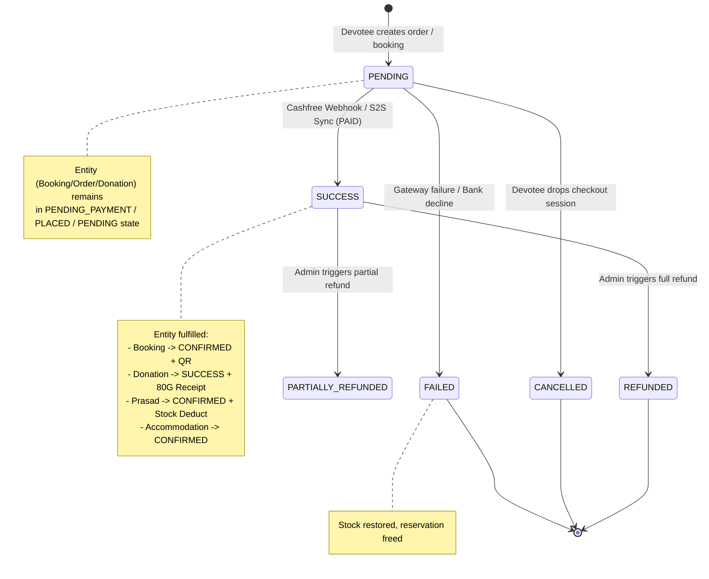

---

## 2. Request Security & Authorization Flow

```mermaid
flowchart TD
    InboundRequest["Incoming HTTP Request"] --> RateLimit["Global Throttler / Helmet Ingress"]
    RateLimit --> ExtractAuth{"Authorization Header Present?"}
    
    ExtractAuth -->|No| CheckPublic{"Is Endpoint Public?"}
    CheckPublic -->|Yes| ValidationPipe["ValidationPipe (whitelist: true, forbidNonWhitelisted: true)"]
    CheckPublic -->|No| Return401["401 Unauthorized (Missing Token)"]

    ExtractAuth -->|Yes| VerifyJWT{"Verify JWT Signature & Expiry"}
    VerifyJWT -->|Invalid / Expired| Return401Invalid["401 Unauthorized (Invalid / Expired Token)"]
    VerifyJWT -->|Valid| LookupUser{"Lookup User in DB / Cache"}

    LookupUser -->|Not Found / Inactive| Return401Inactive["401 Unauthorized (Inactive User)"]
    LookupUser -->|Active| RoleCheck{"Check @Roles() Metadata"}

    RoleCheck -->|Insufficient Role| Return403["403 Forbidden (Insufficient Permissions)"]
    RoleCheck -->|Permitted| ValidationPipe

    ValidationPipe -->|Validation Failed| Return400["400 Bad Request (Invalid DTO)"]
    ValidationPipe -->|Valid DTO| Controller["Controller Route Handler"]
    Controller --> Service["Domain Application Service"]
    Service --> OwnershipCheck{"Devotee Owns Resource?"}
    OwnershipCheck -->|No (IDOR Attempt)| Return404Or403["403 Forbidden / 404 Not Found"]
    OwnershipCheck -->|Yes| PrismaTx["Prisma Atomic Transaction"]
    PrismaTx --> Response200["200 OK / 201 Created (ApiResponseDto)"]
```

---

## 3. Sequence Diagrams (15 Complete User Journeys)

### Flow 1: Devotee Authentication (OTP Lifecycle)
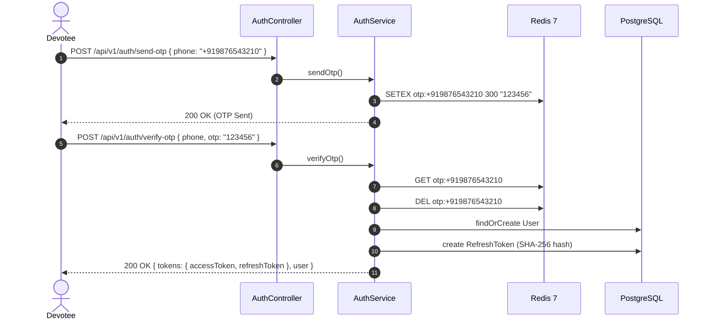

### Flow 2: Puja Booking Lifecycle
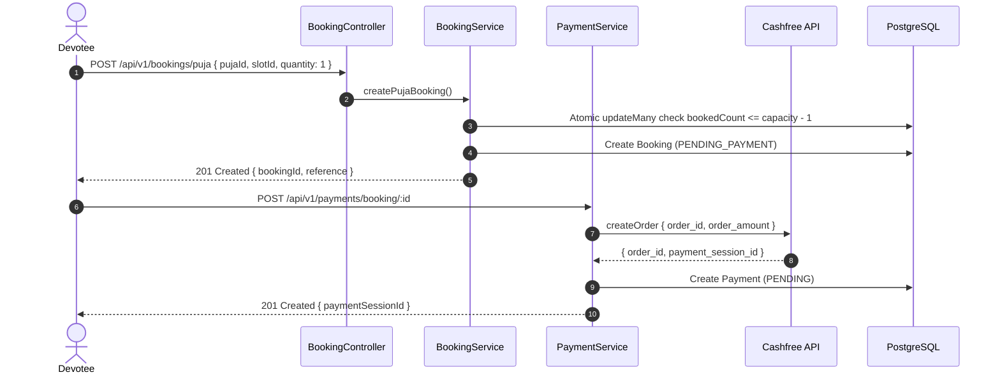

### Flow 3: Seva Booking Lifecycle
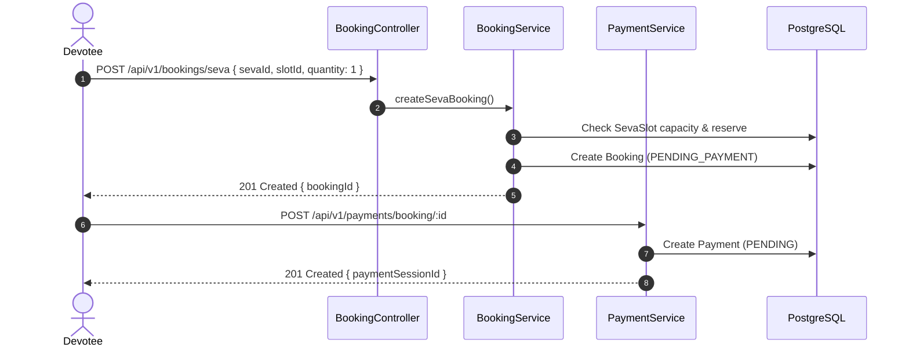

### Flow 4: Donation & 80G Tax Exemption
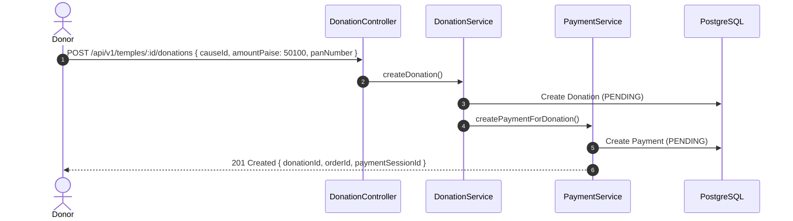

### Flow 5: Prasad Order & Inventory Reservation
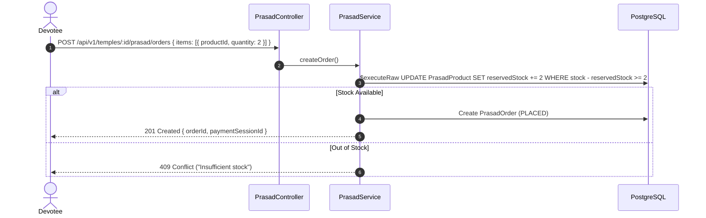

### Flow 6: Accommodation Booking & Overlap Protection
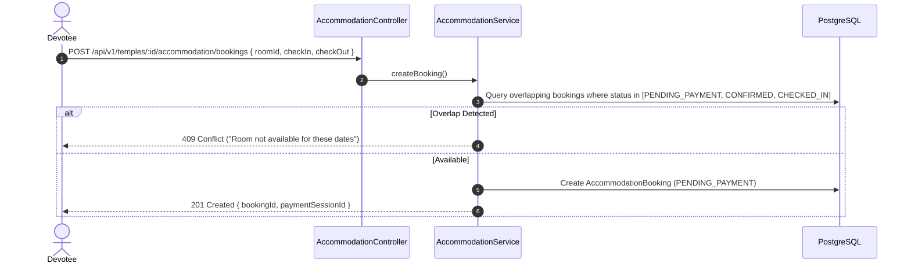

### Flow 7: Mahaprasad Dining Booking
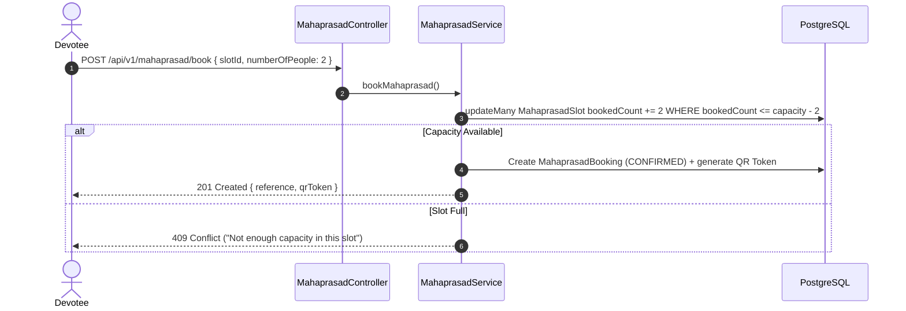

### Flow 8: Gurukul Admission Application & Approval
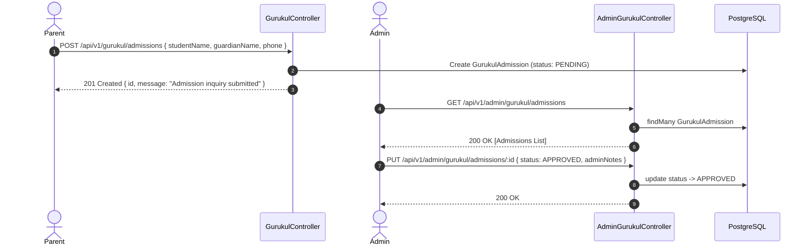

### Flow 9: Jigyasa Samadhan Privacy & Q&A
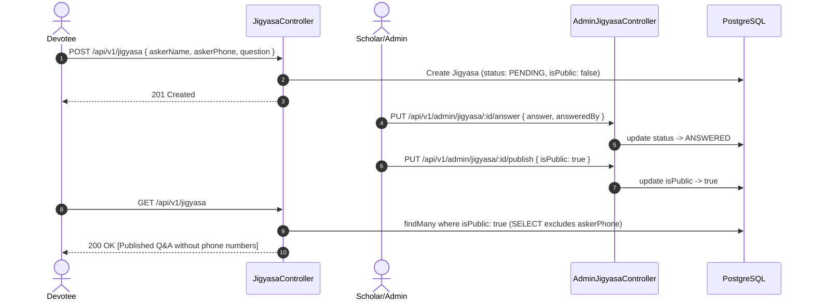

### Flow 10: Paath Publishing & Cache Invalidation
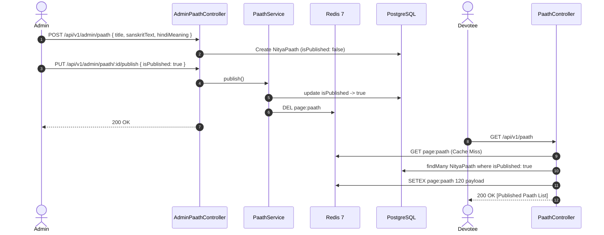

### Flow 11: Admin User Role Management & RBAC
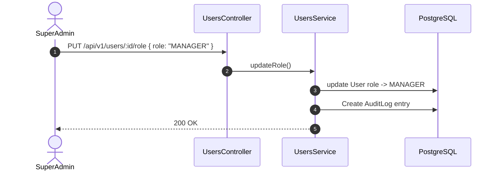

### Flow 12: Cashfree Signed Webhook Handling
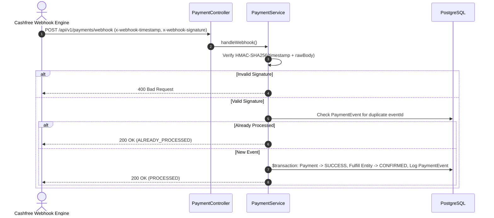

### Flow 13: Server-to-Server Payment Recovery
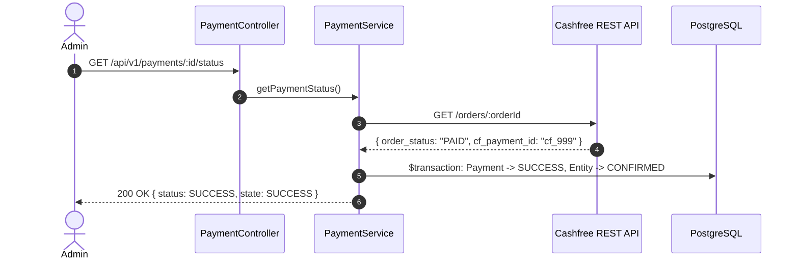

### Flow 14: Payment Refund Lifecycle
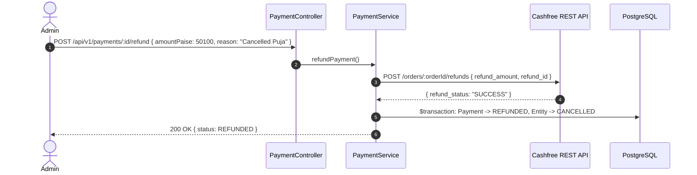

### Flow 15: Gate Check-in & QR Verification
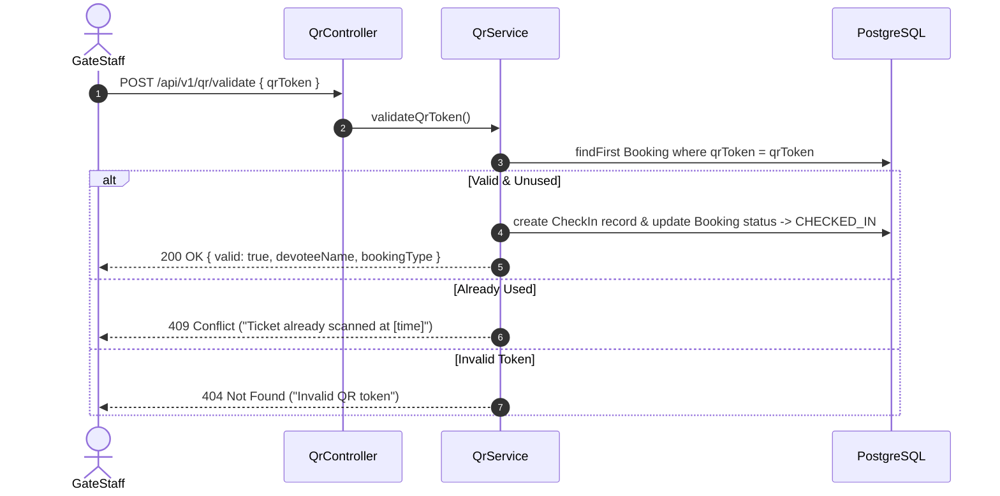
